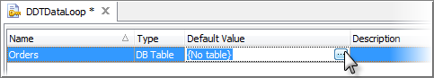
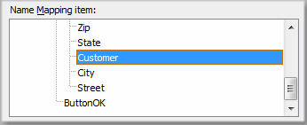
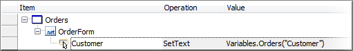
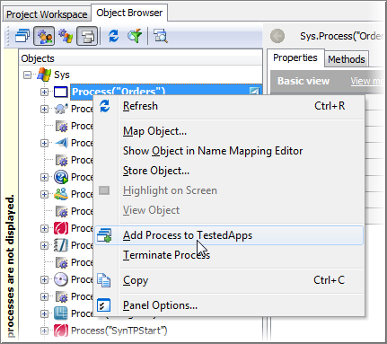
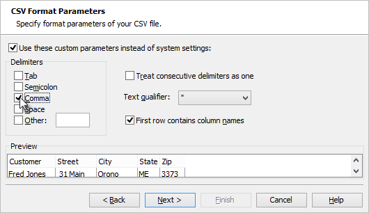
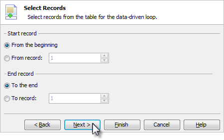
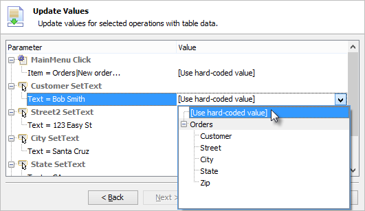
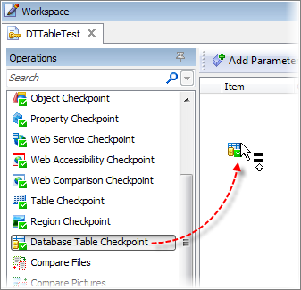
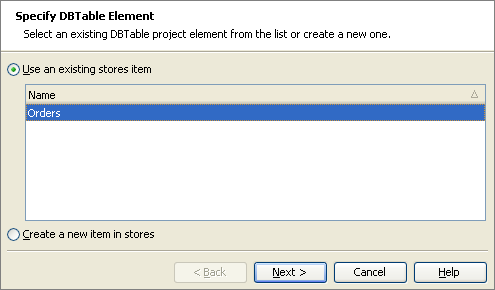

### Data Driven Testing

#### Objectives

This chapter demonstrates how you can drive tests from data stored in a database, spreadsheet or text document. You\'ll learn about the DB Table object used to automatically feed data to your test and how to leverage the DBTable checkpoint to verify database contents.

#### The DB Table Object

TestComplete provides a built-in data driven testing object type called **DB Table** that provides a straight forward and consistent mechanism for working with a wide variety of data sources. DB Tables can provide connection to Excel spreadsheets, comma delimited CSV files and database tables such as Oracle or MS SQL.

#### Creating a DB Table Variable

To create a DB Table variable:

1. Navigate to the **Variables** tab of for the project. Right-click the **Temporary Variables** area and select **New Item\...** from the context menu.

2. Provide a name for the table, drop down the Type list and select **DB Table**. Click the ellipses in the **Default Value** column. This will bring up **Edit DB Table Variable Value** dialog.

3. In the **Edit DB Table Variable Value** dialog, select one of the data source types from the list. In the screenshot below the **CSV file** type is selected. Click the **Next** button to continue.

4. In this page specify a CSV file, an Excel file or a database table, depending on the data source type you specified in the preceding step. In this example we specify the path to a CSV file called \"orders.txt\". Click the **Create File** button to invoke Notepad.

5. In Notepad, enter a comma-delimited list of information as shown in the screenshot below. The first row of information will be used as headings. Once you have entered the data, save and close Notepad. Click the **Next** button to continue.

6. The CSV Format Parameters page of the wizard shows a preview of the data and allows you to tweak parameters including the delimiters, treat several consecutive delimiters as a single entity, and to use the first row for column names. You can leave the default settings and click the **Finish** button.

7. When the wizard is finished you will have a new **Default Value** column entry. This entry will vary depending on the path you\'ve taken through the wizard. Examples of results for several file type choices are shown in the screenshot below. Notice that in all three cases, the name \"Orders\" stays the same and the type is DB Table. Later, if you need to change the data source, assuming the data source contains the same named columns, you can swap in a new data source without changing your test.

#### Accessing DB Table Values

You can assign the values from any column in the DB Table. Here\'s a quick example of assigning the \"Customer\" edit box from the \"Customer\" column in a DB Table.

In the example, we assume that the sample \"Orders\" application with the \"New Order\" dialog is already open and the text boxes there are already mapped. The \"Orders\" DB Table variable should already be configured.

1.  Drag an On-Screen Action Operation to the Keyword Test Editor.

2.  In the On-Screen Action wizard, select the mapped \"Customer\" object.

1.  In the \"Specify Method or Property\" page of the On-Screen Action wizard, select the **SetText** method.

4.  In the \"Operation Parameters\" page of the wizard, click the ellipses for the text value to display the Edit Parameter dialog. In the Edit Parameter dialog, set the **Mode** to \"Variable\", drop down the **Value** list and move the mouse to the \"Orders\" variable. Click the **Column** button when it appears to display the Table Indexes dialog.

The DBTable variable can be created in a project suite, the project or in the variables for a keyword test.

5.  In the Table Indexes dialog, drop down the Column list and select Customer. Click **OK**, **OK** again and the **Finish** button to close the wizard.

6.  The completed On-Screen action shows the \"Customer\" object text being assigned the \"Orders\" DB Table \"Customer\" column value.

#### Creating a Data Driven Test

A productive way to construct data driven Keyword Tests is to identify areas within your application where repetitious data entry is required such as adding customer records or creating orders. These scenarios are generally good targets for performing data driven testing. In this section we\'ll construct a data driven Keyword Test that illustrates just such a scenario using the \"Orders\" sample application. In this example we\'ll illustrate using the DB Table to read data from a comma separated file (CSV). To start, we\'ll record a basic data entry scenario of inserting a new customer order.

#### Recording the Test

1.  Select **File \| New \| Project\...** and click **OK** on the Create Project dialog.

2.  Launch the \"Orders\" sample application.

3.  Right-click the \"Orders\" process in the Object Browser and select **Add to TestedApps** from the context menu. You may need to click the **Refresh** option if you don\'t see the \"Orders\" process in the Object Browser.

4.  Close the \"Orders\" application. We\'ll launch it during the recording using the **TestedApps** button.

5.  Click the **Record** button on the toolbar button.

6.  Using the **TestedApps** button launch the Orders application.

7.  Select **Orders \| New Order\...**

8.  Fill in Customer, Street, City, State and Zip.

9.  Click **OK.**

10. Click the **Stop** button on the recording toolbar to end the recording.

#### Data Driven Loops

The **Data Driven Loop** Operation makes it possible to iterate over data for some set of Test Steps. The Operation will loop once for each record in the data source. The data for columns in the data source will be available to your Keyword Test and can be assigned to items in the test. The walk through below uses the recorded \"Orders\" test where the new order is created, populated and added to the table. These test steps will become a part of a data driven loop.

1.  Select the \"Orders\" node that contains the creation of a new order and entering of fields in the order.

2.  Right-click the Keyword Test Editor and select **Make Data Loop\...** from the context menu. This will display the **Data-Driven Loop** dialog.

3.  In the **Select Table Variable** page of the wizard, select the **Create new variable** radio button and enter \"Orders\" as the variable name. Click the **Next** button to continue.

4.  In the **Specify Table type** page of the wizard, select the \"CSV file\" option. Click the **Next** button to continue.

5.  In the **Select CSV File** page of the wizard, click the ellipses button, locate and open the \"orders.txt\" file that contains the orders data. Click the **Next** button to continue.

6.  In the **CSV Format Parameters** page of the wizard, click the **Comma** checkbox from the **Delimiters** group. Click the **Next** button to continue.

7.  In the \"Select Records\" page of the wizard, leave the defaults to use all the records and click the **Next** button to continue.

8.  In the **Update Values** page of the wizard, drop down the Value list for each data entry field and select the corresponding column from the data. In the screenshot below, the \"Customer\" data entry field is being assigned the \"Customer\" column from the data table.  Click the **Finish** button to create the data table and data driven loop.

9.  Notice in the Keyword Test Editor, we have a new Data-Driven Loop. The Value for the loop is the local \"Orders\" variable. Each text box assignment now comes from columns in the \"Orders\" table.

10. Navigate to the Variables tab and notice the \"Orders\" DB Table variable that was created for us. You can see that the DB Table variable points to the \"Orders.txt\" CSV file.

#### Database Table Checkpoint

The **Table Checkpoint** verifies live database content, both rows and columns, against a static snapshot of the data stored when the checkpoint was created. Using the **Table Checkpoint** is very similar to using the Table checkpoint with the exception being the location where the data is retrieved. To use a **Table Checkpoint** we need:

- A connection string that defines access to a data provider so we can connect to a data store.

- A specific Table, View or Query that defines criteria used to fetch data from the store.

- The connection string allows for connecting to any ADO or ADO.NET supported data provider including data sources such as .CSV files, Excel spreadsheets or a wide variety of database servers.

#### Creating a DBTables Store

For this example, we\'ll use Microsoft\'s Text Driver which provides access to data stored in . CSV files to illustrate the DBTable store. We\'ll use this provider as it does not require an actual database server backend and is generally available on most computers. The connection string for the Microsoft Text Driver is:

Driver={Microsoft Text Driver (\*.txt;\*.csv)};Dbq=c:\\;Extensions=asc,csv,tab,txt;

In this connection string the name **Dbq** specifies the folder where our CSV files are located. We\'ll use a file called \"c:\\order.txt\" to create our store from.

1.  If the **Stores \| DBTables** node does not exist in the Project Explorer, right-click the **Stores** node, select **Add \| New Item\...** from the context menu. Select the **DB tables** item from the list of item types and click the **OK** button to close the dialog.

2.  Right-click the **Stores \| DBTables** node in the Project Explorer and select the **Add \| New Item\...** option. This will display a dialog that allows you to define the store.

3.  Select the **Create a new item in Stores** option and click **Next**. If there are no existing DBTables stores, skip this step.

4.  Use the following values on the **Specify Connection Settings\...** page of the wizard.

**Name** \-- Orders

**Connection** \-- Driver={Microsoft Text Driver (\*.txt;\*.csv)};Dbq=c:\\;Extensions=asc,csv, tab,txt;

**Custom query** \-- radio button should be checked

5.  Type \"select Customer, Street from Orders.txt\" as the SQL statement and click **Next**.

Note that you can also click the Design button here to get help building your SQL string.

6.  The **Specify Data Range** page of the wizard defines the number of rows and which columns to store. Click **Next** (we\'re using the defaults here).

7.  Next, preview of the data then click **Finish** to complete the DBTable checkpoint.

#### Creating a Database Table Checkpoint

To create a Database Table checkpoint that compares the current state of the data with a DBTable store:

1.  Create a new Keyword test called \"DBTableCheckpoint\".

2.  Select the **Checkpoints** category on the Operations palette of the Keyword editor.

3.  Drag/Drop the **Database Table Checkpoint** onto the test.

4.  In the **Specify DBTable Element** page of the wizard, select the **Use an existing stores item** option, make sure that the \"Orders\" store is selected and click **Next**.

5.  Notice that the DBTable Checkpoint has been created in the Keyword Test.

#### Modifying the Checkpoint

Once the checkpoint has been created we\'ll see a new Orders node under **Stores \| DBTables** in our Project Explorer and we can review the data in the Checkpoint editor window. Using the **Edit\...** button we can walk through the wizard again and modify any part of the checkpoint.

The DBTables Checkpoint editor also allows you to specify which rows and columns to use as well as edit the data in any individual cell. As an example, make a few changes here to modify the stored data. In the screenshot below, notice that the \"Customer\" name in row \#2 is changed.

#### Executing the Table Checkpoint

Now we can execute our test to compare the DBTable data against the actual CSV file on disk. Again, this checkpoint is reading data from the CSV file and comparing it to the data we stored in the DBTables checkpoint for our project. When the checkpoint executes it will open the CSV file, execute our \"select\" query statement, return the results and perform the comparison. Notice, we now get a error because the stored data no longer matches the data from the CSV file:

\"Warning: The \'Customer\' field of row 1 contains a value (John Smith) that differs from the stored one (Sam).\"

#### Summary

This chapter demonstrated how you can drive tests from data stored in
a database, spreadsheet or text document. You learned about the DB
Table object used to automatically feed data to your test and how to
leverage the DBTable checkpoint to verify database contents.