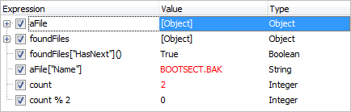
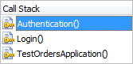

### TestComplete Debugging

#### Objectives

This chapter demonstrates the debugging features of TestComplete that allow you to locate and fix bugs in your tests. Along the way you\'ll learn how to start a test in the debugger, use the various debugger windows and how to work with breakpoints.

#### Debugging Tests

The debugger capabilities in TestComplete help track down script errors, flow problems and also to evaluate the values of local and global variables. TestComplete has its own debugger built-in, so you don\'t need to install any other software. Note: You may need to set a breakpoint to use the debugger, otherwise the test may finish running before stopping anywhere in the code. See the Breakpoints topic for more information.

#### Test Engine Toolbar

You can use the **Run** button on the Test Engine toolbar to start debugging a test. To use the **Run** button from the toolbar you must have a **Project Item** defined otherwise TestComplete will prompt you to create one. Refer to the Project Organization chapter for information on project test Items.

#### Keyword Test Editor Context Menu

You can use the Keyword Test Editor context menu to run and debug tests. As you can see in the image below there are three Run options to start executing a Keyword Test, all of which will start a debug session if the debugger is enabled.

- **Run Test** \-- Executes the current Keyword Test.

- **Run Selected Operation** \-- Executes the selected Keyword Test Step.

- **Run From Selected Operation** \-- Executes all steps from the selected step through the end of the test.

#### Debugger Toolbar

You can also use the debugger toolbar buttons to run your debugging session.

**Run to Cursor** \-- Runs the test up to the cursor and stops, just as if there had been a break point at the cursor location.

**Step Into** \-- Executes the next step in the test. If another test or routine is called, the debugger continues on the first line of the test or routine.

**Step Over** \-- Executes the next step in the test. If another test or routine is called, the debugger executes the entire call at once and continues on the next line after the test or routine.

**Evaluation Dialog** \-- Opens the Evaluate Dialog. The dialog allows you to view and modify variables, expressions and objects.

**Breakpoints, Watch List, Locals** and **Call Stack** \-- These buttons display panels of the same names and are described in the \"Exploring Debugger Panels\" topic.

#### Exploring Debugger Panels

TestComplete includes four different debug panel each of which provides useful feedback for debugging tests.

**Breakpoints** \-- User defined list of steps where the debugger will halt test execution.

**Watch List** \-- User defined list of variables to examine.

**Locals** \-- Used to examine the values of locally defined variables.

**Call Stack** \-- Used to view the current execution path of the test.

#### Watch List Panel

The **Watch List** panel is a read/write list of expressions you\'re interested in examining during the debug session. The Watch List is similar in function to the Locals panel though requires the user to manually specify values to inspect. Like the Locals Window,the list of expressions updates automatically as you debug your code. The Watch List allows you to specify any script expression for inspection including variables, object and mathematical expressions (such as A + B). Like the Locals view, the Watch List uses a tree structure, allowing you to see sub-properties of objects on the system that are used by your test.

The screenshot below shows objects and properties with simple types (Boolean, String and Integer). The last watch is a mathematical expression \"count % 2\". See the online help for the language you are using to see what expressions can be included here. Also notice that the Value column may be highlighted to indicate that the value has changed.

The three columns in the **Watch List** panel are:

|**Column**|**Description**|
|---|---| 
|**Expression**|The expression, variable, parameter, object or property to view while debugging. The checkbox appearing in this column controls whether or not the expression is evaluated. One reason to uncheck an expression is if it takes considerable time to valuate and slows debugging|
|**Value**|The current value of the watch expression|
|**Type**|The data type of the variable being displayed|

##### Using the Watch Properties Dialog

Unlike the Locals panel, the **Watch List** panel is read/write and provides the ability to specify how the information should be displayed. To modify a watch, either double-click the item in the **Watch** panel or select **Edit** from the context menu.

This will display the watch Properties dialog allowing you to control the display of the value returned for the selected watch. For example, if the watch is on an integer value you can view the result as a Hexadecimal value.

##### Recommended Usage

While the **Watch** panel is a very useful tool for debugging, here are a few usability tips that will help you make the most of this tool:

- Keep the total number of active \"watches\" to a reasonable number. TestComplete updates each object after each step, so tracking too many variables can slow debugging.

- Use the checkbox next to the expression to disable the evaluation of a watch while keeping it in the list for later use.

- Use the Locals panel to monitor values used within your test. The Locals panel works like an automatic Watch List without having to add watches explicitly. It\'s possible to position both the Watch List and the Locals Panel to be visible on the screen at the same time.

#### Locals Panel

The **Locals** panel is a read only list of variables in scope at the current point of execution. The list is automatically maintained by TestComplete and updates as you debug your code, providing a convenient means of inspecting the values of the relevant local variables during a debug session. The Locals view uses a tree structure allowing you to \"see into\" variables which reference objects on the system and view their properties as well.

The three columns in the Locals panel are:

|**Column**|**Description**|
|---|---|
|**Name**|Name of the variable|
|**Value**|The current value of the variable|
|**Type**|The data type of the variable being displayed|

#### Call Stack Panel

The **Call Stack** panel is a read only list of the routines currently executing as part of the running test. The list displays entries in descending order, starting with the routine currently being debugged.
This allows you to see and trace the execution path through your test and is only active when a test is executing.

Double clicking items in the **Call Stack** panel will take you to either the Keyword Test Step or line of script depending on the test currently executing. The **Call Stack** can display both Keyword Tests and script routines together.

In the screenshot below, the test that\'s being debugged, \"TestOrdersApplication\" calls \"Login( )\" which in turn calls \"VerifyAuthentication()\".

#### Summary

In this chapter, we covered TestComplete debugging features. We looked at: 
- Requirements for debugging tests using TestComplete.
- Methods for starting a debug session.
- Debugger windows including the Call Stack, Locals, Watch and Breakpoints.