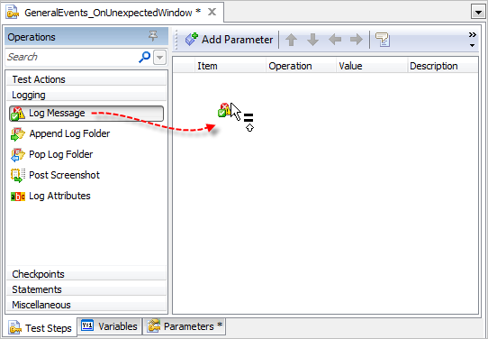
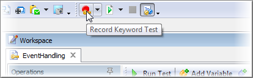

### Event Handling

#### Objectives

This chapter explores how to create tests that respond to events that occur during test execution using the TestComplete Event Handling functionality. You\'ll learn about the available events provided by TestComplete, how to create event handlers and how TestComplete handles unexpected windows.

#### Using Events

The TestComplete event handling mechanism allows the test writer to respond to conditions during test execution. **Events** are occurrences that happen during the running of a test, such as the browser navigating between pages, checkpoints, tests starting and stopping, logging, an unexpected window, an error or timeout.
\"**Event Handlers\"** are routines in script or keyword tests that respond to these events.

The **Events** project item appears under the Advanced folder in the Project Explorer. Using the Events editor, you can register a test to respond to a wide variety of events. Events are grouped by category:

- General Events 
- Manual Testing Events 
- Network Suite Events 
- Test Engine Events

The screenshot below shows an \"OnWebBeforeNavigate\" event being added.

While it\'s possible to respond to ActiveX control events, we\'ll focus on the events included in the TestComplete General Events Source Object.

Looking at the editor we see two columns:

**Available Events** \-- displays events provided by the selected Source Object.

**Events to Handle** \-- displays a list of events added to the current project.

In order to respond to an event, it **must** appear under the **Events to Handle** column. To move events simply double click items in the **Available Events** column or click the **Add Selected** context menu item.

#### Creating an Event Handler

1.  Under the Events to Handle column, locate the **General Events \| OnUnexpectedWindow** event and click the **New** button:

2. On the New Event Handler dialog select **KeywordTests** and click the **OK** button.

3. Navigate to the Project Explorer and notice the new Keyword Test that will be called whenever TestComplete detects an unexpected window during test execution.

Note that our new event handling Keyword Test has three parameters:

 |**Parameter**|**Value**|
|---|---|
|**Sender**|Indicates the Source Object where the event came from|
|**Window**|An object representing the unexpected window from the Object Browser|
|**LogParams**|Controls how log contents will be displayed and processed. This object includes a Locked property. Setting the Locked property \"True\" cancels posting messages to the log|

4. From the Logging category on the Operations palette, drag & drop a **Log Message** operation onto the test:

5. On the **Log Message** dialog type \"OnUnexpectedWindow\" and click the **Finish** button.

At this point, we\'ve completed the setup of our event handler which will be triggered whenever TestComplete detects an unexpected window during test execution. Attaching to any of the other events provided within TestComplete works in the same manner.

#### Handling Unexpected Windows

One of the more complicated areas of GUI automation is dealing with unexpected windows. TestComplete provides rich functionality to automatically handle windows that occur unexpectedly during test execution. In addition, the OnUnexpectedWindow event allows you to customize how unexpected windows are handled.

#### Built-in Unexpected Window Behavior

First, let\'s take a look at the logic TestComplete applies to unexpected windows and understand when this logic kicks in. To configure options that control how unexpected windows behave, double click the Project node and select the Properties tab. The options are located under the **Playback** category.

There are numerous options that tailor Unexpected Window Behavior:

**Ignore unexpected window** \-- TestComplete unexpected window handling will not be used.

**Stop execution** \-- Halt test execution when an unexpected window occurs.

**Click on focused control** \-- Click the focused control (if any) on the unexpected window.

**Press ESC** \-- Send an Escape key press to the unexpected window to try and dismiss it.

**Press Enter** \-- Send an Enter key press to the unexpected window to try and dismiss it.

**Send WM\_CLOSE** \-- Send the Windows API message WM\_CLOSE in an attempt to close the unexpected window.

Also notice that the **Runtime** category has a \"Stop on Error\" option.

#### Unexpected Window Logic Sequence

TestComplete has a very specific sequence it uses to handle unexpected windows. These rules are listed, in order, below. It\'s important to understand these rules and how unexpected window handling may affect your test automation results:

1.  Test execution is delayed until expiration of the Auto-wait timeout interval that is set in the Playback options of your project.

2.  If the unexpected window is still open, TestComplete generates the OnUnexpectedWindow event.

3.  If the window is not closed by the OnUnexpectedWindow event handler, TestComplete posts an error message to the log along with an image of the unexpected window and then acts according to the Playback settings.

4.  If \"Stop on error\" is checked, then the run ends at that point.

5.  Likewise, Test execution halts if \"Stop execution\" is checked in the Unexpected Window section. The difference is that \"Stop on error\" stops on any error, while \"Stop execution\" stops specifically on unexpected windows.

6.  Otherwise, any of the four following actions is taken, depending on the settings in the Unexpected window section:

    -   \"Click on focused control\" simulates a click to the window's default button.

    -   \"Press Esc\" simulates an ESC key press.

    -   \"Press Enter\" simulates an ENTER key press.

    -   \"Send WM\_CLOSE\" sends the window the normal window-closing message.

7.  If the window is still not closed, the run ends. The window may not close if you do not have a closing action checked, or if the closing action fails.

#### Lab

Accompanying the projects for this courseware is a small program called \"CalcApp\" that divides two numbers. However, it does a very poor job, so that it\'s possible to perform an illegal operation, i.e. divide by zero. The result is an an exception dialog (see screenshot below). This lab will generate the exception and then handle the **OnUnexpectedWindow** event.

#### Handling Events with Keyword Tests

First, we\'ll record a test using \"CalcApp\" to see what happens when an unexpected window occurs.

1.  Add \"CalcApp\" as a TestedApp. See the \"Overview of TestComplete\" chapter for more information on adding TestedApps.

2.  Click the Record button on the main toolbar to start recording a new Keyword Test:

3.  From the Recording toolbar, use the TestedApp drop down button and run the \"CalcApp\" TestedApp.

4.  Enter a \"12\" in the first text box, a \"0\" in the second text box and click the \"Calc\" button. Finally, close the \"CalcApp\" window.

The unexpected window will not be detected if there is no action following the error.

5.  The Keyword Test should look something like the screenshot below. Be aware that this version has been cleaned up to remove extraneous keystrokes.

6.  Click the **Run** toolbar button on the Keyword Test Editor to watch how TestComplete OnUnexpectedWindow handling works.

Notice that after the unexpected window is detected that is starts working through its list of ways to close the window, including trying to click the default button (which just ends up showing the error detail) and finally simulating the ESC keystroke that successfully closes the window and allows the test to complete.

7.  Review the Test Log and see how TestComplete reports on the error dialog. Notice that the logging of the Unexpected window automatically records a screenshot of the problem window.

8.  Create a new **OnUnexpectedWindow** event handler.

9.  In the event handler, add a **Log Message** Operation. In the Operation Parameters step of the wizard, set the **AdditionalInformation** parameter to \"An unexpected window appeared\" and the **Picture** parameter to the code expression below:

Log.Picture(Sys.Desktop,\"Full desktop screenshot\")

10. The dialog should look like the screenshot below before pressing the **Finish** button.

11. Rerun the test and review the log. The log now shows that the OnUnexpectedWindow handler was invoked and logged a screenshot of the entire desktop.

#### Reviewing the Test Log

From the Test Log we can see that TestComplete:

1.  Generated a Log Message from our OnUnexpectedWindow event handler.

2.  Generated an OnUnexpectedWindow error message.

3.  Included a screenshot of the dialog that caused the error.

Using the OnUnexpectedWindow event a test writer could examine the **Window parameter** and determine how they want the test to proceed.
The OnUnexpectedWindow event allows for custom handling of error conditions and gives the test writer complete control to customize unexpected window handling including processing the dialog and controlling the log output through the **LogParams** parameter.

If you didn\'t get the same results as shown in this walk through, verify that your \"Runtime\" and \"On Unexpected Window\" project settings are the same as shown in the screenshot at the top of this \"Handling Unexpected Windows\" topic.

#### Summary

In this chapter, we covered TestComplete event handling features. We looked at: 
- Creating Keyword Tests to respond to events.
- TestComplete built-in handling of unexpected windows.
- Unexpected window handling combined with OnUnexpectedWindow event.