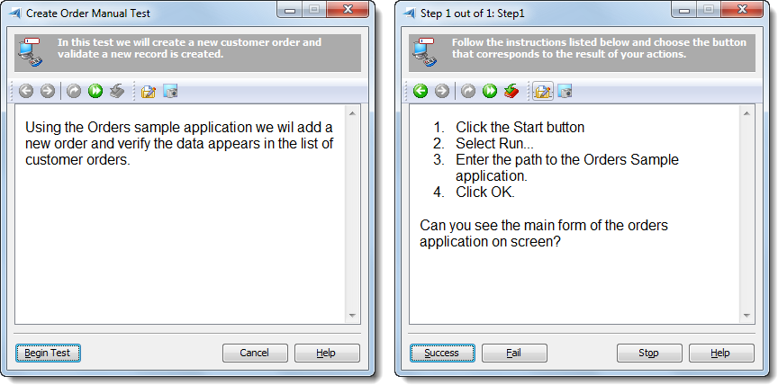
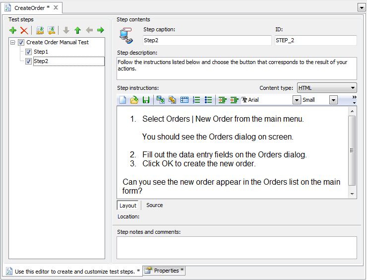
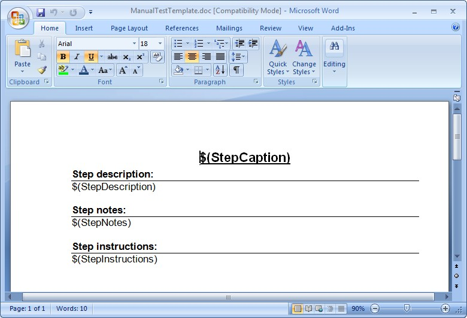
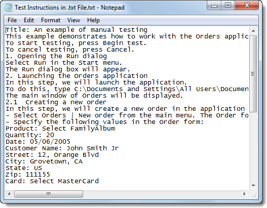

### Manual Testing

Objectives
----------

This chapter looks at TestComplete support for Manual Testing including how to create, edit and execute Manual Tests. You\'ll learn about the upgrade path from manual to automatic tests using the TestComplete import and export features. You\'ll also learn how to use events within a manual test to allow interaction between manual and automated tests.

About Manual Testing
--------------------

If you've worked in any sort of Quality Assurance capacity you\'ll likely be intimately familiar with manual testing and perhaps more so than you might like. Manual testing while extremely valuable can be difficult for humans to perform consistently over long periods of time because of human nature itself. Manual testing generally takes a great deal of concentration and dedicated effort to consistently produce results. TestComplete provides an alternative to what could be considered the more classical approach of using Microsoft Word or Excel. TestComplete support for manual testing allows the test developer to guide the tester through a series of steps, capture data as the test is being performed and automatically log the results of the test. The benefits of manual testing through TestComplete are:

The assurance that the required steps are followed Generation of a log file for every test execution Verification of the results based on Test Log contents Ability to interact with a manual test using Events 

Below is an example of the TestComplete manual test user interface:

Creating Manual Tests
---------------------

In this topic we\'ll walk through the process of creating a Manual Test in TestComplete.

1. Select **File \| New \| New Project\...** and click **OK** on the **Create New Project** dialog.

2. Right click the **Project** node in the **Project Explorer,** select **Add \| New Item\...** and choose **Manual Tests**.

3. Click **OK** on the **Create Project Item** dialog.

4. Right click the **ManualTests** node in the Project Explorer and select **Add \| New Item\...** to create a new Manual Test.

5. On the **Create Project Item** dialog enter \"CreateOrder\" as the name of the manual test and click **OK** to open the Manual Test Editor.

#### Manual Test Editor

The TestComplete Manual Test Editor allows for the creation of a multi-step test that prompts the user through a series of instructions, collecting results with every step.

#### Manual Test Editor Controls

|**Field**|**Description**|
|---|---|
|**Test Steps**|Tree of the steps contained within this test, used for navigation while editing|
|**Test Caption**|Window caption of the Manual Test dialog|
|**ID**|Step ID for use within Manual Test events|
|**Test Description**|Sub caption of the Manual Test dialog|
|**Test Instructions**|Free-form HTML markup for communicating the actual actions to be performed during the test. Appears in the main portion of the Manual Test dialog|
|**Test notes and comments**|Notes for the test writer that are not displayed when the test is executed|

#### Editing the Test Description

By default, the **Manual Test Editor** opens with only the initial node created so we\'ll need to add steps to fill out the test. To create a Manual Test description:

1.  Click the **Test Caption** field and enter \"Create Order Manual Test\".

2.  Edit the **Test Description** field and set the text to \"In this test we will create a new customer order and validate a new record is created.\"

3.  Edit the **Test Instructions** field and set the test to \"Using the Orders sample application we will add a new order and verify the data appears in the list of customer orders.\" The result should look like the following:

#### Adding Steps

Once the description is completed we can start adding steps to the test as follows:

1.  Click the green (+) sign or right click in the Test Steps area and select **New Step** from the context menu.

2.  Fill out the Step **Caption**, **Description** and **Instructions** for this step of our Manual Test. The actual information can be arbitrary or you can use the screenshot below to guide you.
3.  

3.  Add one more manual step and fill out the Step **Caption**, **Description** and **Instructions** for this step

#### Running Manual Tests

Keyword Tests can run Manual Tests using the **Test Actions \| Run Test** Operation. From the **Select Test** dialog, select the **Manual Test** you want to run from the Keyword Test.

Manual Test Interaction With Automated Tests
--------------------------------------------

In this topic we\'ll illustrate how manual tests interact with automated tests. You can call a manual test from a Keyword Test or Script. The reverse is also true. You an call Keyword Tests or Script from your manual test.

You might be thinking \"Why would I do this?\" which is a fair question. The interesting thing about Manual Tests in TestComplete is that you can augment a test by performing actions automatically for the user and by incorporating a Manual Test into a Keyword Test or Script you can execute any actions necessary to ease the testing process such as setup test data, create/delete files, launch applications etc. You can also replace parts of your manual test incrementally as circumstances dictate, allowing you to move over to automated testing in a controlled manner.

#### Running Keyword Tests from Manual Tests

Not only can you kick off a Manual Test from a Keyword Test, you can also run Keyword Tests from your Manual Test. For example, if on \"STEP\_2\", you need the tester to start the \"Orders\" application, you can have this done automatically from the keyword test. The screenshot below, shows the original manual step that requires the user to type a certain path into the Run dialog.

Use the **Content type** drop down list to select \"Keyword Test\". Use the Keyword Test entry ellipses to select an existing Keyword Test from a list. When you run the manual test and it reaches this step, the manual test dialog will disappear briefly while the Keyword Test runs.

#### Converting Manual Tests to Keyword Tests

TestComplete provides extensive support for converting your existing manual tests to automated Keyword Tests. There are two related functions on the Test Steps toolbar that help you to convert from manual to Keyword Tests.

The **Convert Manual Test to Keyword Test** option launches the recorder and creates a keyword test for all your manual test steps. The nice thing about this approach is that you can read off the manual test step as you record the Keyword Test. The recorder starts and stops for each manual test step. Once the recording is complete, a prompt asks if you want a Keyword Test created that will call the Keyword Tests created for each step. The result looks something like this in the Keyword Test Editor:

The **Convert Manual Step to Keyword Test** option launches the recorder and creates a Keyword Test with the same name as the manual test step. Once the recording is complete, you can change the Content Type to \"Keyword Test\" and the new Keyword Test will be automatically selected.

#### Manual Test Event Handling

One of the unique features TestComplete brings to manual testing is the ability for a test developer to inject actions into the test while it\'s being performed. For example, if you wanted to initialize some test data, delete certain files or perform Checkpoint validation of test data, all of those actions can be performed using the built-in Manual Test Events.

Exporting a Manual Test
-----------------------

Once you\'ve created a manual test you\'re given two options to export the test content using the context menu to either Microsoft Word or HTML:

TestComplete provides an option to customize the Microsoft Word export template on the Properties tab at the bottom of the editor window. The export functionality works in a mail merge like fashion and allows you to create a Microsoft Word document containing the contents of the test.

You can optionally, define your own Microsoft Word template for use with the TestComplete export feature. TestComplete includes a default template that looks like this:

Importing a Manual Test
-----------------------

The ability to migrate existing legacy manual tests can be a huge time saver. TestComplete lets you import manual tests stored in text files, Microsoft Word or Microsoft Excel files. TestComplete can handle several format arrangements:

One level or multilevel, bulleted or numbered lists. Numbered lists can use any number style and formatting for levels.

Test steps using different indents for steps of different levels. 

Tables used to organize the step hierarchy.

Keywords to separate the step caption, description, instructions and notes.

TestComplete ships with a set of sample files that can be imported.
Each file demonstrates a particular format, e.g. text, Excel, Word document with headers, etc. The closer your files are to the example formats, the less editing you will need to perform in the Manual Tests editor. See the online help for complete details on supported formats.

You can find example files to import at:

\\TestComplete Samples\\Manual Testing\\Recommended Formats for Manual Test Instructions

#### Simple Text File Import

If you open the document titled \"Test Instructions in .txt file.txt\" you will see steps for testing the Orders application that use numbers to indicate each step.

If you open the document titled \"Test Instructions in .doc file (using headings).doc" you will see steps for testing the Orders application that uses the \"Heading1\" style to indicate a new step.

Test steps can even be arranged in a hierarchy by using styles, i.e. \"Heading1\", \"Heading2\", where \"Heading2\" represents the set of steps indented from \"Heading1\".

See the TestComplete online help topic \"Importing Manual Tests\" for detailed formatting information for each document type.

#### Lab

Let\'s walk through importing one of the sample documents.

1.  From the TestComplete **File** menu choose **Import \| Test\...**

2.  In the **Import Test Options** page of the wizard, enter the **Test Name** as \"OrdersTest\". Click the ellipses of the **Source File Name** and locate the \"Test Instructions in .doc file (using headings).doc\" file in the path indicated at the top of this topic. Click the **Next** button to continue.

3.  The wizard will take a moment to process the file and then present a summary. Click the **Finish** button to close the wizard.

4.  The imported manual test will show under the ManualTests node in the Project Explorer, and all steps described in the document will be included in the ManualTests editor.

Legacy Migration
----------------

The ability to import legacy manual test steps stored in external files coupled with TestComplete tools for converting Manual Test to fully automated Keyword Tests comprises a complete migration path. This path takes you from the labor-intensive, error prone and inconsistent to a wholly automated system that can be run reliably on a schedule.

Summary
-------

In this chapter, we explored TestComplete Manual Testing features and discussed the advantages of developing manual tests using TestComplete. We learned to:

- Create, edit and execute Manual Tests. Call Manual Tests.

- Use Events within a Manual Test. Import and Export Manual Tests.