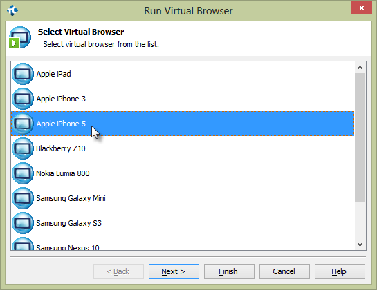
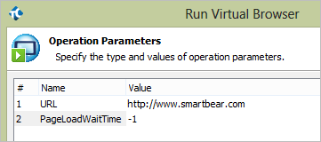
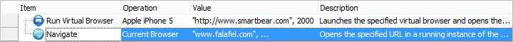
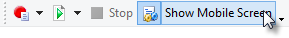
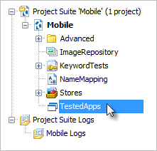
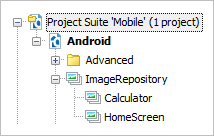
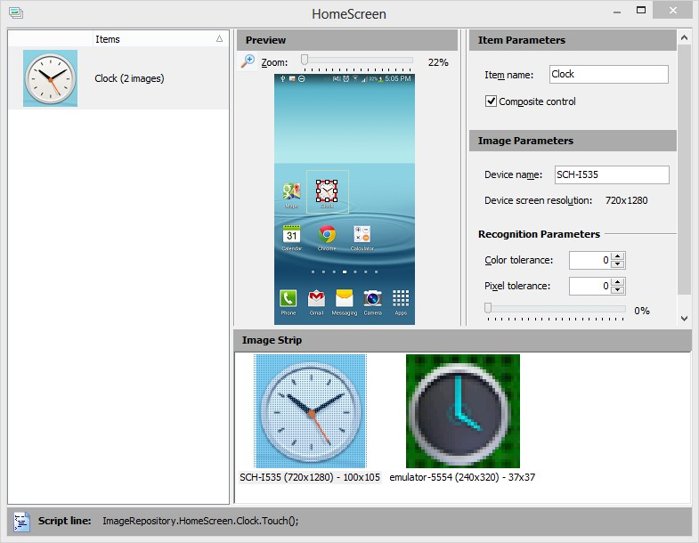
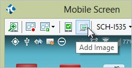
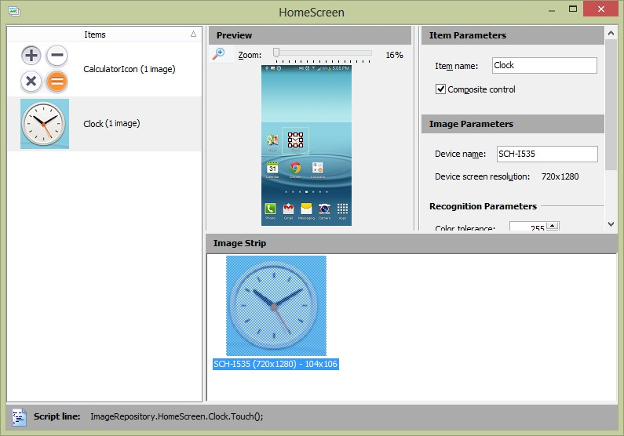

### Mobile

#### Objectives

Does the mobile application you\'re testing show up in a browser on the device? Perhaps you\'re working with a native Android application but you don\'t have access to the source code. Maybe the native Android application is developed in-house. TestComplete provides testing mechanisms that make the best use for each approach. This chapter shows how TestComplete handles mobile web applications that may have multiple layouts based on screen dimension, \"black-box\" native Android applications where you don\'t have access to the application\'s internals and \"white-box\" native Android applications that are open to inspection.

#### Mobile Testing Strategies

Here are some questions that can help determine which TestComplete feature will work best for your needs:

Do you need to test a mobile site on a wide variety of devices, regardless of manufacturer and operating system, for example, iPhone, Android, Blackberry, Windows and so on?

Do you need to test a mobile site that uses responsive design, that is, where the page layout changes based on device characteristics and dimensions?

Do you need access to a device\'s GPS or hardware sensors? Do you need access to the internal objects of an application? Are you testing Xamarin applications?

The [Mobile Web]{.underline} testing option covers the greatest number of devices. In mobile web testing, TestComplete virtual browsers can be configured to any set of device characteristics and dimensions.
This option is relatively easy to set up, leverages your existing knowledge of testing web applications and doesn\'t require that you have the actual physical devices. This option is also very good at testing sites that make heavy use of responsive design. The drawback is that you will not have access to the devices internal objects or hardware.

Within the Android category, there are two approaches for native Java applications that you can use separately or mix-and-match. If you don\'t have access to the application\'s source code, you can perform black-box testing using Image Based Testing. TestComplete has a powerful mechanism that recognizes images on the screen and allows you to work with that area of the screen programmatically and through keyword tests. If you have access to an Android application\'s source code, you can perform white-box testing by configuring the application as an Open Android Application. This will provide you with deep access to an Android application\'s internal screen objects and hardware. Android is fully supported and iOS is on the way.

#### Mobile Web

Verifying that websites work on all devices, dimensions and platforms has become a major scalability challenge. You certainly can\'t keep a junkyard full of physical devices and emulator platforms usually require download and configuration of one or more libraries for support. TestComplete approach is to create *virtual browsers* that run with a set of characteristics and dimensions that mimic a particular physical device. TestComplete comes with a stock set of pre-configured virtual browsers that run from the test recording toolbar.

The screenshot below shows a composite of several virtual browsers running the same site on iPad, iPhone 5 and Samsung Galaxy Mini.

Be aware that TestComplete uses the Chrome browser, no matter what browser the actual device is using. Be sure to prepare Chrome for Web Testing (http://support.smartbear.com/viewarticle/62859/?_ga=1.49190255.819616413.1378486108) and also install Chrome (http://support.smartbear.com/downloads/testcomplete/chrome-patches/?_ga=1.49190255.819616413.1378486108) patches (http://support.smartbear.com/downloads/testcomplete/chrome-patches/?_ga=1.49190255.819616413.1378486108) to match the Chrome version you have.

#### Using Virtual Browsers in Keyword Tests

Mobile web tests use the **Run Virtual Browser** and **Virtual Browser Loop** operations instead of their standard browser counterparts **Run Browser** and **Browser Loop**. When you drag the **Run Virtual Browser** operation to the keyword tested editor, first select a virtual browser from the list and click the **Next** button.

In the **Operation Parameters** page of the wizard, enter the **URL** the virtual browser should navigate to. You can also specify the number of seconds to wait while the page loads. Click the **Finish** button to add the operation to the test.

From here you can use the **Web** group of keyword operations just as you would for standard cross browser testing. The example keyword test below shows the **Run Virtual Browser** operation followed by a standard web **Navigate** operation to [www.smartbear.com.](http://www.smartbear.com/) The **Navigate** operates against the **Current Browser**, so the actual run of the test loads the site into the virtual browser.

#### Defining Your Own Virtual Browsers

As new devices become available, you can define them without waiting for SmartBear to update the list. You will need a *user agent string* and the dimensions of the device.

The characteristics of the device are defined by a user agent string; here\'s an example of a user agent string for Apple\'s iPhone 5:

- Mozilla/5.0 (iPhone; CPU iPhone OS 6\_1\_4 like Mac OS X)

- AppleWebKit/536.26 (KHTML, like Gecko) Version/6.0 Mobile/10B350 Safari/8536.25

To learn more about user agent strings, you can Google for lists of user agent strings and even utilities that will return the user agent string for the device you\'re browsing from.

The following lab will show you how to set up a new device. For this example, we will set up a Nokia Lumia 920 with dimensions 480 x 800.

1. From the TestComplete menu, open the **Tools** menu and select **Current Project Properties**.

2. In the left-hand tree-view, select **Open Applications \| Web Testing \| Virtual Browsers**. This step will display all of the current virtual browsers (see the screenshot below).

3. Click the **Add\...** button.

4. In the **Add Virtual Browser** dialog, paste the user agent string (see below), then click the **Next** button.

Mozilla/5.0 (compatible; MSIE 10.0; Windows Phone 8.0; Trident/6.0; IEMobile/10.0; ARM; Touch; NOKIA; Lumia 920)

5. Enter the screen dimensions as 480 x 800 and click the **Next** button. Note that the prompt is for \"CSS pixels\". Typically, the browser and device screen dimensions are identical. In some cases, the physical device screen may have more pixels than the browser screen.

6. Enter a browser name that will show up in the **Name** column of the **Virtual Browsers** list and click the **Finish** button.

The next time you record a test, the new entry will show in the drop-down list and will be available for keyword and script tests to use.

#### Android

If you need greater control of an Android device than Mobile Web testing in a browser can provide, TestComplete has two solutions. For the best control but requiring knowledge of how to program an Android application, configure an Open Android Application. This will open up the gates to an Android application\'s internal objects, sensors, GPS, operating system commands and so on. If you don\'t have access to the source, you can still use Image Based Testing \l) to access on-screen objects using image recognition. TestComplete image recognition handles differences between devices, resolutions, even minor variations in pixels and colors.

#### The Mobile Screen

The **Mobile Screen** is the primary tool for testing physical devices. It is a device emulator with mobile testing capabilities and an interface used to record keyword and script tests. The Mobile Screen allows you to interact with a variety of devices in a standardized UI, create mobile checkpoints, add images to \"image sets\", take screenshots, record multi- touch gestures and install Android Agent for use in \"white box\", Open Android Applications. The Mobile Screen can emulate devices hooked up through USB,Android SDK emulators and virtual machines running the Android OS (such as Oracle\'s VirtualBox).

**Note**: The Mobile Screen connects only to devices hooked up via USB cable or some emulation of USB. Wi-Fi connections are not supported.

You should interact with the Mobile Screen using keyboard, mouse or touchpad, rather than directly with the physical device. The only exception is that *gestures*, input involving multiple touches, are performed directly on a device.

To get started using the Mobile Screen, click the **Show Mobile Screen** button that appears on the Test Engine toolbar.

If no device is connected, you\'ll get a warning. If there\'s only a single device available it will connect and run. If multiple devices are connected, the **Select Current Device** window displays. You can **Connect** to a single device or **Connect All**. The screenshot below shows a connected physical Samsung device (\"SCH-I535\") and an Android SDK emulator. After connecting, display the Mobile Screen by selecting a device and clicking the **OK** button.

The Mobile Screen user interface consists of a toolbar, a link to **Install TestComplete Agent**, the emulated screen and a footer that contains buttons that emulate hardware on the device. The toolbar is shown in the screenshot below.

The **Size** button gives you a slider that resizes the emulated device\'s screen area and a **Best Size** link to get the optimal match between the device and the Mobile Screen.

**Record** and **Play** Gestures buttons allow you to test using complex, multiple touches on the device. See the Gestures topic for more on recording and playing gestures.

Mobile Checkpoints allows you to take a snapshot of the device\'s screen for later comparison. This checkpoint option depends strictly on visual comparison.

The **Add Image** button allows you to add an image to Image Sets.

The **Select Device** drop down list lets you select the device that should show in the Mobile Screen.

**Take Screenshot** records the emulated screen as a .bmp or .png image.

Install Android Agent loads a package on the device that exchanges data with open Android application and retrieves data from  sensors on the device.

The Mobile Screen footer emulates standard hardware buttons on the device. From left to right, the buttons are **Back**, **Home**, **Menu**, **Volume Down**, **Volume Up**, and **Power**.

#### Using TestedApp to Manage Packages

Packages contain Android application definitions in the form of .apk files. You can install and launch these applications in TestedApps, keyword tests and scripts.

You can define a package in a **TestedApp** and run the TestedApp from the TestComplete IDE, from a Keyword Test or from script. To create a TestedApp representing an Android Package:

1.  In the Project Explorer, Select, the **TestedApps** node.

2.  In the TestedApps editor, right-click and select **Add Android Application\...** from the context menu.

3.  Define the path for the **Android application package file**. The path will point to the location of the .apk file on your local PC where TestComplete resides or in a shared network location. Select the **Deploy to the device on start** checkbox then click the **OK** button.

4.  Now that you have defined the TestedApp, right-click the item and click **Run Selected** from the context menu.

The package will be loaded to the default device and will also show in the Mobile Screen. If the package was already loaded to the device it will be *refreshed*, that is, it will be deleted and reloaded to the device.

For more on how to run a TestedApp from the IDE, keyword test or script, see the Running a TestedApp topic.

#### Using Keyword Tests to Manage Packages

If you want to install an Android package and then run that package in a separate step, leave the TestedApp **Deploy to the device on start** option unchecked. The **Install Package** keyword operation from the **Mobile** group will load the package to the device without having to run it. The screenshot below shows the **Install Package** operation followed by the **Run Tested App** operation from the **Test Actions** group.

#### Managing Devices with Keyword Tests

The **Mobile** group in the keyword test editor has methods and properties for all devices connected to TestComplete on your PC.

Mobile actions are run either on a device that you specify from a list or are applied to the *current device*. The **Select Device** operation specifies the current device that all future operations should run on. The **Parameterized Device** option allows you to select both a device *and an index* (assuming there are multiple devices with the same name). Choose the device from the **Select Device** dialog list and then click **Finish**.

To run the same operations against multiple devices, by drag the **Device Loop** operation onto the keyword test. This will display the **Device Loop** dialog to either Iterate through All **Connected Devices** or choose from a list using the **Iterate Through Specific Devices** option. Each iteration of the loop makes one of the connected devices the current device.

With access to a device, you can run operations to install and run packages on the device, touch the device surface, send keystrokes, touch images and play gestures. The screenshot example below uses the **Image Touch** operation to open the Clock application, then performs a series of **Device Touch** operations to navigate to the world clock tab, add a city and use the **Device Keys** operation to enter \"San Francisco\".

##### Using the On-Screen Action

The **Mobile** section has a sampling of general-purpose operations, but the **On-Screen Action** operation of the **Test Actions** group allows you to access the very powerful **Mobile Device** object. The Device goody bag includes properties for all device\'s information, access to the **Desktop** object that represents the device\'s screen, **GPS** and **Sensor** objects, simulate an **SMS**, and the ability to **Drag**/**Swipe**/**Touch**/**TouchAndHold**/ **TouchPress**/**TouchRelease**. You can also execute Android shell commands and even **Reboot** the device. The screenshot below shows some of the methods for the **Mobile**
**Device()** object.

The **On-Screen Action** operation dialog provides help with the parameters so you don\'t have to guess values. For example, the **PressButton** method expects a predefined button value. If you happen to know that **mbkHome** constant is actually a 4, then all is well. But selecting from a drop-down list is easier and more reliable. The screenshot below shows the mbkHome key constant being selected from a list.

#### Image Based Testing

You can\'t always count on having a prepared, \"white-box\" application that is open and lets you easily get at all the controls on-screen. You won\'t always have that kind of access. In these cases, you can test based on recognizing images. A series of objections pop to mind, like \"what about devices that have different sizes and resolutions?\", \"if I change color scheme or theme, will the image recognition fail?\", and \"will colors bleeding through transparent areas of images fool the image recognition?\" TestComplete has intelligent mechanisms to recognize images in all of these situations, including variable percentages of pixel variation and transparency.

The heart of the approach is the **ImageRepository** in the Project Explorer. The ImageRepository has **Image Sets** where each set contains multiple images representing a single on-screen object. The screenshot below shows the ImageRepository node with two image sets named \"Calculator\" and \"HomeScreen\".

Let\'s say you want to automate a clock icon on your device\'s home screen. The icon may be displayed using more than one image, depending on manufacturer and operating system version. Resolution can also vary, for example, when displayed by a Samsung Galaxy running in 720x1280 pixels vs. an HTC One running in 540x960. By using an Image Set you can recognize images for any configuration. The screenshot below shows the \"HomeScreen\" in the **Image Set Editor** where the clock is listed under **Items** on the left-hand side. The **Image Strip** at the bottom of the screen has a high-quality image of the clock from a device with 720x1280 resolution and another image taken from the emulator that only runs at 240x320. The resolutions are different, the actual artwork representing the clock is different, and the scary part is that the background colors are different based on the chosen wallpaper.

When using a Keyword Test or script to reference the Clock object, TestComplete looks through the Image Strip and tries to match the image with the application under test. If it doesn\'t find the image, TestComplete moves to the next image in the strip and tries again.
This mechanism handles varying resolutions and even helps recognize objects that use completely different artwork to represent the object.

What if the wallpaper on the device changes or there is some variation in the pixel quality between devices? The **Image Parameters** section of the Image Set Editor allow tolerance of color or pixel variations.

**Color tolerance** accepts a number between 0..255 where zero (the default) requires that colors match the stored image exactly and 255 where pixels of any color are treated as identical. 
**Pixel Tolerance** is the number of pixels that can different from the stored Image Strip item. By default, Pixel Tolerance is 0 and all pixels in the tested application and the Image Strip item must match exactly.
The slider below the Pixel tolerance spinner allows you to quickly set the percentage of pixel difference that will be allowed, without having to know about the number of pixels in the image.

##### Adding Images

You can conveniently add new images to an Image Set by clicking the **Add Image** button on The Mobile Screen.

The **Add Image to Image Repository** dialog will display. After a few moments, a second window labeled **Select Object from Screen** will display. Use the mouse to surround a rectangular area. Click the **Select** button that appears to save the area to the **Add Image to Image Repository** dialog. You can change this selected area later.

Provide an **Item name** to be used in scripts and keyword tests. Also select an image set from the drop-down list. If you need to retake the image, click the **Select Image\...** button. Click the **Finish** button to create a new item in the Image Set.

The image will be added as an item to the Image Set editor. Notice the **Script line** at the bottom of the Image Set editor dialog that provides sample script showing how to programmatically touch the selected image.

You can add more images to the strip for the Image Set item by right-clicking and selecting **Add Image\...** or **Add Image From File\...** from the context menu. Use the **Set Recognition Parameters\...** context menu option to tweak color or pixel tolerances.

The Image Set Editor **Item Parameters** panel will display and allow you to change the **Item name**. You can change the Item name at any time, but if keyword tests or scripts refer to it, you will need to update those to match the new item name. The **Composite control** checkbox, when selected, use the exact coordinates of the selection. This checkbox should be selected when the control is composed of several smaller controls, such as a date-time picker or a tabbed control. For simple controls like buttons and check boxes, leave the option unchecked so that selection will occur at the exact center of the control.

The **Preview** panel shows the current selected Image Strip item and has two important rectangular regions (see screenshot below). The *initial target area* is the rectangle you first define when adding the image and is defined by a gray rectangle. The red rectangle defines the *recognition area* used when attempting to match the image set to the on- screen image being tested. You can drag the handles of the recognition area to refine your selection and omit problematic parts of the screen or right-click to drag the recognition area rectangle to a new location. In tests, the upper left corner of the initial target area is used as a reference point when touch actions have coordinates passed to them. Otherwise, the center of the recognition area is used for touch actions.

##### Using Image Sets in Keyword Tests

Use the **Image Touch** operation from the **Mobile** group in the **Operations** window to simulate a touch action on an on-screen object. This will display the **Image Touch** dialog. Select the **Image Set** from the drop-down list and the item from the list, then click **Finish**. **Note**: The default touch action will press the center of the recognition area, but you can optionally click the **Next** button instead of Finish and supply X and Y coordinates or specify the index of the device.

##### Mobile Checkpoints

Mobile checkpoints use Image Sets to verify the state of the application. If an Image Set item is found in the tested application, the checkpoint passes. The setup for the example that follows uses images taken from the Calculator application as shown in the screenshot below.

The example uses an Image set populated from the Calculator with sufficient image to multiply 12x12. The Image set also includes an image of the result \"= 144\".

The **Create Mobile Checkpoint** dialog displays in response to a new keyword **Mobile Checkpoint** operation or by clicking the **Create Mobile Checkpoint** option from the recording toolbar. Your options are to **Create a new item** or to **Use an existing item**. The **Create a new item** option brings up essentially the same dialog as used for Adding Images to an image set. If you choose the **Use an existing item**, select an image from the list of Image Repository items and click the **Finish** button.

##### Mobile Checkpoints in Keyword Tests

The test uses the calculator to multiply 12 x 12 and verifies that the result is an image of 144.

#### Gestures
*Gestures* represent multiple touch events. Gestures must be recorded on a touch-sensitive physical device; emulators cannot be used to record gestures. The Mobile Screen has a Record Gesture feature that allows you to record multiple touches on your device.

Clicking the **Record Gesture** button on the Mobile Screen first prompts to add an **Android Gesture Collection** if a collection doesn\'t already exist. Then the **Add Gesture** dialog displays announcing that you can record gestures on your physical device. Once the dialog displays, the Mobile Screen is disabled and will display the message \"Use a physical device to record gestures\". Enter a name for the gesture, then touch your physical device to simulate multi-touch events. When you\'re done, click the **Stop Recording** button.

TestComplete has a rather nifty way of graphically representing the movement of points touched on the device by animating each point in a unique color. The screenshot below shows the results of a pinching gesture using thumb (shown in red) and index finger (shown in green).
Double-click the **Name** or **Playback Acceleration** column entries to edit them. The Playback Acceleration percentage value can be set between zero and 100. By default, acceleration is set to 10% for better accuracy. Click the **Play Gesture** button to select a recorded gesture and run it.

##### Playing Gestures from Keyword Tests

To play a recorded gesture from a keyword test, drag the **Play Gesture** operation onto the editor. Select an item from the Gesture collection drop down if necessary and then select a gesture from the list.

#### Summary

This chapter explored TestComplete mobile testing mechanisms including how to test mobile web applications that may have multiple layouts based on screen dimension, \"black-box\" native Android applications where you don\'t have access to the application\'s internals and \"white-box\" native Android applications that are open to inspection.