### Overview of TestComplete

 **Objectives**

This chapter takes you on a tour of the TestComplete IDE including the windows that make up the Workspace and Object Browser. You will learn about the layout of the IDE, how project suites and projects are organized and how the TestComplete Object Browser works with processes and applications in your system. You will learn about the tools for recording and playing back tests. Finally, you see how the innovative Test Visualizer allows you to work with visual elements, even when the test is no longer running.

**About the IDE**

The layout of TestComplete is quite similar to other software development tools such as Visual Studio. Below is screenshot of the TestComplete **Integrated Development Environment** or **\"IDE\"**.

The TestComplete IDE contains two main tabs:

**Project Workspace** \-- The primary area for developing and executing TestComplete tests.
**Object Browser** \-- A tree view explorer containing TestComplete objects.

**Project Workspace** is used to record and develop automated tests. The Project Workspace contains two primary panels:

**Workspace Panel** \-- Hosts the editors for any items you have opened from the Project Explorer.

**Project Explorer Panel** \-- Used to create, edit and modify your  test Projects.

#### Workspace Panel

The **Workspace Panel** is where TestComplete displays various editor panels opened from the Project Explorer. The Workspace is a tabbed view displaying one tab for each of the editor windows open in the current session. The screenshot below shows the Workspace panel with tabs opened for a project, a script unit and for events.

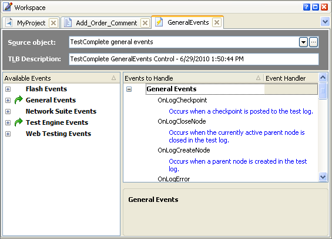

**Figure 1 \--The Workspace Panel**

The most critical editor you will see in the Workspace is for an opened project. The project editor is crucial because it is used to organize individual tests into larger suites and to reuse your tests in different configurations. See the \"Project Organization\" chapter for a complete discussion of this important topic.

#### Project Explorer Panel

The Project Explorer panel contains **Project Explorer** and **Code Explorer** tabs. (Starting TestComplete 14, Code Explorer is disabled by default, feel free to re-enable it from the Options dialog)

##### Project Explorer

Test organization in TestComplete has three main levels: project suite, project and project items. The **Project Explorer** tab
provides a hierarchical view of the open ProjectSuite and any projects contained within it. Each project contains project items such as \"Events\" or \"Script\". Within the project items are child elements appropriate to the type of project item, such as script units for example. The Project Explorer also contains a **ProjectSuite Logs** node that contains test logs grouped by project.

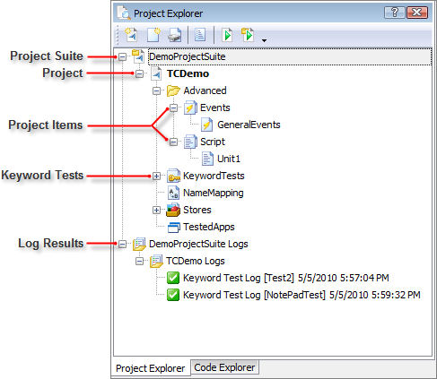
 **Figure 2 \--Project Explorer Tab**

##### Project Suites

TestComplete organizes files into **Project Suites and** **Projects**.
Project Suites contain one or more projects. Project suites are created automatically when a new project is created. Project suites can also be created manually before adding new projects. Project Suites provide a root folder for organizing the contents of your automated tests. While you can have more than one project in a ProjectSuite you can also have multiple Project Suites but only one may be open at any time within TestComplete.

##### Projects

**Projects** contain **Project Items** which are specific types of functionality useful for performing various types of automation. From the **Project Explorer** you can create, edit, and delete **Project Items** in your project using the context menu options: 

 **Figure 3 \--Project Context Menu**

To add, rename or remove **Project Items,** right click the Project node in the Project Explorer and select **Add \| New Item\..., Rename** or **Remove**. TestComplete allows you completely customize your projects through the Project Explorer context menu. If you\'re using TestComplete in conjunction with a Source Control repository you can access the options for checking in/out various project files from the context menu using the **Source Control** option. For details on configuring a Source Control Provider refer to TestComplete online help.

##### Project Item Elements

Project Items may contain zero or more **Project Item Elements** depending on the specific item. Project Item Elements represent the testing functionality of the Project Item or serve to organize its contents. For example, under the **KeywordTests** node you will see individual KeywordTest nodes and under the **Script** node you will see individual Script Units. Certain nodes, like **Name Mapping** have no Project Item Elements and others have a fixed set like the **Stores** Project Item.

##### Code Explorer

The **Code Explorer** tab (disabled by default in TestComplete 14 +) also contains a hierarchical view of your project but displays Code Metrics and related data about your project suite, projects, units and tests. The Code Explorer view provides a deeper hierarchy, making it useful to help navigate script routines in large suites and projects. The Code Explorer also allows you to cut-copy-paste and execute routines directly, via the context menu.

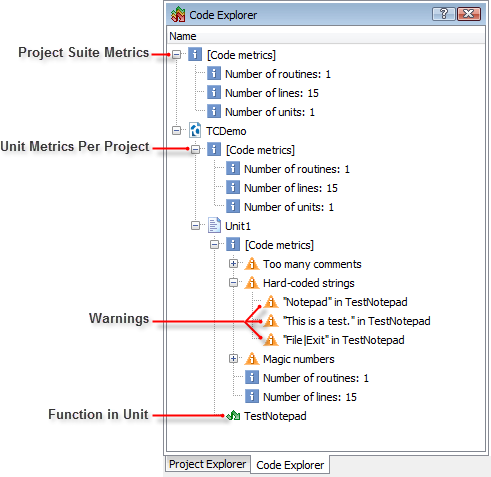
 **Figure 4 \--Code Explorer Tab**

##### TestedApps

TestComplete provides a specific type of Project Item, **TestedApps**, which allows you to associate specific applications with a project. TestedApps makes it easy to launch and work with applications from within your Keyword Tests or Script.

##### TestedApps Columns

 The columns of the TestedApps Editor window are:

  **Column**       **Description**
  ---------------- ------------------------------------------------------------------------------------------------------------------------------------------------------------------------------------
  **Icon**         Show the icon associated with the tested application.
  **Launch**       When checked, this application will be run if the TestedApps.RunAll command is used (either from script or context menu).
  **Name**         The name that TestComplete uses to refer to the tested application (must be a name that the scripting language can handle).
  **File Name**    The name of the application on disk.
  **Count**        This is the number of instances of the application that TestComplete will launch. If the application is already running, TestComplete will post a warning message in the Test Log.
  **File Path**    By default, File Path is the relative path to the file name from the TestComplete project.
  **Run Mode**     How the application is launched.
  **Parameters**   Allows parameters to be set using the ellipses button.

##### Run Mode

**Run Mode** determines the login account and execution context of a TestedApp. Run Mode can be one of the following values:
**Simple** \-- Launches the application under the same user account as TestComplete. Parameters can be passed in Simple mode.
**RunAs** \-- Launches the application under the user account specified by the parameters dialog.
**Debug** \-- Launches the application under the same user account as TestComplete, then TestComplete attaches to the application as a \"debugger\". The stack trace of any exception that occurs in the application while the test(s) are being run will be recorded in the test log. This option requires debug information in the application under test.
**Profile** \-- Launches the application inside of AQtime using the profile (or AQtime project) specified in the parameters dialog. For example, code coverage profiling could be used to see how much of the code is being tested by your automated tests.

##### Adding TestedApps to a Project

1.  On the Project Explorer, right click the TestedApps node and select  **Add \| New Item\...**

2.  Click the button for the **Application** entry and choose a path to an executable file. 
    
#### Note

You can also use the Object Browser to find a running application and select **Add Process to TestedApps** from the context menu.

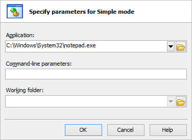
 **Figure 5 \--Adding an Application**

The application is added to the list of TestedApps. Now you can change the File Name or other settings in the TestedApps Editor window. The examples in the screenshot below show \"Notepad\" and \"Internet Explorer\" added to the TestedApps list.

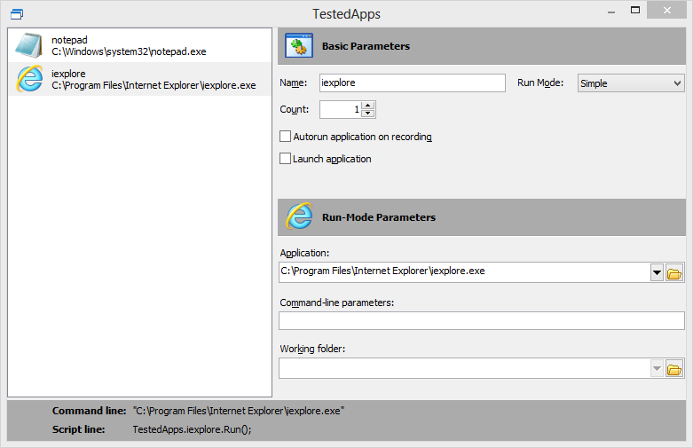
**Figure 6 \--TestedApps**

The File Path dialog will let you simply navigate to a particular file and open it. The file path will be entered for you. Notice in the screenshot above that you can also substitute variables for \"%SYSTEMROOT%\" and \"%PROGRAM FILES%\". If you run the test on another machine, the \"System\" and \"Program Files\" directories may be located differently, so the test will be less likely to break if you use these variables instead of hard coded paths.

##### Running a TestedApp

TestedApps can be run interactively from the TestComplete IDE, from a keyword test or from script.
To run the application from the TestComplete IDE, right-click the TestedApp and then select the **Run Selected** context menu option.
The app will run according to the type of application it is. Desktop apps will display their main window, Android applications will be loaded onto the device and then launched, and so on.

To run a TestedApp from a Keyword test:

1.  Drag the **Run TestedApp** operation into the test area.

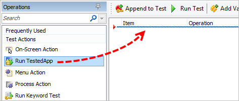

2.  Select the TestedApp you want to run in your keyword test. Click the **Finish** button.

To run a TestedApp from Script use the **TestedApps** object, followed by the name of the TestedApp you have defined and then call the **Run()** method.
TestedApps.NotePad.Run();

#### Object Browser

The **Object Browser** is the core technology enabling TestComplete to perform automation. Understanding how it works is fundamental to successfully developing automated tests.
The **Object Browser** displays how TestComplete \"sees\" your system, displaying a tree view representation of all of the Processes, Windows, Controls and Objects found on your machine. For each object, TestComplete provides a list of all **Properties** and **Methods**.
The screenshot below shows the Object Browser window and the selected Properties for the \"Orders\" process.

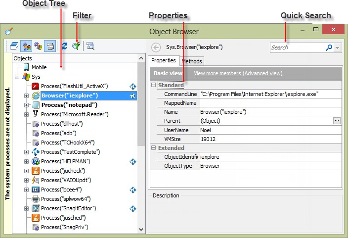
**Figure 7 \--The Object Brow ser**

#### Object Tree

The **Object Tree** displays a hierarchy of TestComplete objects allowing you to automate processes, windows and controls available on your system. The object hierarchy is refreshed frequently to provide an accurate \"picture\" of the various objects. The toolbar above the tree provides options to filter the number of objects TestComplete displays. Filtering allows you to hide nodes that are not relevant to your test automation.

#### Properties Tab

The **Properties tab** displays a list of object properties and their values that reflect details of the object selected in the Object Tree.
Properties can be read-only, read/write or write- only. Read/write properties can be directly manipulated within the Object Browser window. Some properties such as the "Parent\" property are themselves objects. You can use the ellipse button on the right-hand edge of the properties list to navigate into these parent objects. The list of properties may contain different categories such as **Standard**, **Extended** and **.NET** and can vary depending on the selected object. TestComplete allows you to inspect these values in your automated tests and uses them to uniquely identify objects through the use of \"Name Mapping\" (see the \"Name Mapping\" chapter for more information).

#### Methods Tab

The **Methods** tab lists actions and functions that can be called from TestComplete on the selected object. Methods range from common items such as finding or waiting on child objects/properties to interacting with an onscreen object through functions such as **Click**, **DblClick** and **Keys** etc.

#### Fields and Events

The **Fields** and **Events** tabs only display when objects have this information available.

#### Basic and Advanced Views

Both Properties and Methods tabs have links that toggle between \"Basic View\" and \"Advanced View\". The Advanced View shows all possible items while the Basic View shows only the items that you\'re most likely to use. The screenshot below shows the Basic View for Properties in the \"Notepad\" process. The pane lists properties that you might commonly use such as the \"CommandLine\", \"Name\" and \"Parent\".

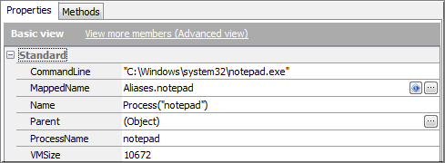
**Figure 8 \--The Basic View**

The Advanced View list includes every possible property of the process. The screenshot below shows the significantly longer list that includes the basic items plus more obscure properties such as \"HandleCount\" and \"ThreadCount\".

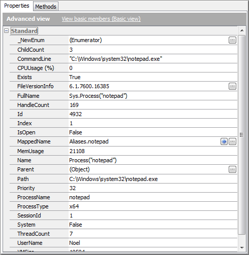
**Figure 9 \--The Advanced View**

If you don\'t see a particular property you think should be available, don\'t forget that you can toggle to the Advanced View for a complete list.

#### Quick Search

Properties and Methods can be instantly filtered using the Quick Search feature. The screenshot below shows \"name\" entered as the search criteria and only the properties that contain \"name\" are listed with the search criteria highlighted. Click the \"x\" button to clear the filter. Use the drop-down list to choose from previous searches.

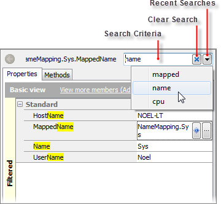
**Figure 10 \--Quick Search**

#### Limitations of the Object Browser

While the Object Browser is a powerful tool that can inspect most applications, there are certain situations where TestComplete is unable to provide access into an objects internal data or sub-controls. For example, if your application uses a grid control that is not specifically supported by TestComplete, you may not be able to easily see the row and column data contained within the control. In such cases you will need to explore alternative mechanisms in order to automate that object. This particular topic can get quite involved and goes beyond the scope of what we can cover in this book.

#### Object Browser Context Menu

The Object Browser Context Menu lets you work with individual processes and windows. The screenshot below shows the context menu for one of the windows in the \"Notepad\" process.

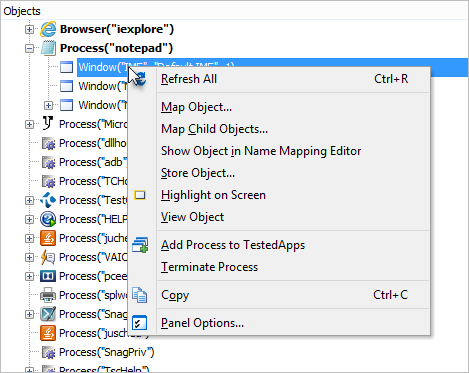
 **Figure 11 \--The Object Brow ser Context Menu**

**Refresh** \-- Reloads the object tree.

**Map Object\...** \-- Name Maps the selected object. See the \"Name Mapping\" topic for more information.

**Map Child Objects\...** \-- Name Maps the child objects of an existing named object.

**Show Object in Name Mapping Editor** \-- Navigates to the Name Mapping Editor and selects the current object. See the \"Name Mapping\" topic for more information.

**Store Object\...** \-- Saves the object and its children in a Store. See the \"Stores and Checkpoints\" topic for more information.

**Highlight on Screen** \-- Places a highlight border on the selected window if the window is visible.

**View Object** \-- Captures a window in the Image Viewer.

**Add Process to TestedApps** \-- Adds the selected process (or parent process if a window is selected) to the TestedApps node.

**Terminate Process** \-- Immediately shuts down the selected process.  It\'s not recommended that you use this option if you can close the  application normally.

**Copy** \-- Makes a copy of the text for the selected node in the Windows clipboard.

**Panel Options\...** \-- Navigates to the main menu\'s **Tools \|Options** page for the Object Browser.

#### TestComplete Toolbars

TestComplete has toolbars configured right out-of-the-box and you can also setup your own toolbars. The Tools and Test Engine toolbars below provide quick access to tasks you want to perform on-the-fly.

**Map Object** \-- Displays the **Map Object** dialog with options to find objects and add them to Name Mapping.

**Object Spy** \-- Displays the **Object Spy** dialog with options to find objects and display their properties and methods.

**Checkpoints** \-- Allows you to add Clipboard and Manual Checkpoints.

**Capture Screen** \-- Captures the current screen and displays in the Image Viewer.

**Open Data Generator Wizard** \-- Opens the data generator to create semi-random data in spreadsheets and variables.

**Record, Run, Stop** \-- The Record button starts recording a keyword or script test and brings up the Recording Toolbar. The Run button begins playing a project or project suite. The Stop button halts a currently playing project or project suite.

**Enable Debugging** \-- When pressed, you can debug your keyword or script test.

**Show Mobile Screen** \-- Displays or hides the **Mobile Screen**.

#### Custom Toolbars

To customize existing toolbars or to create a brand-new toolbar, right-click anywhere in the existing toolbars and select **Customize** from the context menu. This will display the Customize dialog where you can enable, create, edit and delete toolbars. In the Commands tab of the dialog you can find all menu options used in TestComplete. You can drag any of these commands to your toolbars.

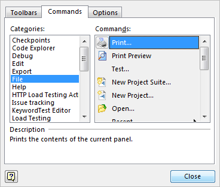
**Figure 12 \--Custom ize Dialog**

**Playback**

Similar to the options for recording tests, TestComplete provides multiple tools for playback. Tests can be executed from the main toolbar or from within the Keyword or Script editors. The Playback Indicator provides additional control and feedback as the test executes.

#### Playback from the Test Engine Toolbar

Individual tests can be run automatically when the project runs. The first step to execute a test as part of a project is to create a **Project Test Item**.

1.  Double click the Project Explorer **Project Node** to display the **Project** tab in the Workspace

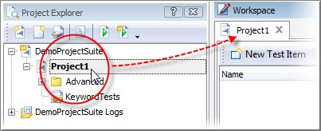
**Figure 13 \--Displaying the Project Tab**

2.  Click the **Test Items** tab at the bottom of the Workspace

3.  From the Project Explorer, drag and drop the desired Keyword Test node onto the Test Items Editor

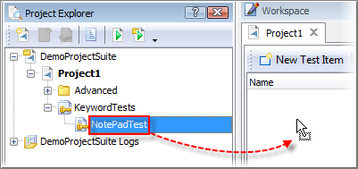
**Figure 14 \--Drag and Drop a Keyw ord Test to Create a New Item**

4.  Once you\'ve created a **Test Item** for the Keyword Test, click the **Run Project** button on the **Test Engine** toolbar to execute all the **Test Items** configured for the project.

**Figure 15 \--Run from Toolbar**

For more information on Project Test Items, see the \"Project Organization\" chapter.

#### Playback from the Project Explorer

Keyword Tests can be manually run from the Project Explorer by right clicking on the Keyword Test node and selecting **Run** from the context menu:

**Figure 16 \--Running a Keyw ord Test**

#### Playback from the Keyword Test Editor

Keyword Tests can also be manually run directly from within the Keyword Test Editor window by using the **Run Test** button on the Editor Toolbar:

**Figure 17 \--Running a Keyw ord Test from Toolbar**

#### Executing Keyword Tests from Script

In addition to the above methods, Keyword Tests can be called directly from a script routine using the KeywordTests object. To create this line of code:

1.  From the Project Explorer expand the **Advanced** and **Script** nodes under your project.

2.  Double click a script unit to display the code editor.

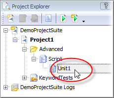
**Figure 18 \--Opening the Code Editor**

3.  At the bottom of the script unit add the following function:

**function** Test()
{

  KeywordTests.Test1.Run();

}

**Sub** 
  Test KeywordTests.Test1.Run
**End Sub**

The screenshot below shows \"Unit1\" with the new \"Test\" function.

**Figure 19 \--Calling a Keyw ord Test from JScript**

#### Playback Indicator

When the test is actually run, the **Playback Indicator** displays status messages and allows you to pause or stop the test.

**Figure 20 \--The Playback Indicator**

**Summary**

In this chapter we toured the TestComplete IDE and overviewed the windows that make up the Workspace and Object Browser. You learned about the layout of the IDE, how project suites and projects are organized and how the TestComplete Object Browser works with processes and applications in your system. You learned about the tools for recording and playing back tests. Finally, you saw how the innovative Test Visualizer allows you to work with visual elements, even when the test is no longer running.