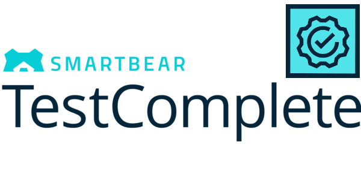

Table of Contents
---------------------------------------------

[Overview of TestComplete](./Overview%20of%20TestComplete/Readme.md)
--------------------------------------------------------

[Keyword Testing](./Keyword%20Testing/readme.md)
--------------------------------------

[Project Organization](./Project%20Organization/readme.md)
------------------------------------------------

[Test Log](./Test%20Log/readme.md)
---------------------------------

[Stores and Checkpoints](./Stores%20and%20Checkpoints/readme.md)
----------------------------------------------------------------

[Name Mapping](./Name%20Mapping/readme.md)
-----------------------------------------

[TestComplete Debugging](./Debugging/readme.md)
--------------------------------------------------

[Event Handling](./Event%20Handling)
-------------------------------------

[Data Driven Testing](./Data%20Driven%20Testing/readme.md)
-----------------------------------------------

[Web Testing](./Web%20Testing/readme.md)
-------------------------------

[Mobile](./Mobile/readme.md)
---------------------

[Web Services Testing](./Web%20Service%20Testing/readme.md)
-------------------------------------------------

[Distributed Testing](./Distributed%20Testing/readme.md)
----------------------------------------

[Manual Testing](./Manual%20Testing/readme.md)
---------------------------------------

[Low Level Procedures](./Low%20Level%20Procedures/readme.md)
---------------------------------------------------

[User Forms](./User%20Forms/readme.md)
--------------------------------

[Best Practices](./Best%20Practices/readme.md)
-------------------------------------

[Appendix A - Cheat Sheet](./Cheat%20Sheet/readme.md)
------------------------------------------------------------

[Appendix B - Types of Testing](./Types%20of%20Testing/readme.md)
-------------------------------------------------------------------