**Table of Contents**

[Overview of TestComplete](./Overview%20of%20TestComplete/Readme.md)
--------------------------------------------------------

[Keyword Testing](#Keyword_Testing)
--------------------------------------

##### [Objectives](#Keyword_Testing)

##### [Materials](#_bookmark62)

##### [Editing Keyword Test Steps](#_bookmark62)

##### [Working with Operations](#Working_with_Operations)

##### [Adding Conditional Logic](#Adding_Conditional_Logic)

##### [Working with Variables](#Working_with_Variables)

##### [Error Handling](#Error_Handling)

##### [Summary](#_bookmark82)

[Project Organization](#Project_Organization)
------------------------------------------------

##### [Objectives](#Project_Organization)

##### [Materials](#_bookmark84)

##### [The Project Workspace Editor](#The_Project_Workspace_Editor)

##### [Lab](#_bookmark92)

##### [Summary](#_bookmark93)

[Test Log](#Test_Log)
------------------------

##### [Objectives](#Test_Log)

##### [Materials](#_bookmark95)

##### [Test Results](#_bookmark95)

##### [Log Window](#Log_Window)

##### [Log Structure](#Log_Structure)

##### [Logged Images](#Logged_Images)

##### [Changing Log Appearance](#Changing_Log_Appearance)

##### [Summary](#_bookmark107)

[Stores and Checkpoints](#Stores_and_Checkpoints)
----------------------------------------------------

##### [Objectives](#Stores_and_Checkpoints)

##### [Materials](#_bookmark109)

##### [About Stores & Checkpoints](#_bookmark109)

##### [Updating Checkpoints](#Updating_Checkpoints)

##### [Summary](#_bookmark135)

[Name Mapping](#Name_Mapping)
---------------------------------

##### [Objectives](#Name_Mapping)

##### [Understanding Name Mapping](#Understanding_Name_Mapping)

##### [Creating Name Mapping](#Creating_Name_Mapping)

##### [Using Name Mapping Editor](#Using_Name_Mapping_Editor)

##### [Unique Identification](#Unique_Identification)

##### [Summary](#_bookmark155)

[TestComplete Debugging](#TestComplete_Debugging)
-----------------------------------------------------

##### [Objectives](#TestComplete_Debugging)

##### [Materials](#_bookmark157)

##### [Debugging Tests](#_bookmark157)

##### [Exploring Debugger Panels](#Exploring_Debugger_Panels)

##### [Summary](#_bookmark168)

[Event Handling](#Event_Handling)
-------------------------------------

##### [Objectives](#Event_Handling)

##### [Materials](#_bookmark170)

##### [Using Events](#_bookmark170)

##### [Creating an Event Handler](#Creating_an_Event_Handler)

##### [Handling Unexpected Windows](#Handling_Unexpected_Windows)

##### [Lab](#_bookmark176)

##### [Summary](#_bookmark179)

[Data Driven Testing](#Data_Driven_Testing)
-----------------------------------------------

##### [Objectives](#Data_Driven_Testing)

##### [Materials](#_bookmark181)

##### [The DB Table Object](#_bookmark181)

##### [Creating a Data Driven Test](#Creating_a_Data_Driven_Test)

##### [Database Table Checkpoint](#Database_Table_Checkpoint)

##### [Summary](#_bookmark193)

[Web Testing](#Web_Testing)
-------------------------------

##### [Objectives](#Web_Testing)

##### [Materials](#_bookmark195)

##### [Web Application Testing Issues](#Web_Application_Testing_Issues)

##### [Understanding The TestComplete View of Web](#Understanding_The_TestComplete_View_of_W)

##### [Applications](#Understanding_The_TestComplete_View_of_W)

##### [Web Tree Models](#Web_Tree_Models)

##### [Web Stores & Checkpoints](#Web_Stores_&_Checkpoints)

##### [Summary](#_bookmark207)

[Mobile](#Mobile)
---------------------

##### [Objectives](#Mobile)

##### [Materials](#_bookmark209)

##### [Mobile Testing Strategies](#_bookmark209)

##### [Mobile Web](#Mobile_Web)

##### [Android](#Android)

##### [Summary](#Xamarin_Open_Apps_Testing)

[Web Services Testing](#Web_Services_Testing)
-------------------------------------------------

##### [Objectives](#Web_Services_Testing)

##### [Materials](#_bookmark230)

##### [Overview of Web Services](#_bookmark230)

##### [Web Service Example](#Web_Service_Example)

##### [Importing a Web Service](#Importing_a_Web_Service)

##### [Lab: Using a Web Service From a Keyw ord Test](#Lab:_Using_a_Web_Service_From_a_Keyword_)

##### [Web Services Checkpoints](#Web_Services_Checkpoints)

##### [Web Services Test Log Results](#Web_Services_Test_Log_Results)

##### [Lab: Using the Web Services Checkpoint From a Keyword Test](#Lab:_Using_the_Web_Services_Checkpoint_F)

##### [XML Checkpoint](#XML_Checkpoint)

##### [Summary](#_bookmark241)

[Distributed Testing](#_bookmark242)
----------------------------------------

##### [Objectives](#_bookmark242)

##### [Materials](#about-the-network-suite)

##### [About the Netw ork Suite](#about-the-network-suite)

##### [Setting up a Distributed Test](#setting-up-a-distributed-test)

##### [Executing Distributed Tests](#executing-distributed-tests)

##### [Lab: Simple Distributed Test](#lab-simple-distributed-test)

##### [Summary](#summary)

[Manual Testing](#manual-testing-2)
---------------------------------------
##### [Objectives](#manual-testing-2)

##### [Materials](#_bookmark267)

##### [About Manual Testing](#_bookmark268)

##### [Creating Manual Tests](#creating-manual-tests)

##### [Manual Test Interaction With Automated Tests](#manual-test-interaction-with-automated-tests)

##### [Exporting a Manual Test](#exporting-a-manual-test)

##### [Importing a Manual Test](#importing-a-manual-test)

##### [Legacy Migration](#legacy-migration)

##### [Summary](#summary-1)

[Low Level Procedures](#low-level-procedures-2)
---------------------------------------------------
##### [Objectives](#low-level-procedures-2)

##### [Materials](#about-low-level-procedures)

##### [About Low Level Procedures](#about-low-level-procedures)

##### [Recording Low Level Procedures](#recording-low-level-procedures)

##### [Calling Low Level Procedures from Keyword Tests](#calling-low-level-procedures-from-keyword-tests)

##### [Summary](#summary-2)

[User Forms](#user-forms-2)
--------------------------------
##### [Objectives](#user-forms-2)

##### [Materials](#Materials)

##### [Using the Designer](#_bookmark297)

##### [Calling User Forms in a Keyword Test](#Calling_User_Forms_in_a_Keyword_Test)

##### [Summary](#_bookmark303)

[Best Practices](#Best_Practices)
-------------------------------------

##### [Objectives](#Best_Practices)

##### [Communicating Test Results](#Communicating_Test_Results)

##### [Plan your testing, but not that kind of planning](#Plan_your_testing,_but_not_that_kind_of_)

##### [Organizing your TestComplete Projects](#Organizing_your_TestComplete_Projects)

##### [Use a Source Control Repository](#Use_a_Source_Control_Repository)

##### [Your Most Important Test](#Your_Most_Important_Test)

##### [General](#General)

##### [Web Page](#Web_Page)

##### [Summary](#Summary)

[Appendix A - Cheat Sheet](#Appendix_A_-_Cheat_Sheet)
------------------------------------------------------------

##### [Keyboard Shortcuts](#Appendix_A_-_Cheat_Sheet)

##### [Keyboard Handling in Recorder](#Keyboard_Handling_in_Recorder)

##### [Configuring Global Shortcuts](#Configuring_Global_Shortcuts)

##### [Configuring Keyboard Emulation](#Configuring_Keyboard_Emulation)

[Appendix B - Types of Testing](#Appendix_B_-_Types_of_Testing)
-------------------------------------------------------------------

##### [Types of Testing](#Types_of_Testing)

### Keyword Testing

1.  []{#Keyword_Testing .anchor}**Keyword Testing**

> **Objectives**
>
> This chapter explains what Keyword Testing is and what it\'s used for.
> You\'ll learn how to create Keyword Tests from multiple points in the
> TestComplete user interface. You\'ll learn how to use the Keyword Test
> Editor to work with existing tests, variables and parameters.

[]{#_bookmark62 .anchor}

> **Editing Keyword Test Steps**
>
> Using the TestComplete Keyword Test Editor is intuitive and supports
> many of the same operations a standard text/code editor supports such
> as cut, copy, paste, undo and selection. Functionally, the editor
> resembles a spreadsheet where you can modify both rows and columns
> within the test.
>
> Test Steps can easily be added or deleted from a Keyword Test. To
> delete a Test Step, simply select the row and press the Delete key. To
> add a Test Step either drag and drop an item from the Operations
> palette onto the test editor, use the editor\'s right click menu and
> select **Insert New Operation** or use the **Append to Test** toolbar
> button to record additional steps onto the end of the current test.
> The screenshot below shows an **If..Then** Operation dragged into an
> existing Keyword Test.

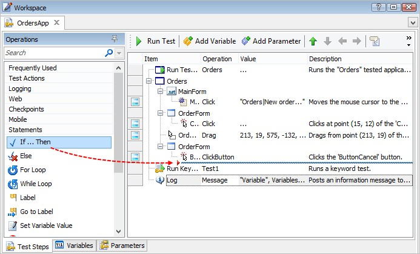{width="5.930250437445319in"
height="3.578957786526684in"}

> **Figure 21 \--Dragging an Operation**
>
> To edit a specific step, double-click the step to invoke the
> corresponding dialog (e.g. On Screen Action, Log Message, and so on) .

#### Editing Item Sub-objects

> By default, the Keyword Test Editor records operations on objects that
> appear in the TestComplete **Object Browser** Tree view. Many of these
> objects include properties which return child objects you may want to
> manipulate in your test. To access these child object properties the
> Keyword Test Editor provides the **Work with Object Through
> Property\...** context menu option. The option allows you to choose a
> specific child object property on which to perform an action.

{width="3.4422200349956253in"
height="2.9609372265966756in"}

> **Figure 22 \--Working w ith Object Child Properties**
>
> For example, if you want to change the scroll position of a window
> that has scrollbars you\'ll need to manipulate the **HScroll** or
> **VScroll** object properties and set the **Pos** property of the
> scrollbar accordingly.

{width="4.389830489938758in"
height="3.0833333333333335in"}

> **Figure 23 \--Selecting the HScroll Property**
>
> []{#Working_with_Operations .anchor}**Working with Operations**
>
> The Operations panel of the Keyword Test Editor contains the list of
> all of the available actions that can be added to a Keyword Test.
> Operations are grouped by category, e.g. the \"Logging\" category
> includes \"Log Message\" and \"Post Screenshot\" Operations.

#### Adding Operations to a Test

> There are several ways to add operations to a Keyword Test including:
> Drag and drop from the Operations palette.
>
> From the right click context menu.
>
> Using the recorder to append new steps to an existing test.

{width="5.950581802274716in"
height="4.311561679790026in"}

> **Figure 24 \--Options for Adding Operations to a Keyword Test**

##### Using the Operations Palette

> Using the mouse, drag and drop an **Operation** from the palette onto
> the **Test Steps** editor at the desired location. Operations can be
> inserted before or after existing steps depending on the placement of
> the mouse at the time of the drop. The mouse cursor will display an
> arrow indicating the specific placement of the new step in relation to
> the other steps. The screenshot below shows a \"Run TestedApp"
> Operation being dragged to the Test Steps editor.

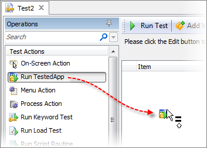{width="3.6812160979877517in"
height="2.6354166666666665in"}

> **Figure 25 \--Dragging and Dropping an Operation**

##### Using the Right Click Menu

> From the editor\'s right click context menu, Operations can be added
> using the **Insert New Operation** submenu. Several common Operations
> are included along with a **More Operations\...** menu item.

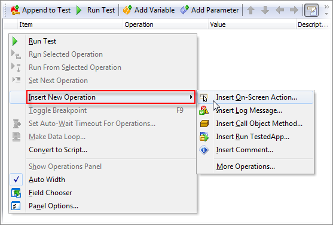{width="5.807069116360455in"
height="3.9270833333333335in"}

> **Figure 26 \--Inserting an Operation Using the Context Menu**
>
> Selecting **More Operations\...** from the **Insert New Operation**
> submenu displays the **Insert Operation** dialog**.** The dialog
> allows you to choose from a complete list of the possible Operations
> available in the Operation palette.

{width="3.764705818022747in"
height="2.6666666666666665in"}

> **Figure 27 \--Using the Insert Operation Dialog**

##### Using the Append to Test Button

> TestComplete provides the ability to append recorded steps to existing
> Keyword Tests using the **Append to Test** tool button on the Keyword
> Editor Toolbar. When this button is clicked, TestComplete minimizes
> and new recorded steps are added at the end of the active Keyword
> test.

{width="3.576489501312336in"
height="0.9384372265966754in"}

> **Figure 28 \--Appending Operations**
>
> []{#Adding_Conditional_Logic .anchor}**Adding Conditional Logic**
>
> Like scripts, Keyword Tests support both branching and looping
> operations allowing you to control the flow of actions performed by
> the test. For conditional logic, TestComplete provides several options
> including \"**If\...Then\", \"Else** and \"**If Object\"** operations.
> To control looping, TestComplete provides \"**For Loop\"** and
> \"**While Loop\"** operations. In this topic we'll examine the **If
> Object** operation.

#### Lab: \"If Object\" Operation

> This example adds logic to take the screenshot only if the sample
> \"Orders\" main window is visible on screen. This example uses the
> \"Orders\" sample application located in your Public Documents folder.
> For help locating the sample projects refer to the TestComplete online
> help and search for \"samples\". To complete these steps, you\'ll need
> to have the \"Orders \"application running on your PC.

3.  Select **File \| New \| New Project\...**

4.  Click the **OK** button on the **Create Project** dialog

5.  Right-click the project node and select **Add \| New Item\...** from
    the context menu. This will display the Create Project Item dialog.

6.  In the Create Project Item dialog, select the Keyword Testing item
    from the list and then click the **OK** button.

7.  Right-click the KeywordTests node and select **Add \| New Item\...**
    from the context menu. This will display the Create Project Item
    dialog.

8.  In the Create Project Item dialog, select the Keyword Test item from
    the list and then click the **OK** button.

9.  Select the **Logging** category within the **Operations** palette,
    then drag and drop the **Post Screenshot** Operation onto the **Test
    Steps** editor. The Post Screenshot dialog will display.

10. From the Post Screenshot dialog, drag the Finder Tool to the
    \"Orders\" window. Click the

> **Finish** button to close the dialog and create the test step.

11. Select the **Test Actions** category within the **Operations**
    palette, then drag and drop the **If Object** operation onto the
    **Test Steps** editor right before our **Post Screenshot** step as
    shown in the screenshot below.

{width="4.321726815398075in"
height="2.2916666666666665in"}

> **Figure 29 \--Adding If..Then Operation**
>
> Notice there is an indicator arrow that will point up-left if the
> Operation will drop above the selected step or down-left if the
> Operation will drop after the selected step.

12. The **If Object** dialog will appear, allowing you to select the
    desired window.

13. With the Orders sample application still open, select the Order\'s
    Main window and click the **Next** button.

{width="5.771734470691164in"
height="5.302083333333333in"}

> **Figure 30 \--\"If Object\" Dialog**

14. Select the **Exists** condition and click **Finish** to complete
    adding the operation to your test.

{width="4.982551399825022in"
height="3.7604166666666665in"}

> **Figure 31 \--Selecting the Condition**

15. Next, indent the **Post Screenshot** step to make it a child step of
    the **If Object**

> operation.

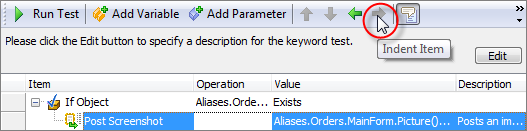{width="5.466100174978128in"
height="1.3509372265966755in"}

> **Figure 32 \--Indenting the Post Screenshot Operation**

16. Run the test with and without the Orders window present.

> We\'ve added conditional logic to our test so the **Post Screenshot**
> step only executes if the Main form of the Orders application Exists.

#### \"If\...Then\" Operation

> We can use the same logic we added above using the **If\...Then**
> operation. The only difference is the structure of the condition used
> in the **If** operation. TestComplete supports a variety of options
> for specifying conditions of a logic statement including:
>
> Constant
>
> Code Expression Variable
>
> Last Operation Result Test Parameter Onscreen Object
>
> By default, an **If\...Then** operation will not contain child
> operations, so the step will have no effect on test execution. Use the
> indent toolbar button to choose which subsequent operation(s) to
> perform when the If statement succeeds. Likewise, to remove a step
> from within an **If\...Then** operation, use the **Outdent** button on
> the editor toolbar. Let\'s take a look\...

1.  To add an **If\...Then** operation to a Keyword Test select the
    Statements category within the Operations palette then drag and drop
    the **If..Then** operation onto the Test Steps editor. Dropping an
    If\...Then operation will invoke the If\...Then dialog to assist
    with constructing a Boolean condition for the operation:

{width="5.38088801399825in" height="3.4375in"}

> **Figure 33 \--If\...Then Dialog**

2.  Click the ellipsis button under the **Value1** column to display the
    Edit Value dialog:

3.  Select **Code Expression** from the **Mode** drop down and type
    \"Aliases.Orders.MainForm. Exists\" as the **Value** then click the
    **OK** button.

{width="3.8167629046369203in"
height="2.7083333333333335in"}

> **Figure 34 \--Edit Value Dialog**

4.  Under the **Value2** column type \"True\" and click the **OK**
    button.

{width="5.38088801399825in" height="3.4375in"}

> **Figure 35 \--Specifying the Condition**

5.  Use the Indent button on the Post Screenshot step to make it a child
    of the If\...Then operation.

> We\'ve now looked at adding \"if\" logic to our Keyword Test using two
> different operations.
>
> []{#Working_with_Variables .anchor}**Working with Variables**
>
> TestComplete includes support for creating user defined **Variables**
> at the **ProjectSuite** and **Project** levels. **ProjectSuite**
> variables can be used throughout all of the projects contained within
> the suite whereas Project variables are limited in scope to the
> project itself.
>
> TestComplete supports two types of variables:
>
> **Persistent** \-- Retain their value between test executions on the
> same machine.
>
> **Temporary** \-- Reset to their default value with each execution of
> the test.
>
> To view ProjectSuite or Project Variables double click the respective
> node from the Project Explorer and select the Variables tab at the
> bottom of the Workspace.

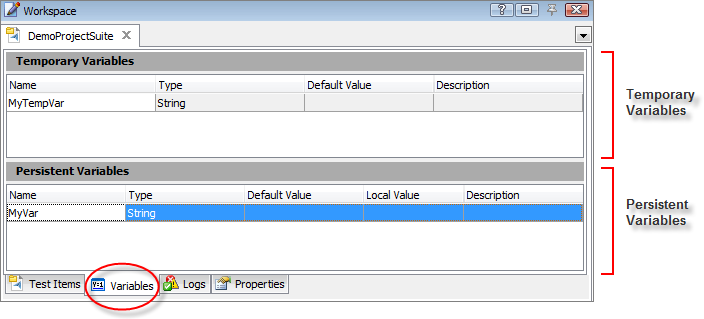{width="5.946475284339457in"
height="2.691561679790026in"}

> **Figure 36 \--Persistent and Tem porary Variables**

#### Temporary and Persistent Variables

> The meanings for Temporary and Persistent Variables columns are
> explained below:

  **Column**          **Description**
  ------------------- --------------------------------------------------------------------------------------------------------------------------------------------------------------------------------------------------------------------------------------------------------------------------------
  **Name**            Specifies the variable name.
  **Type**            Specifies the type of the project or project suite variable.
  **Default Value**   A project can be shared between several testers working on different workstations. The variable values are computer-specific. Using the Default Value column, you can specify the value that will be used when the project is opened for the first time on the remote computer

  **Column**        **Description**
  ----------------- ------------------------------------------------------------------------------------------------------------------------------------------------------------------------------------
  **Local Value**   Specifies the current value of the variable. This value depends on the computer where the project has been opened. Note that the Local Value applies to Persistent variables only.
  **Category**      The category is used to group variables. Use the Field Chooser option on the context menu to view this column. This column is not visible by default.
  **Description**   Any descriptive text related to the variable.

#### Creating and Deleting Variables

> To create or delete variables use the right click context menu of the
> editor:

{width="3.354330708661417in"
height="3.3020833333333335in"}

> **Figure 37 \--Variables Context Menu**
>
> To modify existing variables simply click the appropriate cell within
> the editor to change its value.

#### Lab: Using Variables in a Keyword Test

> In this section will look at an example of using a Project Variable
> within a Keyword Test. First, we\'ll create a new project and declare
> a Temporary project Variable.

1.  Select **File \| New \| New Project\...** and click **OK** on the
    Create New Project dialog

2.  Double click the Project node within the Project Explorer and click
    the **Variables** tab at the bottom of the Workspace:

{width="4.18548665791776in"
height="1.0828116797900262in"}

> **Figure 38 \--Variables Tab**

3.  Right click the **Temporary Variables** section and select **New
    Item.**

{width="3.972832458442695in"
height="2.8541666666666665in"}

> **Figure 39 \--Creating New Variable**

4.  Click the **Name** column and enter \"MyTempVar\". Under the
    **Default Value** column enter \"a Project Variable\" (without the
    quotes)

5.  Right click the **KeywordTests** node in the Project Explorer and
    select **New \| New Item\...** then click **OK** on the Create
    Project Item dialog to create a new Keyword Test.

6.  Click the **Logging** category of the Operations palette and drag &
    drop the **Log Message** operation onto the editor:

{width="3.391874453193351in" height="2.09375in"}

> **Figure 40 \--Adding a Log Message Operation**

7.  Click the **Next** button on the Log Message dialog and then click
    the ellipsis at the far right of row 1 to view the Edit Parameter
    dialog.

8.  In the **Mode** drop down, select **Variable**. In the **Value**
    drop down select Project. Variables.MyTempVar.

{width="5.846792432195976in" height="4.53125in"}

> **Figure 41 \--Selecting a Project Variable**

9.  Click the **Finish** button on the Log Message dialog. When you run
    this test, TestComplete will output the value of the Project
    Variable to the Test Log.

{width="1.9983333333333333in"
height="1.1240616797900262in"}

> **Figure 42 \--Project Variable Value**
>
> In this section, we used a **Project Variable**, though we could have
> used a **ProjectSuite** or
>
> **Keyword Variable** in the same manner.
>
> []{#Error_Handling .anchor}**Error Handling**
>
> Keyword Tests provide support for structured exception handling,
> allowing your tests to manage errors that could change the normal flow
> of your test execution. There are three operations that specifically
> support this style of error handling: **Try**, **Catch**, and
> **Finally.** If you are familiar with exception handling from a
> programming perspective, these operations provide the same level of
> functionality.

#### Error Handling Operations

> These three operations must work in concert with one another, meaning
> that each **Try** operation must be followed by a **Catch** and/or a
> **Finally** Operation. The **Try** operation allows you to group Test
> Steps that may cause a potential error. The **Catch** operation
> handles exceptions thrown by Test Steps that are part of a **Try**
> block/group. The **Finally** operation allows you to perform any steps
> that always need to execute in spite of the fact an error occurred.
> Typically, a **Finally** block is used to restore any resources
> allocated during the steps contained within a **Try** block/group.
>
> Let\'s look at an example of a Keyword Test that utilizes these
> operations. Our focus here isn\'t so much on the error being raised
> rather the structure of the **Try** and **Catch** operations within a
> Keyword Test. For illustration purposes we\'ll use a one line JScript
> function that contains a syntax error that raises an exception.
>
> *// Jscript routine with a syntax error for demonstrating*
>
> *// the Keyword Testing try\...catch handling*
>
> **function** DoSomething()
>
> {
>
> *// Message is spelled incorrectly which raises an exception*
>
> Log.Messag(\"test\");
>
> }
>
> Notice that the call to \"Log.Messag\" is misspelled (missing an
> \"e\") which results in an \"Object doesn\'t support this property or
> method\" exception.
>
> Error handling differs between scripting languages. For more details
> between scripting languages, refer to TestComplete online help.

#### Lab: Error Handling

> In this lab you will first generate an error, then handle it within a
> Keyword Test.

##### Generating an Error

> Let\'s create a Keyword Test that calls this function wrapped with
> **Try** and **Catch** operations to illustrate exception handling
> logic.

1.  Create a new JScript project and add the function below to Unit1
    (You can find the unit under **Advanced \| Script**):

{width="4.826053149606299in"
height="2.5592705599300087in"}

> **Figure 43 \--Adding a JScript Function**

2.  Next, add a new Keyword Test to the project by right clicking the
    KeywordTests node in the Project Explorer and selecting **Add \| New
    Item\...**

3.  Drag and drop the **Run Script Routine** Operation from the **Test
    Actions** group onto the Test Steps list.

4.  On the Select Test dialog, select the \"DoSomething\" routine and
    click the **OK** button:

{width="5.19550634295713in" height="2.9375in"}

> **Figure 44 \--Selecting a Script Routine**

5.  Click the **Run** button on the Keyword Test Editor. You should see
    this dialog and the test execution will end:

{width="3.6323643919510062in"
height="1.6293744531933507in"}

> **Figure 45 \--Runtim e Exception Dialog**
>
> When you look at the resulting log you can see that the test execution
> was interrupted by an exception:

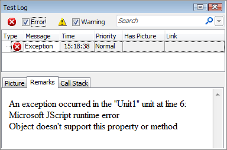{width="4.005352143482065in"
height="2.6458333333333335in"}

> **Figure 46 \--Test Log**

##### Handling the Error

> To catch this error and continue processing we can add the **Try** and
> **Catch** operations bracketing the **Run Script Routine** Operation,
> allowing us to handle the error. To do that:

1.  Drag and drop the **Try** Operation from the **Statements** category
    to a point just above the Run Script Routine step. Next, indent the
    Run Script Routine step so that it appears nested under the Try
    operation:

{width="5.94629593175853in"
height="3.098333333333333in"}

> **Figure 47 \--Adding a Try Operation**

2.  Drag and drop the **Catch** operation below the **Run Script
    Routine**. Use the Indent/ Outdent buttons to make the Try and Catch
    operations appear at the same level, as shown in the screenshot
    below.

{width="5.94629593175853in"
height="3.098333333333333in"}

> **Figure 48 \--Adding a Catch Operation**
>
> At this point, all we need to do is add a **Log Message** Operation
> nested under our **Catch** step so we can output some information and
> illustrate that our Try\...Catch block is working. To do that:

1.  Drag and drop a **Log Message** operation with a simple output
    message:

{width="5.902918853893263in"
height="4.711978346456693in"}

> **Figure 49 \--Adding the Log Message Operation**

2.  Indent the Log Message operation and the resulting Keyword Test
    should look like this:

{width="2.2695352143482066in"
height="1.0931244531933508in"}

> **Figure 50 \--Indented Operation**

3.  Double-click the Project node and navigate to the Properties tab at
    the bottom of the Workspace. In the Playback category of options,
    uncheck the **Error Dialog** and **Stop on Error** check boxes.

{width="4.14383530183727in"
height="2.2916666666666665in"}

> **Figure 51 \--Turning Off Project Options**

4.  Now, run the test again and review the resulting log output. The
    error still occurs, but the Log step from inside the Catch runs.

{width="3.9248392388451445in"
height="1.0931244531933508in"}

> **Figure 52 \--Test Log Output**
>
> []{#_bookmark82 .anchor}**Summary**
>
> In this chapter we looked at what Keyword Testing is and what it\'s
> used for. You learned how to create Keyword Tests from multiple points
> in the TestComplete user interface. You also learned how to use the
> Keyword Test Editor to work with existing tests, variables and
> parameters.

### Project Organization

4.  []{#Project_Organization .anchor}**Project Organization**

> **Objectives**
>
> This chapter examines the Project Workspace Editor and in particular,
> Test Items. You will see how Test Items are used to organize tests
> into larger hierarchical groupings and how to execute a group of tests
> all at one time.
>
> []{#_bookmark84 .anchor}**Materials**
>
> \\Projects\\Project Organization
>
> []{#The_Project_Workspace_Editor .anchor}**The Project Workspace
> Editor**
>
> Although the Workspace Panel holds all the possible editors that can
> be opened by double-clicking nodes in the Project Explorer, the
> **Project Workspace Editor** is a \"key player\". Using the Project
> Workspace Editor, you can organize tests into lists that can be
> configured, executed and logged as one entity under the **Test Items**
> tab.
>
> The Project Workspace Editor displays in the Workspace Panel when you
> open a project in the Project Explorer. Other tabs let you define
> variables available to the entire project, track issues, look at the
> logs for the project and define properties.

#### Test Items

> Use Test Items to reuse tests and to organize tests into larger
> groups. The Project Workspace Editor also controls how many times each
> test executes and how TestComplete should react if an error occurs.
>
> The screenshot below shows that both keyword and script tests can be
> organized into nested folders, renamed with friendly names and
> configured. The Test Items tab in the screenshot below shows a \"Smoke
> Tests\" group that contains an \"Order Entry\" group. Inside the
> \"Order Entry\" group is yet another group called \"Create Order\"
> that contains both keyword and script tests. Notice that you can place
> tests and/or groups at any level.

{width="5.8895056867891515in"
height="4.229166666666667in"}

> **Figure 53 \--The Project Workspace Editor**
>
> If you click the **Run Project** button from the main toolbar, a
> dialog like the one in the screenshot below may display complaining
> that there are no \"test items\". This dialog is telling you that you
> need to navigate to the project\'s Test Items and add tests.

{width="5.711650262467192in"
height="1.423124453193351in"}

> **Figure 54 \--The \"no selected test item s\" Dialog**

##### Adding Test Items

> Add items to the Test Items grid by either dragging tests from the
> Project Explorer, using the context menu or the toolbar. The
> screenshot below shows a script test being dragged and added as a Test
> Item.

{width="5.946353893263342in"
height="2.3785411198600177in"}

> **Figure 55 \--Adding Tests**
>
> You can only drag script units that contain at least one function and
> that have no syntax errors. Dragging a script unit to the test Items
> area includes all the functions within that unit. To be more
> selective, click the **Test** column and choose a single function for
> that test item.

##### Test Items Columns

> Each line in the Test Items grid represents either a folder or a test.
> You can disable an item from being run by unselecting the checkbox.
> This prevents the item and any of its children from running.

{width="5.843654855643044in"
height="0.7631244531933509in"}

> **Figure 56 \--Colum n Headings**
>
> **Name** \-- The friendly name of the test item as it will appear in
> the log.
>
> **Test** \-- The name of the test for that Test Item. This can be a
> keyword test, script, low level procedure etc.
>
> **Count** \-- The number of times the Test Item will run. By default,
> the value for this column is one. Use the up-down arrows in the column
> to adjust the count.
>
> **Timeout** \-- The maximum number of minutes the test item can run
> before timing out, generating an OnTimeout event and posting an error
> message in the log. Use the up- down arrows in the column to adjust
> the timeout.
>
> **Parameters** \-- This column lists parameters passed to the Test
> Item. The parameters are picked up automatically when a test is
> assigned. Click the ellipses in the column to display the **Test
> Parameters** dialog where you can adjust the **Value** for each
> parameter.

{width="3.2914785651793528in"
height="3.3541666666666665in"}

> **Figure 57 \--Test Item Param eters**
>
> **Description** \-- A user friendly description of the Test Item.
>
> **Stop on Error**, **Stop on Exception** \-- You can specify the
> behavior of a test item after an error or exception. \"Errors\" can
> occur during the execution of script code and \"exceptions\" can occur
> in the application under test. The possible options you can choose
> from the drop-down list in the columns are \"None\" to ignore the
> error or exception and continue, \"Project\" to stop execution of the
> entire project if an error or exception occurs and \"Test Item\".
> \"Test Item\" is the default and stops execution for the current item
> and its children but allows the sibling items and higher to continue.
>
> By default, **Stop on Error** and **Stop on Exception** columns don\'t
> appear. To add them, right-click the Test Items grid and select Field
> Chooser from the context menu. The Customization dialog will appear
> with any columns that aren\'t showing. Drag columns to the grid
> heading, watching for the arrow indicators to show where the column
> will be inserted. You can also remove columns by dragging them back to
> the Customization dialog.

{width="2.6677482502187226in"
height="1.5778116797900263in"}

> **Figure 58 \--Adding Colum ns**

##### Test Items Toolbar

> The toolbar and context menu for the Test Items area have roughly the
> same options that allow you to build the structure of the Test Items
> tree view.

{width="5.506196412948381in"
height="0.7940616797900263in"}

> **Add Child Test Item \--** Adds a child test item just below the
> selected item. You can use the context menu to add a new top level
> item.
>
> **Add Group \--** Adds a top level folder that can contain other
> folders and tests.
>
> **Add Subgroup \--** Add a child folder under the selected test item.
>
> **Delete \--** Remove the selected item permanently.
>
> **Run Selected \--** Run the selected test item and any children.
>
> **Jump to Test \--** Open up the keyword or script test.
>
> **Move Items \--** Move test items up/down/indent/outdent in the list.
>
> **Enable/Disable \--** Enable or disable items. Options from
> left-to-right are Enable All, Disable All, Toggle All, Enable Selected
> and Disable Selected.

#### Variables

> The **Variables** tab of the Project Workspace Editor allows you to
> define **Temporary Variables** that are active only during one test
> run and **Persistent Variables** that are available between tests
> runs.

{width="5.205701006124235in"
height="2.9791666666666665in"}

> **Figure 59 \--Variables**
>
> **Name** \-- The name of the variable. The name must be alpha-numeric,
> must not contain spaces and must start with an alpha character. If
> these naming rules are not followed, Name entry reverts to its
> previous contents when you press enter.
>
> **Type** \-- The type of data that will be stored in the variable.
> Both Persistent and Temporary variables can store Integer, Double,
> String and Boolean types. Temporary variables can also store Object,
> DB Table and Table types.
>
> **Default Value** \-- The value when the project is first opened on a
> remote computer.
>
> **Local Value** \-- The current value of the variable on the computer
> where the project is opened. The Local Value column is only available
> for Persistent variables.
>
> **Description** \-- A user friendly description of the variable.
>
> **Category** \-- An arbitrary category that you can assign to make it
> easy to sort and filter variables. This column is not visible by
> default. Use the Field Chooser option on the context menu to view this
> column.

#### Issue Tracking Templates

> The Issue Tracking Templates tab allows you to establish connections
> to a bug tracking system such as Visual Studio Team System or Bugzilla
> and have TestComplete post results directly to those systems.
>
> []{#_bookmark92 .anchor}**Lab**
>
> In this Lab you will use Test Items to build a \"Smoke Test\" from
> other tests.

17. Create a new project called \"MyProject\".

18. Create four Keyword tests and name them \"Login\", \"Logout\",
    \"AddOrderHeader\", \"AddOrderDetail\". You can use Keyword Tests or
    Script tests. If you use Script, you must place at least one
    function in each so they will be recognized by the Project Test Item
    editor.

19. Double-click the \"MyProject\" node in the Project Explorer.

20. In the Test Items window, click the **Add New Group** button on the
    toolbar. Click the group and rename it \"Smoke Test\".

{width="4.452789807524059in"
height="1.5984372265966753in"}

> **Figure 60 \--Adding and Renam ing a Group**

21. Click the **Add Subgroup** button and rename the subgroup \"Order
    Entry\".

{width="4.272753718285214in"
height="1.8356244531933508in"}

> **Figure 61 \--Adding and Renam ing a Subgroup**

22. From the Project Explorer, drag the \"Login\" test and drop it on
    the \"Order Entry\" group.

{width="6.232737314085739in"
height="2.4660411198600176in"}

> **Figure 62 \--Adding a Test**

23. Click the \"ProjectTestItem1\" and rename the test item \"Login\".

24. Repeat dragging tests \"AddOrderHeader\", \"AddOrderDetail\" and
    \"Logout\" to the \"OrderEntry\" subgroup and name them \"Add Order
    Header\", \"Add Order Detail\" and \"Logout\", respectively. The
    Test Items should now look like the screenshot below.

{width="3.8528805774278214in"
height="1.4746872265966755in"}

> **Figure 63 \--Project Test Item s**

25. Click the **Run Project** button from the TestComplete toolbar.

{width="1.7737489063867016in"
height="0.8868744531933508in"}

> **Figure 64 \--Running the Project**

26. When the test completes, the test log will display. Notice that the
    structure of the log matches the structure of the test items.

{width="2.907415791776028in"
height="2.6145833333333335in"}

> **Figure 65 \--Test Log**
>
> []{#_bookmark93 .anchor}**Summary**
>
> In this chapter you examined the Project Workspace Editor and in
> particular, Test Items. You saw how Test Items are used to organize
> tests into larger hierarchical groupings and how to execute a group of
> tests all at one time.

### Test Log

5.  []{#Test_Log .anchor}**Test Log**

> **Objectives**
>
> This chapter discusses the test log and the types of messages
> available in TestComplete. You will learn how to navigate, analyze and
> share the test log. You will learn about the Log Window user
> interface, about the types of available logging message and how images
> are logged. You will learn how to structure Test Log folders and
> change the appearance of messages. You will also learn how to view
> test logs in Internet Explorer and how to communicate your test
> results by email.

[]{#_bookmark95 .anchor}

> **Test Results**
>
> Up to this point we\'ve focused on building tests and playing them
> back. Another key element of testing is analyzing and communicating
> the test results. TestComplete includes a **Log Window** to review all
> of the output produced during a test run. It\'s important to
> understand how TestComplete manages log output so we\'ll start by
> looking at the Project Explorer. At the bottom of the Project Explorer
> window is a node which contains all of the log output for all projects
> contained within the ProjectSuite. Expanding this node lets you see
> all of the test executions for a given project. To view the Log
> Window, simply double click one of the **Project Log** nodes as
> illustrated below:

{width="3.572620297462817in"
height="3.6770833333333335in"}

> **Figure 66 \--Opening a Log**
>
> []{#Log_Window .anchor}**Log Window**
>
> Logs are used to persist feedback from your tests including errors,
> warning messages and events as well as entire files and images. Logs
> are stored in a directory as XML files. The Log Window displays all of
> the output produced by the test and is divided into several regions,
> as shown in the screenshot below.

{width="5.8924704724409445in"
height="4.620937226596675in"}

#### Test Log Pane

> This panel displays the actual log output from the test including
> **Errors**, **Warnings**, **Messages**, **Events**, and **Images**.
>
> Each of the above types has a unique glyph and can be filtered using
> the check boxes found at the top of the **Test Log** pane. Notice in
> the screenshot below that **Error** items are *not* displayed and the
> yellow bar to the left of the list indicates the view is filtered.

{width="5.022623578302712in" height="2.3125in"}

> **Figure 67 \--The Filtered Test Log**
>
> To fine-tune filtering behavior, right-click the log and choose
> **Filter Data** from the context menu. This displays the Filter
> Builder dialog. The Simple Filter tab of the dialog lets you choose
> from the same set of categories available directly in the log window.
> Log messages can be organized in a tree structure. The **Show all
> parents** and **Show all children** check boxes allow all parents and
> children of a log message to display.

{width="4.964430227471566in" height="3.09375in"}

> **Figure 68 \--The Filter Builder**
>
> The **Extended Filter** tab allows you to build complex filters
> complete with AND/OR/NOT AND/NOT OR sections. The first part of each
> statement can be clicked to get a list of log elements that can be
> used such as \"Priority\" or \"Message\". The next link will display a
> list of comparison operators that work with the first part of the
> statement. The last part of the statement will be a value to compare
> against.

{width="4.964430227471566in" height="3.09375in"}

> **Figure 69 \--The Extended Filter**

#### Picture Tab

> The **Test Log** can also display pictures captured during the test
> execution. For example, you can post a screenshot using the Log object
> in your script or keyword test. Here is an example of a screen capture
> displayed in the **Test Log** upon completion of the test.

{width="5.935445100612424in"
height="3.311353893263342in"}

> **Figure 70 \--Picture Window of the Test Log**

#### Additional Information

> The **Additional Information** of the **Test Log** pane contains
> information associated with a specific **Test Log** item (if any). For
> example, Log Message includes a Remarks parameter that can be used to
> add straight text or HTML.

{width="5.771224846894138in"
height="1.588124453193351in"}

> **Figure 71 \--Additional Inform ation**
>
> []{#Log_Structure .anchor}**Log Structure**
>
> You can create a hierarchical structure via creating and pushing log
> folders onto the log using the Log object. Here are **Log** object
> methods that can be used to restructure the log:
>
> **AppendFolder:** Creates a folder in the test log and activates this
> folder.
>
> **PopLogFolder:** Pops the folder that is currently at the top of the
> folder stack out of the stack. The folder left at the top of the stack
> is now the default folder of the test log.

{width="3.2919225721784775in" height="1.485in"}

> **Figure 72 \--Hierarchical Structure in Log**
>
> All messages by default go into the active log folder (i.e., the top
> of the stack). Each \"AppendFolder\" moves the logging inside a folder
> and each \"PopLogFolder\" moves the logging out one level.

#### Logging in Keyword Tests

> The Keyword Test shown in the screenshot below creates the log shown
> in the preceding topic. Simply use **Append Log Folder** to add a
> folder and make that the active folder so that all logged messages and
> new folders are created inside of the folder. Use **Pop Log Folder**
> to move one level outside the current folder.

{width="5.967701224846894in"
height="1.8112489063867017in"}

> **Figure 73 \--Appending and Popping Log Folders**
>
> []{#Logged_Images .anchor}**Logged Images**
>
> TestComplete automatically takes screenshots of Test Steps as they are
> recorded and another set during the test playback. As you click
> through the test log you can see the recorded **Expected Image** next
> to the **Actual Image** recorded during the test playback.

{width="5.9375in" height="3.28125in"}

> **Figure 74 \--Logged Im ages**

#### Image Toolbar

> The toolbar for the **Actual Ima**ge is shown in the screenshot below.

{width="3.7275820209973753in"
height="0.8353116797900263in"}

> **Figure 75 \--Actual Im age Toolbar**
>
> The **Synchronize View** button is on by default and simply makes the
> Expected and Actual Image stay together as you scroll the window, e.g.
> when you scroll the Expected Image window to the right, the Actual
> Image will also scroll to the right.
>
> The **View Comparison Result** button makes analyzing the log quicker.
> When this button is pressed, the Actual Image shows the pixel
> differences between the two images in red. In the screenshot below,
> the Expected Image shows that **Customer Name is** \"Bart Simpson and
> the actual image is \"Marge Simpson\". Toggling the **View Comparison
> Result** button makes changes stand out in red. The button's drop-down
> sets the background to white, light or dark.

{width="5.920659448818897in"
height="3.5523950131233595in"}

> **Figure 76 \--Expected and Actual Im ages**
>
> []{#Changing_Log_Appearance .anchor}**Changing Log Appearance**
>
> If you need to make a logged message or remarks stand out, you can
> format both the Message and the Remarks. The formatting can apply to
> messages, folders and logged images. The screenshot below shows the
> log message \"Incomplete results\" where the background is green and
> the font is red, bold and italic. In the Remarks section, the last
> sentence is actually a bit of HTML surrounded by bold \"\<b\>\" tags.
>
> The topic that follows will show you how to achieve a similar result.

{width="5.923784995625547in"
height="3.78625in"}

> **Figure 77 \--Form atted Log Message and Rem arks**

#### Formatting the Log with Keyword Operations

> The formatted message requires two Operations, both from the Logging
> section of the Operations palette. The **Log Attributes** Operation
> configures how following log messages are formatted. The **Log
> Message** Operation then specifies the Log Attributes in its Attrib
> property.

{width="5.9703838582677164in"
height="2.0425in"}

> **Figure 78 \--Log Attributes and Message**
>
> When you drop the Log Attributes Operation, a dialog will appear where
> you can set the **Message** font color, background and formatting. The
> **Remarks** can be formatted as either \"HTML\" or \"Plain Text\". In
> this example we\'re using the HTML format.

{width="3.4280555555555554in" height="3.125in"}

> **Figure 79 \--Setting Log Attributes**
>
> When you add the Log Message Operation to the test you need to
> surround the message with \<HTML\> tags and any other HTML formatting
> you want showing in the Remarks. The example below surrounds the
> second sentence with Bold \"\<b\>\" tags.

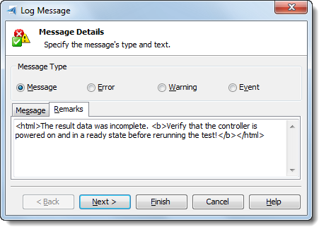{width="4.702015529308836in" height="3.34375in"}

> **Figure 80 \--Entering HTML Rem arks**
>
> To have the Log Message use the Log Attributes, click the ellipses for
> the Attrib and set the Mode to \"Last Operation Result\".

{width="5.933474409448819in"
height="4.913333333333333in"}

> **Figure 81 \--Setting the Log Message Attrib**
>
> []{#_bookmark107 .anchor}**Summary**
>
> In this chapter you became familiar with the test log and the types of
> messages available in TestComplete. You learned how to navigate,
> analyze and share the test log. You learned about the Log Window user
> interface, about the types of available logging message and how images
> are logged. You learned how to structure Test Log folders and change
> the appearance of messages. You also learned how to view test logs in
> Internet Explorer and how to communicate your test results by email.

### Stores and Checkpoints

6.  []{#Stores_and_Checkpoints .anchor}**Stores and Checkpoints**

> **Objectives**
>
> This chapter shows how to leverage the TestComplete Stores and
> Checkpoints features to quickly add validation to your automated
> tests. We\'ll take a look at creating each of the built-in Checkpoints
> provided with TestComplete and examine the Update logic that allows
> you to refresh your project\'s test data automatically.

[]{#_bookmark109 .anchor}

> **About Stores & Checkpoints**
>
> The real benefit of automation is realized by validating that the
> application being tested is producing the expected results. Stores and
> Checkpoints provide the ability to perform comparisons of expected
> versus actual data and help control the flow of your tests by using
> the results of these comparisons during test execution. Checkpoints
> can optionally log comparison results helping speed test development
> and freeing the tester to focus on the tests rather than log file
> output. TestComplete provides a variety of Stores and Checkpoints,
> many of which allow complex data comparisons using a single operation.
>
> In this chapter we\'ll illustrate creating some of these checkpoints
> using the C\# version of the \"Orders\" Sample application included
> with TestComplete.
>
> Here is a screenshot of the main form of the TestComplete Orders
> application used within this chapter to illustrate Checkpoints. The
> Orders application is displaying test data from the \"MyTable.tbl\"
> data file included with TestComplete.

{width="5.957095363079615in"
height="3.1666666666666665in"}

> **Figure 82 \--TestCom plete Orders Sam ple Application**

#### Creating Checkpoints

> The Checkpoint Wizard and the individual Checkpoint types can be
> invoked from multiple locations.
>
> Checkpoints can be created during a recording session from the drop
> down on the recording toolbar:

{width="4.221163604549432in"
height="3.4270833333333335in"}

> **Figure 83 \--Recording Toolbar Checkpoints Menu**
>
> You can add Checkpoints via drag/drop from the Checkpoint section of
> the Operations palette in a Keyword test. You can also drag/drop the
> Checkpoint Wizard which will help you choose the most appropriate
> Checkpoint for a given scenario.

{width="2.018757655293088in"
height="2.5208333333333335in"}

> **Figure 84 \--Checkpoint Operations**
>
> You can create Checkpoints from the toolbar on the Script Editor.

{width="3.030452755905512in" height="3.28125in"}

> **Figure 85 \--Checkpoints Script Editor Toolbar Menu**

#### Checkpoint Wizard

> TestComplete provides a **Checkpoint Wizard** designed to help create
> the most appropriate type of checkpoint. The first page of the
> Checkpoints Wizard looks like the screenshot below:

{width="5.902430008748906in"
height="5.312187226596675in"}

> **Figure 86 \--The Checkpoint Wizard**
>
> The wizard does not support Checkpoints added to TestComplete through
> Script Extensions. Script Extensions are plug-in functionality to the
> TestComplete environment.
>
> The Checkpoint Wizard doesn\'t actually \"create\" Checkpoints.
> Instead, it prompts the user through a series of questions to
> determine which of the built-in Checkpoints best matches the given
> scenario. Once the wizard has been completed clicking the **Finish**
> button launches a Checkpoint specific wizard for completing the
> creation of the desired Checkpoint. Once you\'re familiar with the
> available Checkpoints, you can bypass the wizard and directly select
> the specific Checkpoint.

#### Selecting an Object

> TestComplete provides wizards to help create supported Checkpoint
> types. Typically you will select an onscreen object from which to
> capture test data that\'s maintained under the Stores folder as part
> of your project. There are three options:

{width="5.968567366579178in"
height="1.8010411198600176in"}

> **Figure 87 \--Object Selection Options**
>
> Using the **Drag the target to point to the object** simply drag the
> cross hairs to the desired onscreen object for selection. If dragging
> the mouse interferes with object selection, you can use the **Point
> and fix** method instead. Position the mouse over the desired object
> and press **Shift+Ctrl+A** to select the object. If necessary you can
> reconfigure the shortcut using **Tools \| Options \| General \| Global
> Shortcuts.** The third option lets you select an object from the
> Visualizer window.

#### Property Checkpoint

> The **Property Checkpoint** is perhaps the simplest of all Checkpoints
> and is used to examine a single property of an object.
>
> While the Property Checkpoint is quick and easy to create, it\'s
> restricted to a single property of an object and has several
> disadvantages when compared to an **Object Checkpoint**. You should
> consider the following when using this Checkpoint:
>
> Test data for a Property Checkpoint is stored as part of the
> Checkpoint itself and does not leverage the Stores folder. To update a
> Property Checkpoint that has new data, you have to search for and
> update the steps manually.
>
> Property Checkpoints do not support the update logic discussed at the
> end of this chapter and therefore need to be manually updated when
> there is a change in the test data.

##### Define the Property Checkpoint

27. Create the Property Checkpoint using one of the methods described in
    the [Creating Checkpoints](#creating-checkpoints) topic. This will
    display the **Create Property Checkpoint** wizard.

28. Using the **Drag the target to point to the object** option,
    drag/drop the crosshairs onto the main form of the Orders Sample
    application, then click the **Next** button.

29. On the **Create Property Checkpoint** page, first click the **View
    more members** link to see all properties.

{width="3.0914359142607175in"
height="1.11375in"}

> **Figure 88 \--View ing All Properties**

30. Also in the **Create Property Checkpoint** page, choose the
    **WndCaption** property:

{width="4.130188101487314in" height="1.65in"}

> **Figure 89 \--Selecting the WndCaption Property**

31. Click the **Next** button to specify the type of comparison. Select
    **Starts with** from the **Condition** drop down list, clear the
    Case sensitive check box and enter \"orders\" to the **Value** text
    box.

{width="2.9252701224846893in"
height="3.5416666666666665in"}

> **Figure 90 \--Setting Comparison Parameters**

32. Click the **Finish** button to complete the Checkpoint.

##### Use Property Checkpoints from a Keyword Test

> 1\. After clicking the Finish button you will return to the Keyword Test
> Editor where you can see a new item has been added:

{width="5.9703838582677164in"
height="0.6808333333333333in"}

> **Figure 91 \--The New Property Checkpoint**
>
> It\'s that simple to create a Checkpoint to verify onscreen data
> during your test. Many of the following Checkpoints function in the
> same manner with the exception being that the test data is saved under
> the Stores folder of your project. In the case of a Property
> Checkpoint the test data is part of the Property Checkpoint item
> itself.

#### Object Checkpoint

> The **Object Checkpoint** is an incredibly powerful tool for
> performing validation of test data. Unlike the **Property Checkpoint**
> which verifies a single piece of data the Object Checkpoint can
> validate an entire set of objects and optionally include their
> children. The data for an Object Checkpoint is placed under the Stores
> node of the project allowing you to easily examine and modify the test
> data.

##### Define the Object Checkpoint

1.  For this example, first select **Orders \| New Order\...** from the
    main menu of the Orders sample application.

2.  Create the Property Checkpoint using one of the methods described in
    the [Creating Checkpoints](#creating-checkpoints) topic. This will
    display the Create Object Checkpoint wizard:Using the **Drag the
    target to point to the object** tool to select the Group box
    containing the data entry controls on the New Order dialog. Drag and
    drop the crosshairs on any open spacing within the Group box (the
    large bounding rectangle on the dialog). Here is the order dialog
    displaying the first record of the MyTable.tlb test data included
    with the sample application with the group box highlighted during
    object selection:

{width="5.1877132545931754in"
height="5.083333333333333in"}

> **Figure 92 \--New Order Dialog**

3.  After selecting the group box, the Create Object Checkpoint dialog
    shows the \"Aliases. Orders.OrderForm.Group\" object is selected and
    the screenshot of the object is displayed in the Preview section of
    the dialog. Click the **Next** button to continue.

{width="6.222974628171478in"
height="5.620416666666666in"}

> **Figure 93 \--The Selected OrderForm Group Box**

4.  The **Create Object Checkpoint** dialog displays. Leave the default
    selection, **Retrieve data from an object** and then click the
    **Next** button.

> {width="5.908513779527559in"
> height="2.6329166666666666in"}
>
> **Figure 94 \--Create Object Checkpoint Dialog**

5.  You can validate the data in multiple controls using a single Object
    Checkpoint. Select the **Store data of the select object and its
    children** option.

{width="5.92178915135608in" height="2.67in"}

6.  The list of objects involved in the checkpoint displays. Click the
    **Properties\...** button.

{width="5.921666666666667in"
height="5.921666666666667in"}

7.  The Store Object Properties dialog displays. Select specific
    properties for each object to include in the Checkpoint by using the
    property selection buttons to move properties in and out of the
    Selected Properties list.

> By default, TestComplete will choose a base set of properties for each
> control and indicate the number of selected properties in the Select
> Properties column of the tree view. In this example, we\'ll modify the
> Checkpoint to store only data from a subset of edit controls contained
> within the Group box. Click the **OK** button to close the Store
> Object Properties dialog.

{width="5.879794400699913in"
height="4.033332239720035in"}

> **Figure 95 \--Store Object Properties Dialog**

8.  Click the **Finish** button to create the new Object Checkpoint.
    Under **Stores \| Objects** in the Project Explorer. You can find
    the new checkpoint. In the editor, you can select the name, click
    the F2 button and edit the name.

{width="6.25793416447944in"
height="2.6640616797900263in"}

> **Figure 96 \--Setting the Stores Object Nam e**

##### Using Groups within an Object Checkpoint

> You\'ll notice from the [[above
> example]{.underline}](#define-the-object-checkpoint), if you\'re
> working with a UI containing many similar controls such as edit boxes
> it can be tedious to select specific properties for each control.
> TestComplete solves this problem with the **Edit Groups\...** feature
> which allows you to create groups of controls based on the class names
> of each control. The Edit Groups\... feature is invoked from the
> **Store Object Properties** dialog.
>
> Using the **Edit Groups\...** button you can add a group, provide a
> class name that will be used to select the objects that should be in
> the group and the properties that should be selected by default. In
> the screenshot, the \"Edit Boxes\" group looks for classes that
> contain \"EDIT\". When you close the **Edit Groups** dialog, the
> selected objects list will automatically find the objects where the
> WndClass contains \"EDIT\".

{width="5.908968722659668in"
height="4.789374453193351in"}

> **Figure 97 \--Editing Groups**
>
> Let\'s take a look at an example of grouping the Edit style controls
> on the Orders dialog allowing us to configure the properties for all
> edit boxes simultaneously. Here are the steps to use the **Edit
> Groups\...** feature.

1.  On the **Store Object Properties** dialog click the **Edit
    Groups\...** button.

{width="2.790845363079615in"
height="1.0621872265966754in"}

> **Figure 98 \--Clicking Edit Groups\...**

2.  In the Edit Groups dialog click the **Add** button.

{width="5.664337270341207in"
height="3.1458333333333335in"}

> **Figure 99 \--The Edit Groups Dialog**

3.  Type \"Edit\" (without the quotes) for the group name.

4.  In the \"Group Class Names\" edit box enter \"\*EDIT\*\" (without
    quotes).

5.  In the \"Properties Selected by Default\" edit box, enter
    \"Enabled\", \"Visible\" and \"WndCaption\".

{width="5.663265529308837in"
height="3.34375in"}

> **Figure 100 \--The Modified Edit Groups Dialog**

6.  Click the **OK** button and notice the grouping of the Edit boxes in
    the tree view on the left. Also notice that as you click between
    objects that the same Selected Properties show up for each object in
    the \"Edit\" group.

{width="2.7186701662292214in"
height="2.7395833333333335in"}

> **Figure 101 \--The Grouped Properties**

7.  Select the check boxes on the left to only include the \"Customer\",
    \"CardNo\", \"Zip\", \"State\", \"City\" and \"Street\".

{width="6.212676071741033in" height="2.79in"}

> **Figure 102 \--Selecting Properties**

8.  Finally, click the **OK** button to return to the Create Object
    Checkpoint dialog and complete the Checkpoint.

##### Modifying an Existing Object Checkpoint

> To edit an existing Checkpoint, simply double click the name of the
> Checkpoint under the
>
> **Stores** node in the Project Explorer**:**

{width="5.888020559930009in"
height="4.09062445319335in"}

> **Figure 103 \--Object Checkpoints Editor**
>
> Use the **Edit\...** button to add or remove objects and properties
> from the Checkpoint. Also, notice the Update column on the left-hand
> window of the Workspace which contains a checkbox that allows you to
> update the information stored by this Checkpoint during test execution
> rather than comparing the data.
>
> For more on updating Checkpoints refer to the [[Updating
> Checkpoints]{.underline}](#Updating_Checkpoints) topic.

#### Region Checkpoint

> The **Region Checkpoint** is useful for comparing data captured
> directly from an onscreen object or a specific rectangle within an
> object. The data for Region checkpoints is located under the **Stores
> \| Regions** node in the Project Explorer. Like the Property
> **Checkpoint,** the **Region Checkpoint** also has disadvantages since
> the data being captured must match exactly pixel-for-pixel. Here are a
> few recommendations:
>
> Keep your Regions small.
>
> Avoid capturing any portion of the screen containing elements that are
> specific to a particular version of Windows such as dialog borders,
> window captions or buttons.
>
> Fortunately, TestComplete handles themed windows and transparency
> automatically. For example, if we look at the Notepad application with
> two different Windows themes active, the windows might look like the
> screenshots below with the green and purple borders, respectively.
> TestComplete takes the transparent \"alpha\" into account and
> considers the two images identical.

{width="4.874561461067366in"
height="2.4895833333333335in"}{width="4.82581583552056in"
height="2.4646872265966753in"}

##### Comparison Parameters

> The **Comparison Parameters** of the Region Checkpoint also help allow
> for known differences.
>
> **Pixel Tolerance**: Number of pixels allowed to be different between
> the stored region and the onscreen region.
>
> **Color Tolerance**: A number between 0..255 that allows color
> differences between two images. If zero, then pixels in the two images
> must have exactly the same color. If 255, pixels of any color are
> considered identical.
>
> **Mask**: The path to a black and white image where only the pixels
> underlying the white portion of the image are taken into account.
>
> **Transparent**: If true, the topmost left pixel is treated as the
> transparent color.
>
> **Include Mouse Pointer**: If true, the image of the mouse cursor will
> be captured in the compare.

##### Define the Region Checkpoint

> For this example, rather than using a data entry application we\'ll
> use a web page containing an image to illustrate the Region
> Checkpoint.

1.  Create the **Region Checkpoint** using one of the methods described
    in the [Creating Checkpoints](#creating-checkpoints) topic. This
    will display the **Create Region Checkpoint** wizard.

2.  Launch a browser and navigate to
    [[http://news.google.com/news/]{.underline}](http://news.google.com/news/).

3.  Using the **Drag the target to point to the object** option,
    drag/drop the crosshairs onto the Google logo. Click the **Next**
    button to continue.

4.  Leave the default **Capture an image of a window or control** option
    selected. Click the

> **Next** button to continue.

{width="5.905129046369204in"
height="3.439478346456693in"}

> **Figure 104 \--Im age Options**

5.  This page allows you to tweak comparison parameters to ignore a
    certain amount of pixels or colors. Leave the default settings and
    click the **Next** button.

> {width="5.904242125984252in"
> height="3.5321872265966756in"}
>
> **Figure 105 \--Comparison Parameters**

6.  This page allows you to \"mask\" areas of the image from the
    comparison. Leave the defaults and click the **Finish** button.

{width="5.899283683289589in"
height="2.8461450131233597in"}

#### Table Checkpoint

> The **Table Checkpoint** is useful for comparing tabular data captured
> from an onscreen control. A tabular control is any control that
> TestComplete can accurately recognize as containing tabular data which
> includes support for a wide variety of 3rd party control libraries.
> Like the Object Checkpoint, this Checkpoint provides a powerful
> feature for comparing large amounts of data quickly and easily.

##### Define the Table Checkpoint

1.  Create the **Table Checkpoint** using one of the methods described
    in the [Creating Checkpoints](#creating-checkpoints) topic. This
    will display the **Create Table Checkpoint** wizard.

2.  Leave the default \"Retrieve data from an object\" option selected
    and set the \"Stores Table Name\" to \"Orders\". Click the **Next**
    button to continue.

{width="6.250646325459318in"
height="3.03125in"}

> **Figure 106 \--Creating a Table Checkpoint**

3.  Using the **Drag the target to point to the object** option,
    drag/drop the crosshairs onto the Orders window grid of records. The
    selection should encompass just the grid headers and rows. If you
    select a larger area, you will get an error message. Click the
    **Next** button to continue.

4.  In the next step, choose the columns you would like to include and
    specify the number of rows. Click the **Next** button to continue.

> {width="5.925897856517936in"
> height="4.52239501312336in"}
>
> **Figure 107 \--Specifying a Data Range**

5.  Preview the data to be captured by the Checkpoint then click the
    **Finish** button to create the Checkpoint.

{width="5.941725721784777in"
height="2.9291666666666667in"}

> **Figure 108 \--Preview Data**

#### Verifying File Contents

> You may need to verify that the contents of a file match a baseline
> copy or that the contents match some other file. The **File
> Checkpoint** verifies file contents against a baseline copy while
> **Compare Files** contrasts two different files.
>
> It\'s important to point out that the file comparisons work at the
> byte level, meaning that although two files may appear to contain the
> same data, such as Excel spreadsheets or Word documents, the actual
> files may contain differences that are not readily apparent.
> Therefore, you should use these Operations in situations where you can
> more easily discern the differences between two files. The
> recommendation would be to use the support for a third-party
> comparison tool to validate complex files.

##### Compare Files

> **Compare Files** is useful for performing byte level comparisons
> between two files. In this example we\'ll use two similar, but not
> identical, text files. You\'ll need to use Windows Notepad to create
> the files used in this example and save them to your \"c:\\\"
> directory. The only significant differences between these two files
> are tab characters used in \"report.txt\" (on the right) to separate
> the data.

{width="5.893144138232721in" height="2.05in"}

> **Figure 109 \--Sam ple Text Files**
>
> By default, *any* differences will cause the comparison to fail.
> TestComplete can use a \"HashValue\" to account for simple, known
> differences between two files. The example first shows the comparison
> failing because the second file has extra tab characters. Later in the
> example you will see how to account for these differences using the
> \"HashValue\" parameter.

##### Comparing Files in Keyw ord Tests

1.  Under the Checkpoints section of the Operations palette drag and
    drop the **Compare Files** Operation onto the Keyword Test Editor.

2.  Under \"File 1\" enter \"c:\\original.txt\". Note: The drop-down
    arrow will populate only if you have existing items added to your
    Files node under the Stores Project Item.

3.  Under \"File 2\" enter \"c:\\report.txt\"

{width="4.713950131233596in" height="3.0625in"}

> **Figure 110 \--The Com pare Files Dialog**

4.  Leave the other parameters at their defaults and click the **OK**
    button to create the Compare Files item. Notice that the
    **MessageType** for a failed compare is set to **ImWarning**.

5.  When you run the test, the Test Log will show that the two files are
    not equal. Another important detail to notice here is the
    **HashValue** that represents the two files and their specific known
    differences. Note this HashValue for later use.

{width="6.0768974190726155in"
height="0.8353116797900263in"}

> **Figure 111 \--The Test Log**

6.  In the Keyword Test, double-click the **Compare Files** Operation to
    display the Compare Files Operation Parameters. Copy the logged hash
    value into the HashValue parameter. Click the **OK** button to
    finish modifying the Compare Files Operation.

> {width="4.656516841644795in"
> height="3.021561679790026in"}
>
> **Figure 112 \--Using the HashValue Parameter**

7.  When the test is run, the differences for these two files are taken
    into account, and the test passes.

##### 3rd Party Comparison Tools

> You may require a more robust file comparison tool than the relatively
> simple \"difference\" tool built into TestComplete. TestComplete
> provides an option for specifying a third-party tool for use with file
> comparisons. You can plug in your own utility using the settings found
> at **Tools \| Options \| Engines \| Stores**. By specifying a file
> path for a third-party file difference tool in the **Diff name** field
> and checking the **Active** checkbox, TestComplete will execute the
> Diff utility in place of the built-in file compare functionality.

{width="5.526575896762905in" height="3.5625in"}

> **Figure 113 \--Stores Options**

#### Manual Checkpoint

> **Manual Checkpoints** are simply text instructions in a file store
> that are displayed to the tester. The tester reads the instructions
> during the test run and indicates if the instructions were successful
> or not. Manual Checkpoints are invoked from the recording toolbar
> after which, the **Create Manual Checkpoint** dialog will display.
> Enter a set of manual instructions and a file name to be used to
> identify the item in **Stores \| Files**.

{width="4.691653543307087in"
height="3.3541666666666665in"}

> **Figure 114 \--Create Manual Checkpoint Dialog**
>
> When the test actually runs, the \"Manual Checkpoint\" dialog displays
> the instructions again and the status of the test step depends on
> whether the tester clicks the **Success** or **Fail** button.

{width="4.8363877952755905in"
height="3.7395833333333335in"}

> **Figure 115 \--Manual Step During Test Run**

##### Calling Manual Checkpoints from Keyword Tests

> When the recording stops, new test steps are added to your Keyword
> Test. The first statement displays the test instructions from the file
> store. If the tester clicks the \"Fail\" button for the manual step,
> the Log Error operation is invoked.

{width="5.927173009623797in" height="0.7175in"}

> **Figure 116 \--Recorded Manual Checkpoint**

#### Clipboard Checkpoint

> The Clipboard Checkpoint is also invoked from the recording toolbar.
> This Checkpoint simply grabs whatever is on the clipboard at the time
> and makes a comparison of the clipboard at a later time when the test
> is run.

{width="4.994055118110237in"
height="1.5262489063867017in"}

> **Figure 117 \--Invoking the Clipboard Checkpoint**
>
> The **Create Clipboard Checkpoint** dialog will display the clipboard
> contents and prompt for the kind of verification you want to perform,
> that is, **Equals to** or **Contains**. Make your selection and click
> the **OK** button.

{width="4.686274059492564in"
height="2.4895833333333335in"}

##### Calling the Clipboard Checkpoint from Keyword Tests

> When the recording stops, new test steps are added. The first
> statement compares the current contents of the clipboard to the
> contents of the clipboard at the time the test steps were recorded. If
> they are not equal, an error is logged.

{width="5.906065179352581in"
height="0.880728346456693in"}

> **Figure 118 \--Clipboard Com parison**
>
> []{#Updating_Checkpoints .anchor}**Updating Checkpoints**
>
> Over the lifetime of your automated tests it\'s possible, and in fact
> likely, your test data will change and your Checkpoints will become
> outdated. TestComplete provides the ability to selectively update your
> Checkpoints. You can selectively control this Update logic under
> **Tools \| Options \| Engines \| Stores** in the section titled
> \"**Perform the following actions instead of comparing\"**. These
> update options cause TestComplete to capture new data while the test
> is running rather than performing comparisons. Each update option
> corresponds to a type of Checkpoint.

{width="5.5809536307961505in"
height="1.7531244531933508in"}

> **Figure 119 \--Options for Update vs. Com pare**
>
> Your original test data will be overwritten so be sure to have a
> backup or preferably a version of the project committed to your source
> control repository.
>
> []{#_bookmark135 .anchor}**Summary**
>
> In this chapter, we introduced the concept of Stores & Checkpoints
> that TestComplete provides to help manage your test data. We looked
> at:
>
> Selecting objects for use within Checkpoints.
>
> Adding items to the store through the creation of Checkpoints.
> Property, Object, Region, Table and File Checkpoints.
>
> TestComplete options for updating test data during test execution.

### Name Mapping

7.  []{#Name_Mapping .anchor}**Name Mapping**

> **Objectives**
>
> This chapter explains how Name Mapping and Aliases are used to improve
> the maintainability and readability of your tests. You\'ll learn the
> role of automatic Name Mapping and how to use the Name Mapping Editor
> to review and modify Name Mapping.
>
> []{#Understanding_Name_Mapping .anchor}**Understanding Name Mapping**
>
> The easiest way to understand the Name Mapping and Aliases features of
> TestComplete is to look at an example. Using the Object Browser,
> we\'ll look at the objects that make up the data entry dialog of the
> Order sample application included with TestComplete. Notice that the
> Object Browser displays nodes for all of the UI elements within the
> dialog including controls that are containers such as panels and group
> boxes.

{width="5.9424343832021in" height="4.01375in"}

> **Figure 120 \--Orders Process and Objects**
>
> In order to manipulate and inspect elements of an application
> appearing on screen, TestComplete utilizes a process called Name
> Mapping to provide a mechanism to uniquely and consistently identify
> objects within an application. Using Name Mapping you can associate a
> user defined Name and a specific set of attributes for each object
> within an application.

#### Control Reference Options

> TestComplete provides several different ways to refer to the same
> control. Below is a table containing various paths used to denote the
> \"Customer\" edit field on the \"New Order" dialog from the \"Orders\"
> sample application. The Name Mapping and Alias values were created
> automatically by TestComplete during a simple recording.

+-----------------------------------+-----------------------------------+
| **Reference**                     | **Example**                       |
+===================================+===================================+
| **FullName Property**             | Sys.Process(\"Orders\").WinFormsO |
|                                   | bject(\"OrderForm\").             |
|                                   | WinFormsObject(\"Group\").        |
|                                   |                                   |
|                                   | WinFormsObject(\"Customer\")      |
+-----------------------------------+-----------------------------------+
| **Name Mapping**                  | NameMapping.Sys.Orders.OrderForm. |
|                                   | Group.Customer                    |
+-----------------------------------+-----------------------------------+
| **Alias**                         | Aliases.Orders.OrderForm.Group.Cu |
|                                   | stomer                            |
+-----------------------------------+-----------------------------------+

> As you can see the **Name Mapping** has a one-to-one correspondence
> with objects found in the **FullName** though the **Aliases** path is
> more flexible and can be more specific to the Orders application by
> omitting the **Sys** node.

#### Benefits of Name Mapping

> Name Mapping provides several benefits that may not be immediately
> apparent such as:
>
> Provides human readable names for objects within an application,
> making tests more maintainable.
>
> Provides a level of abstraction that helps isolate the impact of UI
> changes on automated tests.
>
> Provides a more accurate mechanism to uniquely identify controls whose
> properties may change from one build to the next.

#### Automatic Name Mapping

> In early versions of TestComplete, Name Mapping had to be created
> manually, a time consuming and often tedious process. With Automatic
> Name Mapping, TestComplete constructs mapping on-the-fly at the
> completion of a recording. While Automatic Name Mapping is a welcome
> and much needed addition to the product, there are some assumptions
> regarding which properties uniquely identify an object. In many cases,
> these assumptions work very well, though you\'ll likely run into
> situations where tweaking a Name Mapping is required in order for an
> object to be recognized correctly.
>
> []{#Creating_Name_Mapping .anchor}**Creating Name Mapping**
>
> You can perform Name Mapping for a single object or for child objects
> of a given object. The difference between **Map Object\...** and **Map
> Child Objects\...** options are that **Map Object\...** maps the
> object and everything above it in the hierarchy, while **Map Child
> Objects\...** maps everything below an object in the hierarchy. These
> Name Mappings can be created from multiple places within TestComplete
> including:
>
> The Object Browser right click menu **Map Object\...** and **Map Child
> Objects\...** options.

{width="5.441216097987752in"
height="4.010416666666667in"}

> **Figure 121 \--Object Browser Menu**
>
> The **Map Object From Screen** dialog.

{width="5.96028324584427in"
height="3.5970833333333334in"}

> **Figure 122 \--The Map Object Dialog**
>
> The **Map Object** and **Map Child Objects** options from the Name
> Mapping Editor\'s context menu

{width="3.3219641294838147in"
height="3.65625in"}

> **Figure 123 \--The Map Child Objects Dialog**

#### Mapping an Object

> Once you\'ve started the process of creating a Name Mapping,
> TestComplete will prompt you for information regarding objects to be
> mapped. For a new Name Mapping, TestComplete will prompt if you want
> to map the object as a group (that is, objects are mapped
> automatically using default properties) or if you can choose names and
> properties manually.

{width="4.453461286089238in"
height="2.90625in"}

> By choosing to **Map the object as \<object name\>**, all parent
> objects are automatically mapped for you:

{width="3.5997003499562554in"
height="1.1756244531933508in"}

> If you select the **choose a name and properties manually** option,
> you are first asked to continue mapping the parent items.

{width="5.916244531933509in" height="2.6675in"}

> Next, a series of **Object Name Mapping** dialogs allows you to define
> the properties for each object in turn. Notice that the heading of the
> dialog shows \"(1/3)\" indicating that it is mapping the first of
> three objects.

{width="5.9048993875765525in"
height="4.962187226596676in"}

#### Mapping Child Objects

> The [[Map Child Objects..]{.underline}](\l)[.](#Creating_Name_Mapping)
> options maps all objects below the selected object in the hierarchy.
> The screenshots that follow show mapping the child objects of the
> object named \"Group\" found in the Orders sample project. After
> selecting the [[Map Child
> Objects..]{.underline}](#Creating_Name_Mapping)
>
> [.](#Creating_Name_Mapping) option, the **Select Objects to Map**
> dialog displays. By default, all check boxes are selected to map all
> child objects automatically. If you don\'t need to individually
> fine-tune each objects mapping, select the Map objects automatically
> checkbox located lower left on the dialog. Click the **OK** button to
> continue.

{width="5.483814523184602in"
height="3.7916666666666665in"}

> Next, a dialog asks if you want to map the items automatically or
> manually. If you choose to map the items manually, the [Object Name
> Mapping](#the-object-name-mapping-dialog) dialog appears.

#### The Object Name Mapping Dialog

> The screenshot below shows the Object Name Mapping dialog for an edit
> box named \"Street\". The dialog presents the user with **Selected**
> and **Available** property lists that define the search criteria
> TestComplete uses to locate an object within the object hierarchy. The
> TestComplete default for selected properties typically works well. But
> in the event, there is an ambiguous Name Mapping, TestComplete will
> prompt you to augment the mapping to uniquely identify the object.

{width="5.935629921259842in" height="3.9675in"}

> **Figure 124 \--Object Nam e Mapping Dialog**
>
> The table below explains the elements of the Object Name Mapping
> dialog.

  **Item**                   **Meaning**
  -------------------------- --------------------------------------------------------------------
  **Mapped Object Name**     Name of the object as it will appear in code.
  **Selected Properties**    Properties used for object identification.
  **Available Properties**   Properties that can be used to augment the object\'s Name Mapping.

  **Item**            **Meaning**
  ------------------- ---------------------------------------------------------------------------------------------
  **Templates**       Provides the option to customize the default properties used for a specific type of object.
  **Extended Find**   Option to expand the search for this object to all descendant objects of the parent.

> []{#Using_Name_Mapping_Editor .anchor}**Using Name Mapping Editor**
>
> The Name Mapping Editor allows viewing, editing, updating and deleting
> elements within a Name Mapping. In addition, the editor allows for the
> creation of Name Mapping configurations which are useful for
> applications that are translated to different spoken languages. The
> Name Mapping Editor contains the following panes:
>
> Mapped Objects pane. Aliases pane.
>
> Mapped properties pane.

{width="5.943172572178478in"
height="3.273957786526684in"}

> **Figure 125 \--The Nam e Mapping Editor**

#### Mapped Object Pane

> The Mapped Objects Pane displays a hierarchy that directly corresponds
> to the nodes found within the Object Browser for a given application
> or object. The Mapped Objects pane must accurately reflect the
> applications own internal object structure to function properly.
> Mapped Objects can be edited using the context menu.
>
> There are columns hidden from view by default. To see them,
> right-click and select **Field Chooser** from the context menu. You
> can select the \"Extended Find\" and \"Conditional Mode\" columns.
> When **Extended Find** is checked, the search will include all
> descendant objects of the parent, not just the immediate children. If
> the **Conditional Mode** is checked, the object is mapped using
> compound conditional expressions (see the "Modifying a Name Mapping\"
> topic for more on Conditional Mode).

{width="2.9642705599300085in"
height="2.0521872265966756in"}

> **Figure 126 \--Mapped Objects Colum ns**

#### Aliases Pane

> The Aliases Pane is an abstract representation of the Name Mapping
> hierarchy and may not reflect the one-to-one correspondence found in
> the Name Mapping. By constructing Aliases, a user can create a more
> logical view of objects within an application and remove unnecessary
> objects from the hierarchy. For example, you can remove container
> objects which have no function other than to contain a set of child
> objects.

{width="1.9712489063867016in"
height="1.7118744531933507in"}

#### Properties Pane

> The Properties Pane displays a list of attributes the selected mapped
> object must have for the mapping to succeed. Each mapped object has
> one or more properties and Required Children that uniquely identify a
> specific object within an application

{width="2.7906725721784778in"
height="1.7325in"}

#### Leveraging Name Mapping to Manage Changes to UI

> One of the largest benefits of Name Mapping is the ability to preserve
> your investment in test automation. For example, when a UI change
> occurs that impacts the ability of an automated test to execute
> correctly, you may be able to avoid changing any of your scripts by
> simply updating the Name Mapping to adjust for the UI modification.
> Let\'s take a look at an example.
>
> Suppose in the \"Orders\" sample application the Group box on the
> \"New Order\" dialog was removed as a result of changing application
> requirements. The changes are shown in the screenshot below where the
> original dialog is displayed on the left and the modified dialog is on
> the right:

{width="5.868989501312336in"
height="2.9447911198600174in"}

> **Figure 127 \--Original and Modified Order Dialog**
>
> All of the data entry controls previously contained by the Group box
> are now parented directly to the dialog itself. When our tests
> execute, this UI change results in an \"Object Does Not Exist\" error
> and causes the test to fail. The screenshot below shows the log with
> the error message.

{width="5.935124671916011in"
height="1.04125in"}

> **Figure 128 \--Failed Log After UI Change**
>
> By updating our Name Mapping we can avoid having to modify any of our
> tests, thus preserving our investment in test development and
> debugging. In this case, we can use the Name Mapping editor and
> re-parent the data entry objects that have moved and then re- run our
> tests. Here are the steps:

33. Double click the NameMapping node within the Project Explorer to
    display the Name Mapping Editor.

34. Under the Mapped Objects window select the data entry controls and
    re-parent them by dragging and dropping them onto the \"OrderForm\"
    node:

{width="2.2262707786526685in"
height="3.0833333333333335in"}

> **Figure 129 \--Re-Parenting Objects**

35. Repeat these steps for each of the data entry controls, thus
    remapping them to the \"OrderForm\". The Name Mapping will now
    appear as follows:

{width="1.9141087051618548in" height="3.135in"}

> **Figure 130 \--Rem apped Orders Dialog**
>
> These changes avoid having to modify tests that rely on a particular
> name mapping. The data entry objects are centralized, allowing us to
> quickly resolve the issues of the previous execution.

#### Handling Difficult Mapping Situations

> You may not have the luxury of knowing exactly what an object\'s
> identifier is or what property values the object contains. For this
> reason, you can map using any number of properties that uniquely
> identify an object. Instead of an object identifier, you may map using
> the object\'s text, the object position in an array, the object
> tagName if you\'re in a web page, the object\'s Parent.Name or any
> other measure that points to a particular object.

#### Modifying a Name Mapping

> In some instances where the application being tested is modified you
> will need to update the Name Mapping to allow your tests to function
> properly. In this section we\'ll look at some of the options you have
> for editing the Name Mapping.

##### Editing a Specific Object

> To modify the properties used within an existing Name Mapping simply
> right click the object from either the **Mapped Objects** or
> **Aliases** window. Then select **Edit\...** from the context menu.

{width="4.456706036745407in"
height="5.28125in"}

> **Figure 131 \--Editing Existing Mapping**
>
> If the object currently exists in the Object Browser you will be
> presented the **Edit Name Mapping Item** dialog allowing you to modify
> the existing mapping:

{width="5.741151574803149in"
height="4.989583333333333in"}

> **Figure 132 \--Modifying Existing Name Mapping**
>
> If the selected object cannot be found on your system, you\'ll be
> restricted to editing the existing values using the properties pane of
> the **Name Mapping** editor.

##### Editing a Properties Value

> Regardless of whether or not the selected object is onscreen, you can
> always modify any existing mapped properties by editing values on the
> right-hand side of the **Name Mapping editor**. Simply click the
> desired property and use the ellipsis to change the property value.

{width="4.961455599300088in"
height="3.7916666666666665in"}

> **Figure 133 \--Edit Property**
>
> []{#Unique_Identification .anchor}**Unique Identification**
>
> How does TestComplete know the difference between objects on the
> screen? What happens if there are *two* controls at the same ownership
> level with the same selected properties that are equal to each other,
> how does TestComplete know how to differentiate between them when the
> test is run?
>
> For example, in the \"Orders\" application, how does TestComplete know
> the difference between edit boxes when creating a new order? In the
> screenshot below, the address portion of the dialog that creates a new
> order shows little apparent difference between the edit boxes.

{width="4.808732502187227in"
height="0.7631244531933509in"}

> **Figure 134 \--Address Edit Boxes**
>
> Let\'s say now you need to manually add the edit box for \"Street\" to
> your Name Mapping Project Item. From the Object Browser tab, right
> click the \"Street\" edit box item and choose the **Map Object\...**
> context menu option.

{width="3.8466896325459317in" height="3.0in"}

> **Figure 135 \--Mapping the Toolbar**
>
> If you have trouble locating the item in the Object Browser, invoke
> the **Object Spy** from the main toolbar. You can use this to locate
> the onscreen object you're looking for and then highlight the object
> back in the Object Browser. Or you can use the **Map Object from
> Screen** from the main toolbar to map the object starting with the
> on-screen object.

{width="2.174905949256343in"
height="1.1446872265966754in"}

{width="2.092366579177603in"
height="1.1034372265966754in"}

> The Object Name Mapping dialog will appear that allows you to specify
> a new name for the edit box, provide a description, and most
> importantly, select the properties that make the component unique on
> the form.
>
> By moving properties from the \"Available\" list to the \"selected\"
> list, the dialog makes TestComplete identify that control on the form
> by these attributes. Of course, the more properties you select the
> more unique the control would be. Notice in the screenshot below that
> the \"WndClass\" and \"Index\" property have been automatically
> selected to make the object unique. For best performance, it is
> important to distinguish between instances of an object using the
> fewest number of properties that make a name mapping unique.

{width="5.881858048993876in"
height="2.372916666666667in"}

> **Figure 136 \--Object Nam e Mapping Dialog**
>
> []{#_bookmark155 .anchor}**Summary**
>
> In this chapter, we covered the TestComplete Name Mapping feature. We
> looked at:
>
> The benefits of Name Mapping for preserving automated tests when UI
> changes occur. Automatic Name Mapping.
>
> Conditional Name Mapping.
>
> Various options for creating a Name Mapping including mapping multiple
> objects at one time.
>
> The Name Mapping dialog and discussed fixing Name Mapping issues.

### TestComplete Debugging

8.  []{#TestComplete_Debugging .anchor}**TestComplete Debugging**

> **Objectives**
>
> This chapter demonstrates the debugging features of TestComplete that
> allow you to locate and fix bugs in your tests. Along the way you\'ll
> learn how to start a test in the debugger, use the various debugger
> windows and how to work with breakpoints.

[]{#_bookmark157 .anchor}

> **Debugging Tests**
>
> The debugger capabilities in TestComplete help track down script
> errors, flow problems and also to evaluate the values of local and
> global variables. TestComplete has its own debugger built-in, so you
> don\'t need to install any other software. Note: You may need to set a
> breakpoint to use the debugger, otherwise the test may finish running
> before stopping anywhere in the code. See the Breakpoints topic for
> more information.

#### Test Engine Toolbar

> You can use the **Run** button on the Test Engine toolbar to start
> debugging a test. To use the **Run** button from the toolbar you must
> have a **Project Item** defined otherwise TestComplete will prompt you
> to create one. Refer to the Project Organization chapter for
> information on project test Items.

{width="1.868176946631671in"
height="0.86625in"}

> **Figure 137 \--Test Engine Toolbar**

#### Keyword Test Editor Context Menu

> You can use the Keyword Test Editor context menu to run and debug
> tests. As you can see in the image below there are three Run. options
> to start executing a Keyword Test, all of which will start a debug
> session if the debugger is enabled.
>
> **Run Test** \-- Executes the current Keyword Test.
>
> **Run Selected Operation** \-- Executes the selected Keyword Test
> Step.
>
> **Run From Selected Operation** \-- Executes all steps from the
> selected step through the end of the test.

{width="4.321056430446194in"
height="5.260416666666667in"}

> **Figure 138 \--Keyw ord TestEditor Context Menu**

#### Debugger Toolbar

> You can also use the debugger toolbar buttons to run your debugging
> session.

{width="3.3071194225721783in"
height="2.2291666666666665in"}

> **Figure 139 \--Debug Toolbar**
>
> **Run to Cursor** \-- Runs the test up to the cursor and stops, just
> as if there had been a break point at the cursor location.
>
> **Step Into** \-- Executes the next step in the test. If another test
> or routine is called, the debugger continues on the first line of the
> test or routine.
>
> **Step Over** \-- Executes the next step in the test. If another test
> or routine is called, the debugger executes the entire call at once
> and continues on the next line after the test or routine.
>
> **Evaluation Dialog** \-- Opens the Evaluate Dialog. The dialog allows
> you to view and modify variables, expressions and objects.
>
> **Breakpoints, Watch List, Locals** and **Call Stack** \-- These
> buttons display panels of the same names and are described in the
> \"Exploring Debugger Panels\" topic.
>
> []{#Exploring_Debugger_Panels .anchor}**Exploring Debugger Panels**
>
> TestComplete includes four different debug panel each of which
> provides useful feedback for debugging tests.
>
> **Breakpoints** \-- User defined list of steps where the debugger will
> halt test execution.
>
> **Watch List** \-- User defined list of variables to examine.
>
> **Locals** \-- Used to examine the values of locally defined
> variables.
>
> **Call Stack** \-- Used to view the current execution path of the
> test.

#### Watch List Panel

> The **Watch List** panel is a read/write list of expressions you\'re
> interested in examining during the debug session. The Watch List is
> similar in function to the Locals panel though requires the user to
> manually specify values to inspect. Like the Locals Window, the list
> of expressions updates automatically as you debug your code. The Watch
> List allows you to specify any script expression for inspection
> including variables, object and mathematical expressions (such as A +
> B). Like the Locals view, the Watch List uses a tree structure,
> allowing you to see sub-properties of objects on the system that are
> used by your test.
>
> The screenshot below shows objects and properties with simple types
> (Boolean, String and Integer). The last watch is a mathematical
> expression \"count % 2\". See the online help for the language you are
> using to see what expressions can be included here. Also notice that
> the Value column may be highlighted to indicate that the value has
> changed.

{width="4.497669510061242in"
height="1.4334372265966755in"}

> **Figure 140 \--The Watch List**
>
> The three columns in the **Watch List** panel are:

  **Column**       **Description**
  ---------------- -----------------------------------------------------------------------------------------------------------------------------------------------------------------------------------------------------------------------------------------------------------------------------------
  **Expression**   The expression, variable, parameter, object or property to view while debugging. The checkbox appearing in this column controls whether or not the expression is evaluated. One reason to uncheck an expression is if it takes considerable time to evaluate and slows debugging.
  **Value**        The current value of the watch expression
  **Type**         The data type of the variable being displayed

##### Using the Watch Properties Dialog

> Unlike the Locals panel, the **Watch List** panel is read/write and
> provides the ability to specify how the information should be
> displayed. To modify a watch, either double-click the item in the
> **Watch** panel or select **Edit** from the context menu.

{width="4.525252624671916in"
height="3.1666666666666665in"}

> **Figure 141 \--Editing a Watch**
>
> This will display the watch Properties dialog allowing you to control
> the display of the value returned for the selected watch. For example,
> if the watch is on an integer value you can view the result as a
> Hexadecimal value.

{width="3.5705347769028872in"
height="1.5984372265966753in"}

> **Figure 142 \--Editing Watch Properties**

##### Recommended Usage

> While the **Watch** panel is a very useful tool for debugging, here
> are a few usability tips that will help you make the most of this
> tool:
>
> Keep the total number of active \"watches\" to a reasonable number.
> TestComplete updates each object after each step, so tracking too many
> variables can slow debugging.
>
> Use the checkbox next to the expression to disable the evaluation of a
> watch while keeping it in the list for later use.
>
> Use the Locals panel to monitor values used within your test. The
> Locals panel works like an automatic Watch List without having to add
> watches explicitly. It\'s possible to position both the Watch List and
> the Locals Panel to be visible on the screen at the same time.

#### Locals Panel

> The **Locals** panel is a read only list of variables in scope at the
> current point of execution. The list is automatically maintained by
> TestComplete and updates as you debug your code, providing a
> convenient means of inspecting the values of the relevant local
> variables during a debug session. The Locals view uses a tree
> structure allowing you to \"see into\" variables which reference
> objects on the system and view their properties as well.

{width="3.1135411198600176in"
height="0.6227077865266841in"}

> **Figure 143 \--Locals Panel**
>
> The three columns in the Locals panel are:

  **Column**   **Description**
  ------------ -----------------------------------------------
  **Name**     Name of the variable
  **Value**    The current value of the variable
  **Type**     The data type of the variable being displayed

#### Call Stack Panel

> The **Call Stack** panel is a read only list of the routines currently
> executing as part of the running test. The list displays entries in
> descending order, starting with the routine currently being debugged.
> This allows you to see and trace the execution path through your test
> and is only active when a test is executing.
>
> Double clicking items in the **Call Stack** panel will take you to
> either the Keyword Test Step or line of script depending on the test
> currently executing. The **Call Stack** can display both Keyword Tests
> and script routines together.
>
> In the screenshot below, the test that\'s being debugged,
> \"TestOrdersApplication\" calls \"Login( )\" which in turn calls
> \"VerifyAuthentication()\".

{width="1.7332731846019247in"
height="0.8353116797900263in"}

> **Figure 144 \--Call Stack Panel**
>
> []{#_bookmark168 .anchor}**Summary**
>
> In this chapter, we covered TestComplete debugging features. We looked
> at: Requirements for debugging tests using TestComplete.
>
> Methods for starting a debug session.
>
> Debugger windows including the Call Stack, Locals, Watch and
> Breakpoints.

### Event Handling

9.  []{#Event_Handling .anchor}**Event Handling**

> **Objectives**
>
> This chapter explores how to create tests that respond to events that
> occur during test execution using the TestComplete Event Handling
> functionality. You\'ll learn about the available events provided by
> TestComplete, how to create event handlers and how TestComplete
> handles unexpected windows.

[]{#_bookmark170 .anchor}

> **Using Events**
>
> The TestComplete event handling mechanism allows the test writer to
> respond to conditions during test execution. **Events** are
> occurrences that happen during the running of a test, such as the
> browser navigating between pages, checkpoints, tests starting and
> stopping, logging, an unexpected window, an error or timeout.
> \"**Event Handlers\"** are routines in script or keyword tests that
> respond to these events.
>
> The **Events** project item appears under the Advanced folder in the
> Project Explorer. Using the Events editor, you can register a test to
> respond to a wide variety of events. Events are grouped by category:
>
> General Events Manual Testing Events Network Suite Events Test Engine
> Events
>
> The screenshot below shows an \"OnWebBeforeNavigate\" event being
> added.

{width="5.952159886264217in"
height="3.3833333333333333in"}

> **Figure 145 \--Events Project Item Editor**
>
> While it\'s possible to respond to ActiveX control events, we\'ll
> focus on the events included in the TestComplete General Events Source
> Object.
>
> Looking at the editor we see two columns:
>
> **Available Events** \-- displays events provided by the selected
> Source Object.
>
> **Events to Handle** \-- displays a list of events added to the
> current project.
>
> In order to respond to an event, it **must** appear under the **Events
> to Handle** column. To move events simply double click items in the
> **Available Events** column or click the **Add Selected** context menu
> item.
>
> []{#Creating_an_Event_Handler .anchor}**Creating an Event Handler**

36. Under the Events to Handle column, locate the **General Events \|
    OnUnexpectedWindow** event and click the **New** button:

{width="3.522117235345582in"
height="2.5083333333333333in"}

> **Figure 146 \--Creating a New Event Handler**

37. On the New Event Handler dialog select **KeywordTests** and click
    the **OK** button.

{width="5.559914698162729in"
height="3.1770833333333335in"}

> **Figure 147 \--The New Event Handler Dialog**

38. Navigate to the Project Explorer and notice the new Keyword Test
    that will be called whenever TestComplete detects an unexpected
    window during test execution.

{width="3.273616579177603in"
height="2.5833333333333335in"}

> **Figure 148 \--New Event Handler**
>
> Note that our new event handling Keyword Test has three parameters:
>
> {width="5.767677165354331in"
> height="1.7531244531933508in"}
>
> **Figure 149 \--Event Handler Param eters**

  Parameter   Value
  ----------- ------------------------------------------------------------------------------------------------------------------------------------------------------------------------------
  Sender      Indicates the Source Object where the event came from.
  Window      An object representing the unexpected window from the Object Browser.
  LogParams   Controls how log contents will be displayed and processed. This object includes a Locked property. Setting the Locked property \"True\" cancels posting messages to the log.

39. From the Logging category on the Operations palette, drag & drop a
    **Log Message**

> operation onto the test:

{width="5.650444006999125in"
height="3.9166666666666665in"}

> **Figure 150 \--Adding a Log Message**

40. On the **Log Message** dialog type \"OnUnexpectedWindow\" and click
    the **Finish** button.

{width="5.531691819772528in"
height="2.7083333333333335in"}

> **Figure 151 \--Log Message Dialog**
>
> At this point, we\'ve completed the setup of our event handler which
> will be triggered whenever TestComplete detects an unexpected window
> during test execution. Attaching to any of the other events provided
> within TestComplete works in the same manner.
>
> []{#Handling_Unexpected_Windows .anchor}**Handling Unexpected
> Windows**
>
> One of the more complicated areas of GUI automation is dealing with
> unexpected windows. TestComplete provides rich functionality to
> automatically handle windows that occur unexpectedly during test
> execution. In addition, the OnUnexpectedWindow event allows you to
> customize how unexpected windows are handled.

#### Built-in Unexpected Window Behavior

> First, let\'s take a look at the logic TestComplete applies to
> unexpected windows and understand when this logic kicks in. To
> configure options that control how unexpected windows behave, double
> click the Project node and select the Properties tab. The options are
> located under the **Playback** category.

{width="5.389070428696413in"
height="3.9895833333333335in"}

> **Figure 152 \--Project Properties Tab**
>
> There are numerous options that tailor Unexpected Window Behavior:
>
> **Ignore unexpected window** \-- TestComplete unexpected window
> handling will not be used.
>
> **Stop execution** \-- Halt test execution when an unexpected window
> occurs.
>
> **Click on focused control** \-- Click the focused control (if any) on
> the unexpected window.
>
> **Press ESC** \-- Send an Escape key press to the unexpected window to
> try and dismiss it.
>
> **Press Enter** \-- Send an Enter key press to the unexpected window
> to try and dismiss it.
>
> **Send WM\_CLOSE** \-- Send the Windows API message WM\_CLOSE in an
> attempt to close the unexpected window.
>
> Also notice that the **Runtime** category has a \"Stop on Error\"
> option.

#### Unexpected Window Logic Sequence

> TestComplete has a very specific sequence it uses to handle unexpected
> windows. These rules are listed, in order, below. It\'s important to
> understand these rules and how unexpected window handling may affect
> your test automation results:

1.  Test execution is delayed until expiration of the Auto-wait timeout
    interval that is set in the Playback options of your project.

2.  If the unexpected window is still open, TestComplete generates the
    OnUnexpectedWindow event.

3.  If the window is not closed by the OnUnexpectedWindow event handler,
    TestComplete posts an error message to the log along with an image
    of the unexpected window and then acts according to the Playback
    settings.

4.  If \"Stop on error\" is checked, then the run ends at that point.

5.  Likewise, Test execution halts if \"Stop execution\" is checked in
    the Unexpected Window section. The difference is that \"Stop on
    error\" stops on any error, while \"Stop execution\" stops
    specifically on unexpected windows.

6.  Otherwise, any of the four following actions is taken, depending on
    the settings in the Unexpected window section:

    -   \"Click on focused control\" simulates a click to the window's
        default button.

    -   \"Press Esc\" simulates an ESC key press.

    -   \"Press Enter\" simulates an ENTER key press.

    -   \"Send WM\_CLOSE\" sends the window the normal window-closing
        message.

7.  If the window is still not closed, the run ends. The window may not
    close if you do not have a closing action checked, or if the closing
    action fails.

> []{#_bookmark176 .anchor}**Lab**
>
> Accompanying the projects for this courseware is a small program
> called \"CalcApp\" that divides two numbers. However, it does a very
> poor job, so that it\'s possible to perform an illegal operation, i.e.
> divide by zero. The result is an an exception dialog (see screenshot
> below). This lab will generate the exception and then handle the
> **OnUnexpectedWindow** event.

{width="5.351535433070866in" height="3.0625in"}

> **Figure 153 \--Unhandled Exception Window**

#### Handling Events with Keyword Tests

> First, we\'ll record a test using \"CalcApp\" to see what happens when
> an unexpected window occurs.

1.  Add \"CalcApp\" as a TestedApp. See the \"Overview of TestComplete\"
    chapter for more information on adding TestedApps.

2.  Click the Record button on the main toolbar to start recording a new
    Keyword Test:

{width="4.292335958005249in"
height="1.3303116797900263in"}

> **Figure 154 \--Start Recording a New Keyw ord Test**

3.  From the Recording toolbar, use the TestedApp drop down button and
    run the \"CalcApp\" TestedApp.

{width="4.302992125984252in"
height="1.3199989063867017in"}

> **Figure 155 \--Adding the TestedApp**

4.  Enter a \"12\" in the first text box, a \"0\" in the second text box
    and click the \"Calc\" button. Finally, close the \"CalcApp\"
    window.

> The unexpected window will not be detected if there is no action
> following the error.

5.  The Keyword Test should look something like the screenshot below. Be
    aware that this version has been cleaned up to remove extraneous
    keystrokes.

{width="2.7383278652668417in"
height="1.7840616797900262in"}

> **Figure 156 \--The Recorded Test**

6.  Click the **Run** toolbar button on the Keyword Test Editor to watch
    how TestComplete OnUnexpectedWindow handling works.

> Notice that after the unexpected window is detected that is starts
> working through its list of ways to close the window, including trying
> to click the default button (which just ends up showing the error
> detail) and finally simulating the ESC keystroke that successfully
> closes the window and allows the test to complete.

7.  Review the Test Log and see how TestComplete reports on the error
    dialog. Notice that the logging of the Unexpected window
    automatically records a screenshot of the problem window.

> {width="5.819727690288714in"
> height="4.351874453193351in"}
>
> **Figure 157 \--The Test Log**

8.  Create a new **OnUnexpectedWindow** event handler.

9.  In the event handler, add a **Log Message** Operation. In the
    Operation Parameters step of the wizard, set the
    **AdditionalInformation** parameter to \"An unexpected window
    appeared\" and the **Picture** parameter to the code expression
    below:

> Log.Picture(Sys.Desktop,\"Full desktop screenshot\")

10. The dialog should look like the screenshot below before pressing the
    **Finish** button.

{width="5.050600393700788in"
height="2.71875in"}

> **Figure 158 \--Log Message Dialog**

11. Rerun the test and review the log. The log now shows that the
    OnUnexpectedWindow handler was invoked and logged a screenshot of
    the entire desktop.

{width="4.473144138232721in"
height="3.1458333333333335in"}

> **Figure 159 \--Logged Unexpected Window**

#### Reviewing the Test Log

> From the Test Log we can see that TestComplete:

1.  Generated a Log Message from our OnUnexpectedWindow event handler.

2.  Generated an OnUnexpectedWindow error message.

3.  Included a screenshot of the dialog that caused the error.

> Using the OnUnexpectedWindow event a test writer could examine the
> **Window parameter** and determine how they want the test to proceed.
> The OnUnexpectedWindow event allows for custom handling of error
> conditions and gives the test writer complete control to customize
> unexpected window handling including processing the dialog and
> controlling the log output through the **LogParams** parameter.
>
> If you didn\'t get the same results as shown in this walk through,
> verify that your \"Runtime\" and \"On Unexpected Window\" project
> settings are the same as shown in the screenshot at the top of this
> \"Handling Unexpected Windows\" topic.
>
> []{#_bookmark179 .anchor}**Summary**
>
> In this chapter, we covered TestComplete event handling features. We
> looked at: Creating Keyword Tests to respond to events.
>
> TestComplete built-in handling of unexpected windows.
>
> Unexpected window handling combined with OnUnexpectedWindow event.

### Data Driven Testing

10. []{#Data_Driven_Testing .anchor}**Data Driven Testing**

> **Objectives**
>
> This chapter demonstrates how you can drive tests from data stored in
> a database, spreadsheet or text document. You\'ll learn about the DB
> Table object used to automatically feed data to your test and how to
> leverage the DBTable checkpoint to verify database contents.
>
> []{#_bookmark181 .anchor}**The DB Table Object**
>
> TestComplete provides a built-in data driven testing object type
> called **DB Table** that provides a straight forward and consistent
> mechanism for working with a wide variety of data sources. DB Tables
> can provide connection to Excel spreadsheets, comma delimited CSV
> files and database tables such as Oracle or MS SQL.

#### Creating a DB Table Variable

> To create a DB Table variable:

41. Navigate to the **Variables** tab of for the project. Right-click
    the **Temporary Variables**

> area and select **New Item\...** from the context menu.

42. Provide a name for the table, drop down the Type list and select
    **DB Table**. Click the ellipses in the **Default Value** column.
    This will bring up **Edit DB Table Variable Value** dialog.

{width="5.028421916010498in"
height="0.8971872265966754in"}

> **Figure 160 \--Defining the Table**

43. In the **Edit DB Table Variable Value** dialog, select one of the
    data source types from the list. In the screenshot below the **CSV
    file** type is selected. Click the **Next** button to continue.

{width="5.9469061679790025in" height="3.125in"}

> **Figure 161 \--Selecting the Data Source Type**

44. In this page specify a CSV file, an Excel file or a database table,
    depending on the data source type you specified in the preceding
    step. In this example we specify the path to a CSV file called
    \"orders.txt\". Click the **Create File** button to invoke Notepad.

{width="5.50991469816273in"
height="2.8229166666666665in"}

> **Figure 162 \--Selecting a CSV File**

45. In Notepad, enter a comma-delimited list of information as shown in
    the screenshot below. The first row of information will be used as
    headings. Once you have entered the data, save and close Notepad.
    Click the **Next** button to continue.

{width="4.676351706036745in" height="1.8975in"}

46. The CSV Format Parameters page of the wizard shows a preview of the
    data and allows you to tweak parameters including the delimiters,
    treat several consecutive delimiters as a single entity, and to use
    the first row for column names. You can leave the default settings
    and click the **Finish** button.

{width="4.533639545056868in" height="3.6875in"}

47. When the wizard is finished you will have a new **Default Value**
    column entry. This entry will vary depending on the path you\'ve
    taken through the wizard. Examples of results for several file type
    choices are shown in the screenshot below. Notice that in all three
    cases, the name \"Orders\" stays the same and the type is DB Table.
    Later, if you need to change the data source, assuming the data
    source contains the same named columns, you can swap in a new data
    source without changing your test.

{width="5.020610236220472in"
height="1.7634372265966753in"}

#### Accessing DB Table Values

> You can assign the values from any column in the DB Table. Here\'s a
> quick example of assigning the \"Customer\" edit box from the
> \"Customer\" column in a DB Table.
>
> In the example, we assume that the sample \"Orders\" application with
> the \"New Order\" dialog is already open and the text boxes there are
> already mapped. The \"Orders\" DB Table variable should already be
> configured.

1.  Drag an On-Screen Action Operation to the Keyword Test Editor.

{width="3.214634733158355in"
height="1.8665616797900262in"}

> **Figure 163 \--Creating an On-Screen Action**

2.  In the On-Screen Action wizard, select the mapped \"Customer\"
    object.

{width="3.583225065616798in"
height="1.4540616797900263in"}

> **Figure 164 \--Selecting an Object**

3.  In the \"Specify Method or Property\" page of the On-Screen Action
    wizard, select the

> **SetText** method.

{width="5.4898392388451445in"
height="1.6396872265966753in"}

> **Figure 165 \--Selecting the SetText Method**

4.  In the \"Operation Parameters\" page of the wizard, click the
    ellipses for the text value to display the Edit Parameter dialog. In
    the Edit Parameter dialog, set the **Mode** to \"Variable\", drop
    down the **Value** list and move the mouse to the \"Orders\"
    variable. Click the **Column** button when it appears to display the
    Table Indexes dialog.

{width="5.534167760279965in"
height="4.322916666666667in"}

> **Figure 166 \--Selecting the DB Table Variable**
>
> The DBTable variable can be created in a project suite, the project or
> in the variables for a keyword test.

5.  In the Table Indexes dialog, drop down the Column list and select
    Customer. Click **OK**, **OK** again and the **Finish** button to
    close the wizard.

{width="4.955260279965004in"
height="2.90625in"}

> **Figure 167 \--Selecting the DB Table Colum n**

6.  The completed On-Screen action shows the \"Customer\" object text
    being assigned the \"Orders\" DB Table \"Customer\" column value.

{width="5.331420603674541in"
height="0.7631244531933509in"}

> **Figure 168 \--The Completed SetText Operation**
>
> []{#Creating_a_Data_Driven_Test .anchor}**Creating a Data Driven
> Test**
>
> A productive way to construct data driven Keyword Tests is to identify
> areas within your application where repetitious data entry is required
> such as adding customer records or creating orders. These scenarios
> are generally good targets for performing data driven testing. In this
> section we\'ll construct a data driven Keyword Test that illustrates
> just such a scenario using the \"Orders\" sample application. In this
> example we\'ll illustrate using the DB Table to read data from a comma
> separated file (CSV). To start, we\'ll record a basic data entry
> scenario of inserting a new customer order.

#### Recording the Test

1.  Select **File \| New \| Project\...** and click **OK** on the Create
    Project dialog.

2.  Launch the \"Orders\" sample application.

3.  Right-click the \"Orders\" process in the Object Browser and select
    **Add to TestedApps** from the context menu. You may need to click
    the **Refresh** option if you don\'t see the \"Orders\" process in
    the Object Browser.

{width="4.490891294838145in"
height="3.9895833333333335in"}

> **Figure 169 \--Adding to TestedApps**

4.  Close the \"Orders\" application. We\'ll launch it during the
    recording using the

> **TestedApps** button.

5.  Click the **Record** button on the toolbar button.

6.  Using the **TestedApps** button launch the Orders application.

7.  Select **Orders \| New Order\...**

8.  Fill in Customer, Street, City, State and Zip.

9.  Click **OK.**

10. Click the **Stop** button on the recording toolbar to end the
    recording.

#### Data Driven Loops

> The **Data Driven Loop** Operation makes it possible to iterate over
> data for some set of Test Steps. The Operation will loop once for each
> record in the data source. The data for columns in the data source
> will be available to your Keyword Test and can be assigned to items in
> the test. The walk through below uses the recorded \"Orders\" test
> where the new order is created, populated and added to the table.
> These test steps will become a part of a data driven loop.

1.  Select the \"Orders\" node that contains the creation of a new order
    and entering of fields in the order.

2.  Right-click the Keyword Test Editor and select **Make Data
    Loop\...** from the context menu. This will display the
    **Data-Driven Loop** dialog.

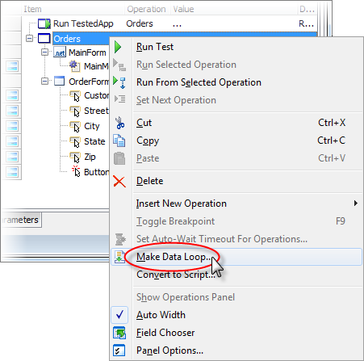{width="4.6980096237970255in"
height="4.65625in"}

> **Figure 170 \--Making a Data Loop**

3.  In the **Select Table Variable** page of the wizard, select the
    **Create new variable** radio button and enter \"Orders\" as the
    variable name. Click the **Next** button to continue.

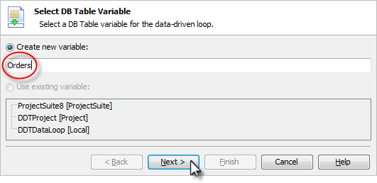{width="5.542230971128609in" height="2.6875in"}

> **Figure 171 \--Selecting the DB Table Variable**

4.  In the **Specify Table type** page of the wizard, select the \"CSV
    file\" option. Click the **Next**

> button to continue.

{width="5.673924978127734in"
height="3.34375in"}

> **Figure 172 \--Setting the Data Source Type**

5.  In the **Select CSV File** page of the wizard, click the ellipses
    button, locate and open the \"orders.txt\" file that contains the
    orders data. Click the **Next** button to continue.

{width="5.609075896762905in"
height="1.9284372265966754in"}

> **Figure 173 \--Selecting the CSV File**

6.  In the **CSV Format Parameters** page of the wizard, click the
    **Comma** checkbox from the **Delimiters** group. Click the **Next**
    button to continue.

{width="5.473197725284339in"
height="3.155624453193351in"}

7.  In the \"Select Records\" page of the wizard, leave the defaults to
    use all the records and click the **Next** button to continue.

{width="4.693610017497813in"
height="2.9270833333333335in"}

> **Figure 174 \--Selecting The Record Range**

8.  In the **Update Values** page of the wizard, drop down the Value
    list for each data entry field and select the corresponding column
    from the data. In the screenshot below, the \"Customer\" data entry
    field is being assigned the \"Customer\" column from the data table.
    Click the **Finish** button to create the data table and data driven
    loop.

{width="5.483486439195101in"
height="3.165937226596675in"}

9.  Notice in the Keyword Test Editor, we have a new Data-Driven Loop.
    The Value for the loop is the local \"Orders\" variable. Each text
    box assignment now comes from columns in the \"Orders\" table.

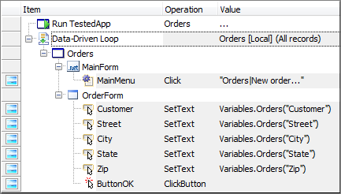{width="4.518367235345582in" height="2.5625in"}

> **Figure 175 \--The Data Driven Loop**

10. Navigate to the Variables tab and notice the \"Orders\" DB Table
    variable that was created for us. You can see that the DB Table
    variable points to the \"Orders.txt\" CSV file.

{width="5.0311570428696415in"
height="1.7531244531933508in"}

> **Figure 176 \--The DB Table Variable**
>
> []{#Database_Table_Checkpoint .anchor}**Database Table Checkpoint**
>
> The **Table Checkpoint** verifies live database content, both rows and
> columns, against a static snapshot of the data stored when the
> checkpoint was created. Using the **Table Checkpoint** is very similar
> to using the Table checkpoint with the exception being the location
> where the data is retrieved. To use a **Table Checkpoint** we need:
>
> A connection string that defines access to a data provider so we can
> connect to a data store.
>
> A specific Table, View or Query that defines criteria used to fetch
> data from the store.
>
> The connection string allows for connecting to any ADO or ADO.NET
> supported data provider including data sources such as .CSV files,
> Excel spreadsheets or a wide variety of database servers.

#### Creating a DBTables Store

> For this example, we\'ll use Microsoft\'s Text Driver which provides
> access to data stored in . CSV files to illustrate the DBTable store.
> We\'ll use this provider as it does not require an actual database
> server backend and is generally available on most computers. The
> connection string for the Microsoft Text Driver is:
>
> Driver={Microsoft Text Driver (\*.txt;
> \*.csv)};Dbq=c:\\;Extensions=asc,csv,tab,txt;
>
> In this connection string the name **Dbq** specifies the folder where
> our CSV files are located. We\'ll use a file called \"c:\\order.txt\"
> to create our store from.

1.  If the **Stores \| DBTables** node does not exist in the Project
    Explorer, right-click the **Stores** node, select **Add \| New
    Item\...** from the context menu. Select the **DB tables** item from
    the list of item types and click the **OK** button to close the
    dialog.

2.  Right-click the **Stores \| DBTables** node in the Project Explorer
    and select the **Add \| New Item\...** option. This will display a
    dialog that allows you to define the store.

3.  Select the **Create a new item in Stores** option and click
    **Next**. If there are no existing DBTables stores, skip this step.

4.  Use the following values on the **Specify Connection Settings\...**
    page of the wizard.

> **Name** \-- Orders
>
> **Connection** \-- Driver={Microsoft Text Driver (\*.txt;
> \*.csv)};Dbq=c:\\;Extensions=asc,csv, tab,txt;
>
> **Custom query** \-- radio button should be checked

{width="5.190495406824147in"
height="4.03125in"}

> **Figure 177 \--Setting the Connection**

5.  Type \"select Customer, Street from Orders.txt\" as the SQL
    statement and click **Next**.

{width="5.152006780402449in"
height="1.9903116797900262in"}

> **Figure 178 \--Entering SQL**
>
> Note that you can also click the Design button here to get help
> building your SQL string.

6.  The **Specify Data Range** page of the wizard defines the number of
    rows and which columns to store. Click **Next** (we\'re using the
    defaults here).

{width="5.159082458442695in"
height="4.041666666666667in"}

> **Figure 179 \--Setting the Data Range**

7.  Next, preview of the data then click **Finish** to complete the
    DBTable checkpoint.

{width="5.151218285214348in"
height="2.0521872265966756in"}

> **Figure 180 \--Preview ing the Data**

#### Creating a Database Table Checkpoint

> To create a Database Table checkpoint that compares the current state
> of the data with a DBTable store:

1.  Create a new Keyword test called \"DBTableCheckpoint\".

2.  Select the **Checkpoints** category on the Operations palette of the
    Keyword editor.

3.  Drag/Drop the **Database Table Checkpoint** onto the test.

{width="3.0258366141732282in"
height="2.911457786526684in"}

> **Figure 181 \--Adding the DBTable Checkpoint**

4.  In the **Specify DBTable Element** page of the wizard, select the
    **Use an existing stores item** option, make sure that the
    \"Orders\" store is selected and click **Next**.

{width="5.163638451443569in"
height="3.0208333333333335in"}

> **Figure 182 \--Specifying an Existing DBTable Store**

5.  Notice that the DBTable Checkpoint has been created in the Keyword
    Test.

{width="5.132080052493438in"
height="0.6635411198600175in"}

> **Figure 183 \--New DBTable Checkpoint**

#### Modifying the Checkpoint

> Once the checkpoint has been created we\'ll see a new Orders node
> under **Stores \| DBTables** in our Project Explorer and we can review
> the data in the Checkpoint editor window. Using the **Edit\...**
> button we can walk through the wizard again and modify any part of the
> checkpoint.

{width="5.906521216097988in"
height="3.3366666666666664in"}

> **Figure 184 \--DBTables Checkpoint Editor**
>
> The DBTables Checkpoint editor also allows you to specify which rows
> and columns to use as well as edit the data in any individual cell. As
> an example, make a few changes here to modify the stored data. In the
> screenshot below, notice that the \"Customer\" name in row
>
> \#2 is changed.

{width="2.0833333333333335in"
height="2.0833333333333335in"}

> **Figure 185 \--Editing the Data**

#### Executing the Table Checkpoint

> Now we can execute our test to compare the DBTable data against the
> actual CSV file on disk. Again, this checkpoint is reading data from
> the CSV file and comparing it to the data we stored in the DBTables
> checkpoint for our project. When the checkpoint executes it will open
> the CSV file, execute our \"select\" query statement, return the
> results and perform the comparison. Notice, we now get a error because
> the stored data no longer matches the data from the CSV file:
>
> \"Warning: The \'Customer\' field of row 1 contains a value (John
> Smith) that differs from the stored one (Sam).\"

{width="3.834070428696413in"
height="2.8885411198600175in"}

> **Figure 186 \--DBTables CheckpointFailure**
>
> []{#_bookmark193 .anchor}**Summary**
>
> This chapter demonstrated how you can drive tests from data stored in
> a database, spreadsheet or text document. You learned about the DB
> Table object used to automatically feed data to your test and how to
> leverage the DBTable checkpoint to verify database contents.

### Web Testing

11. []{#Web_Testing .anchor}**Web Testing**

> **Objectives**
>
> This chapter examines TestComplete web application testing features
> and functionality. First, you\'ll learn about the significant
> differences between Windows client and web application testing.
> You\'ll learn about the primary automation challenges web applications
> typically present. You\'ll also explore a few of the essential methods
> TestComplete provides to effectively automate web applications.
>
> []{#_bookmark195 .anchor}**Materials**
>
> \\Projects\\Web Testing
>
> []{#Web_Application_Testing_Issues .anchor}**Web Application Testing
> Issues**
>
> First, let\'s highlight some of the important differences between
> Windows and Web applications. For example, the following statements
> are true of Web applications:
>
> The client UI loads asynchronously, meaning the browser fetches
> different parts of the same page at the same time. The primary impact
> this has on web testing is that the test must allow for the UI to
> completely render prior to interacting with the page contents. In many
> cases this is handled automatically. However, there may be instances
> where you\'ll need to add code to allow the browser to completely
> download a page prior to your test continuing.
>
> Are typically \"stateless\", meaning that the client functions in a
> disconnected manner from the server.
>
> Use HTML/browser-based controls for data entry.
>
> May have dynamically changing UI as a result of JavaScript, AJAX or
> Silverlight executing on the page.
>
> Typically have different functional behavior than Windows
> applications. Generally, require page refreshes thus requiring a
> refresh of the Object Browser. Multiple web browsers (Internet
> Explorer, Firefox, Chrome).
>
> Multiple browser versions and platforms (x86, x64).
>
> These differences make the already challenging task of Web automation
> more difficult than automating Windows applications. To deal with
> these issues TestComplete provides special functions that take Web
> application behavior into account. Before looking to these functions,
> let\'s first take a look at the Object Browser and examine how
> TestComplete \"sees\" web application from an object perspective.
>
> []{#Understanding_The_TestComplete_View_of_W .anchor}**Understanding
> the TestComplete View of Web Applications**
>
> Below is a screenshot of the Object Browser displaying information
> about a typical web application in Internet Explorer.
>
> {width="0.10416666666666667in"
> height="0.10416666666666667in"}{width="0.15625in"
> height="0.13541666666666666in"}{width="0.13541666666666666in"
> height="0.13541666666666666in"}{width="0.13541666666666666in"
> height="0.13541666666666666in"}Earlier versions of Internet Explorer
> may look significantly different in Object Browser than the screenshot
> below. Recent versions of Internet Explorer show \"Browser
> (iexplore)\" in two different locations. \"Browser (iexplore)\" is the
> first instance of the browser while \"Browser (\"iexplore\", 2)\" is a
> completely separate browser window. The two pages in \"Browser
> (iexplore)\" are represented by two tabs in the browser. Each page
> contains HTML objects. Also notice that browser instances are open
> applications that expose internal information to TestComplete. Each
> browser instance is indicated by the open application icon . Special
> icons in the Object Browser tree indicate the type of open
> application, e.g. Flash {width="0.15625in"
> height="0.14583333333333334in"}, .NET , Silverlight , Java , etc.

{width="5.886606517935258in"
height="3.180833333333333in"}

> Internet Explorer, Firefox and Chrome handle multiple browser
> instances and tabs differently and these differences show up in the
> Object Browser. Let\'s set up an example where you open a Chrome
> browser window and navigate to Google, then open a second tab on the
> Falafel site and finally open a completely separate browser instance
> and navigate to [http://www.SmartBear.com](http://www.SmartBear.com/).
> The browsers would look something like the screenshot below.

{width="5.3998654855643045in"
height="3.8593744531933507in"}

> **Figure 187 \--Two Browser Windows, Three Tabs**
>
> Now replicate this configuration to open browsers and tabs for
> Internet Explorer and FireFox. The Object Browser Objects panel might
> look something like the screenshot below.

{width="4.3329461942257215in" height="4.5in"}

> **Figure 188 \--Object Browser View of Browsers**
>
> To design effective web application tests, it\'s important to be aware
> of differences in browser design. Browser design will vary according
> to browser type (Internet Explorer, Firefox, etc.) and version.

#### Processes and Tabs

> Modern browsers use individual processes to isolate web applications
> hosted in separate tabs within the browser\'s main window, offering
> greater stability. In the event an individual process fails, the
> browser and other open tabs remain unaffected. If you're testing on
> earlier browser versions, you\'ll only see one process for the browser
> regardless of the number of open tabs.
>
> When recording tests against browsers that use individual processes
> for each tab, be consistent regarding the number of open browser
> windows and tabs at the time of the recording. This guideline makes it
> easier to create reliable tests and to allow TestComplete to capture
> consistent Name Mapping information.
>
> []{#Web_Tree_Models .anchor}**Web Tree Models**
>
> **Web Tree Models** define how web page elements are shown in the
> Object Browser and how they are addressed in tests. TestComplete
> supports four models:
>
> **DOM** \-- Document Object Model, the native way that Internet
> Explorer looks at web pages. The DOM model creates a very flat tree in
> the Object Browser. All items on the web page need to be re-read each
> time the web page is updated. This is the slowest method for using web
> pages.
>
> **TAG** \-- All HTML elements are sorted by their TAG value. If a link
> (\<A\> HTML tag) gets created, only the \"A\" node part of the Object
> Browser tree gets updated.
>
> **Tree** \-- Treats a web page like a normal application where the
> list follows the hierarchy of HTML elements on the web page. The names
> of the objects are taken from the element type names (rather than tag
> names). This model creates a very deep tree for most web pages. The
> tree only contains elements with text and also does not include
> document, window or body objects. This is the fastest method for using
> web pages. This is the default.
>
> **Hybrid** \-- Hybrid is a combination of both DOM and Tree.
>
> The Hybrid model, used in earlier versions of the product as the
> default, has been replaced by the Tree model. The Tree model is faster
> and is recommended for new tests. The Tree model is also required for
> cross browser tests.

#### Naming Conventions

> The naming convention for HTML elements used by TestComplete depends
> on the web page model used:
>
> **DOM** \-- HTML elements are in the form of Item(index). The index
> will be either the ID or Name attribute, if any (with the
> Identification attribute having priority). If the element does not
> have either attribute, TestComplete will assign an index number based
> on the order the item was created.
>
> **TAG** \-- HTML elements have the same form as DOM but are sorted by
> type.
>
> **Tree** \-- HTML elements have the form ObjectType(Index), for
> example: Panel(0) - div element, Image(\"Logo.gif\") - image element.

#### Setting the Project Web Tree Model

> To set the web page model used for the project:

48. In the Project Explorer, select the project node and then click on
    the workspace

##### Properties tab.

49. Select **Open Application \| Web Testing**.

50. Select the Tree model from the drop-down list.

{width="5.900003280839895in"
height="3.754166666666667in"}

> **Figure 189 \--Setting the Web Page Model**
>
> []{#Web_Stores_&_Checkpoints .anchor}**Web Stores & Checkpoints**
>
> TestComplete provides two Checkpoints specific to web testing called
> **Web Comparison** and **Web Accessibility**. In this topic we\'ll
> walk through using both Checkpoints against the \"Orders\" sample web
> site. As with all other Checkpoints, Web Comparison and Web
> Accessibility Checkpoints can be added from the Recording toolbar,
> dragged to a Keyword Test as a Checkpoint operation or created from
> the Script Editor toolbar.

#### Web Comparison

> The **Web Comparison Checkpoint** is geared towards verifying the HTML
> contents of a specific web page. Here are the steps to setup a Web
> Comparison checkpoint:

1.  Create a Web Comparison Checkpoint either from the Recording
    toolbar, drag as a Keyword Test Operation or create from the Script
    toolbar.

2.  On the **Create Web Comparison Checkpoint** dialog, drag & drop the
    cross-hairs icon anywhere onto a web page within Internet Explorer.
    For this example, we\'re using the \"Orders\" sample application
    located at
    [[http://training.falafel.com/Orders]{.underline}](http://training.falafel.com/Orders).
    Click the **Next** button.

{width="5.544225721784777in"
height="2.46875in"}

> **Figure 190 \--Selecting the Page**

3.  The **Specify a Stores element for this checkpoint** page lets you
    configure exactly how and what on the page is stored. To make a new
    store choose the **Create new item in stores** option and supply a
    **Stores object name**. In the **Mode** drop down list decide if you
    want to compare the entire page, only the tag structure or only
    specified tags. If you select the last option for only specified
    tags, you can specify that only **Links**, **Images**, **Input
    Elements** or some combination will be compared. By default, the
    page is read from the browser, but you can **Read content from the
    server** instead. Click the **Finish** button to close the dialog.

{width="5.407373140857393in"
height="4.001248906386702in"}

4.  Click **OK** on the **Create Web Comparison Checkpoint** dialog.

5.  From the **Project Explorer**, navigate to the **Advanced \| Stores
    \| Web Testing** node. Double click the web comparison node to open
    the **Web Comparison Checkpoint** editor. From the editor window you
    can modify the options selected on the **Web Comparison Checkpoint**
    dialog as well as edit the actual HTML markup used during the
    comparison.

{width="5.939494750656168in"
height="3.7199989063867016in"}

> **Figure 191 \--Web Com parison Checkpoint Editor**

#### Web Comparison Options

> The Web Comparison options provides several options that dictate the
> web elements included in the comparison. Use these options to reduce
> the scope of the Checkpoint:

{width="3.0673982939632545in"
height="1.2375in"}

> **Figure 192 \--Web Comparison Options**
>
> **Mode \--** This drop-down list specifies if the comparison will
> verify the contents of the entire web page, \"only tag structure\" or
> \"only specified tags\". If the last option to compare only specified
> tags is selected, the check boxes for **Links**, **Images** and
> **Input elements** are enabled.
>
> **Read the web contents directly from the web server \--** This
> option, controls whether TestComplete should fetch the content
> directly from the web server or from the web browser window. In some
> cases, the content can be considerably different and using this option
> can improve the stability of the results.

#### Web Accessibility

> The **Web Accessibility Checkpoint** ensures that specific web pages
> adhere to guidelines designed to improve the usability of the page by
> people with disabilities. Similar to the Web Comparison Checkpoint,
> you can control the scope of the Web Accessibility Checkpoint to focus
> on the specific items of interest. Most web applications tend to have
> accessibility issues, so you shouldn\'t be surprised if your pages
> have many warnings when applying this Checkpoint using the full range
> of available options. To use a Web Accessibility Checkpoint:

1.  Create a **Web Accessibility Checkpoint** either from the Recording
    toolbar, drag as a Keyword Test Operation or create from the Script
    toolbar

2.  On the **Create Web Accessibility Checkpoint** dialog, drag & drop
    cross-hairs icon anywhere onto a web page within the browser. This
    action will automatically set the name of the Page object. For this
    example, we\'re using the "Orders\" sample application at
    [[http://training.falafel.com/Orders]{.underline}](http://training.falafel.com/Orders).
    Click the Next button to continue.

{width="4.213719378827647in" height="2.6075in"}

> **Figure 193 \--Web Accessibility Checkpoint**

3.  Provide a name for the Checkpoint, de-select any check boxes that
    should not be part of the comparison and click the **OK** button to
    create the Checkpoint.

{width="5.935020778652668in" height="4.9875in"}

#### Web Accessibility Checkpoint Options

> The available options for the Web Accessibility checkpoint are as
> follows:
>
> **Check \"alt\" attribute** \-- All IMG, APPLET, AREA and INPUT
> elements must have a non- empty ALT attribute.
>
> **Check \"mailto:\"** \-- Web page must have at least one A element
> (link), whose REF attribute starts with mailto:
>
> **Check image sizes** \-- All IMG elements must have the WIDTH and
> HEIGHT attributes specified.
>
> **Check \"title\" tag** \-- The web page must have a non-empty TITLE
> element.
>
> **Check tab indexes** \-- All INPUT, SELECT, and TEXTAREA elements
> must have the TABINDEX attribute.
>
> **Check link accessibility** \-- Checks for broken links.
>
> **Check ActiveX objects** \-- Verifies there are no ActiveX objects on
> the web page.
>
> **Check Applet object** \-- Verifies there are no Applet objects on
> the web page.
>
> **Check multimedia links** \-- Verifies there are not AVI or SWF files
> on the web page.
>
> **Check server-side images** \-- Verifies that none of the IMG
> elements SRC attributes contain parameters (i.e. the question mark
> \"?\" is not detected in the SRC attribute).
>
> []{#_bookmark207 .anchor}**Summary**
>
> In this chapter, we looked at Web Testing and how it differs from
> standard Windows client testing. We learned:
>
> How TestComplete \"sees\" the elements of a web page from the Object
> Browser. What the Page object provides regarding web testing.
>
> How specific Web testing methods can be used to solve real world
> problems. To deal with dynamic JavaScript client-side UI.
>
> How to dynamically locate objects on a page.

### Mobile

12. []{#Mobile .anchor}**Mobile**

> **Objectives**
>
> Does the mobile application you\'re testing show up in a browser on
> the device? Perhaps you\'re working with a native Android application
> but you don\'t have access to the source code. Maybe the native
> Android application is developed in-house. TestComplete provides
> testing mechanisms that make the best use for each approach. This
> chapter shows how TestComplete handles mobile web applications that
> may have multiple layouts based on screen dimension, \"black-box\"
> native Android applications where you don\'t have access to the
> application\'s internals and \"white-box\" native Android applications
> that are open to inspection.

[]{#_bookmark209 .anchor}

> **Mobile Testing Strategies**
>
> Here are some questions that can help determine which TestComplete
> feature will work best for your needs:
>
> Do you need to test a mobile site on a wide variety of devices,
> regardless of manufacturer and operating system, for example, iPhone,
> Android, Blackberry, Windows and so on?
>
> Do you need to test a mobile site that uses responsive design, that
> is, where the page layout changes based on device characteristics and
> dimensions?
>
> Do you need access to a device\'s GPS or hardware sensors? Do you need
> access to the internal objects of an application? Are you testing
> Xamarin applications?
>
> The [Mobile Web]{.underline} testing option covers the greatest number
> of devices. In mobile web testing, TestComplete virtual browsers can
> be configured to any set of device characteristics and dimensions.
> This option is relatively easy to set up, leverages your existing
> knowledge of testing web applications and doesn\'t require that you
> have the actual physical devices. This option is also very good at
> testing sites that make heavy use of responsive design. The drawback
> is that you will not have access to the devices internal objects or
> hardware.
>
> Within the [Android]{.underline} category, there are two approaches
> for native Java applications that you can use separately or
> mix-and-match. If you don\'t have access to the application\'s source
> code, you can perform black-box testing using [Image Based
> Testing]{.underline}. TestComplete has a powerful mechanism that
> recognizes images on the screen and allows you to work with that area
> of the screen programmatically and through keyword tests. If you have
> access to an Android application\'s source code, you can perform
> white-box testing by configuring the application as an [Open Android
> Application]{.underline}. This will provide you with deep access to an
> Android application\'s internal screen objects and hardware. Android
> is fully supported and iOS is on the way.
>
> []{#Mobile_Web .anchor}**Mobile Web**
>
> Verifying that websites work on all devices, dimensions and platforms
> has become a major scalability challenge. You certainly can\'t keep a
> junkyard full of physical devices and emulator platforms usually
> require download and configuration of one or more libraries for
> support. TestComplete approach is to create *virtual browsers* that
> run with a set of characteristics and dimensions that mimic a
> particular physical device. TestComplete comes with a stock set of
> pre-configured virtual browsers that run from the test recording
> toolbar.

{width="4.121692913385827in"
height="2.454374453193351in"}

> The screenshot below shows a composite of several virtual browsers
> running the same site on iPad, iPhone 5 and Samsung Galaxy Mini.

{width="5.082027559055118in"
height="6.4518744531933505in"}

> Be aware that TestComplete uses the Chrome browser, no matter what
> browser the actual device is using. Be sure to [[prepare Chrome for
> Web
> Testing]{.underline}](http://support.smartbear.com/viewarticle/62859/?_ga=1.49190255.819616413.1378486108)
> and also [[install
> Chrome]{.underline}](http://support.smartbear.com/downloads/testcomplete/chrome-patches/?_ga=1.49190255.819616413.1378486108)
> [[patches]{.underline}](http://support.smartbear.com/downloads/testcomplete/chrome-patches/?_ga=1.49190255.819616413.1378486108)
> to match the Chrome version you have.

#### Using Virtual Browsers in Keyword Tests

> Mobile web tests use the **Run Virtual Browser** and **Virtual Browser
> Loop** operations instead of their standard browser counterparts **Run
> Browser** and **Browser Loop**. When you drag the **Run Virtual
> Browser** operation to the keyword tested editor, first select a
> virtual browser from the list and click the **Next** button.

{width="5.680190288713911in" height="4.375in"}

> In the **Operation Parameters** page of the wizard, enter the **URL**
> the virtual browser should navigate to. You can also specify the
> number of seconds to wait while the page loads. Click the **Finish**
> button to add the operation to the test.

{width="3.73584864391951in" height="1.65in"}

> From here you can use the **Web** group of keyword operations just as
> you would for standard [cross browser testing]{.underline}. The
> example keyword test below shows the **Run Virtual Browser** operation
> followed by a standard web **Navigate** operation to
> [www.smartbear.com.](http://www.falafel.com/) The **Navigate**
> operates against the **Current Browser**, so the actual run of the
> test loads the site into the virtual browser.

{width="5.940080927384077in"
height="0.4793744531933508in"}

#### Defining Your Own Virtual Browsers

> As new devices become available, you can define them without waiting
> for SmartBear to update the list. You will need a *user agent string*
> and the dimensions of the device.
>
> The characteristics of the device are defined by a user agent string;
> here\'s an example of a user agent string for Apple\'s iPhone 5:
>
> Mozilla/5.0 (iPhone; CPU iPhone OS 6\_1\_4 like Mac OS X)
>
> AppleWebKit/536.26 (KHTML, like Gecko) Version/6.0 Mobile/10B350
> Safari/8536.25
>
> To learn more about user agent strings, you can Google for lists of
> user agent strings and even utilities that will return the user agent
> string for the device you\'re browsing from.
>
> The following lab will show you how to set up a new device. For this
> example, we will set up a Nokia Lumia 920 with dimensions 480 x 800.

51. From the TestComplete menu, open the **Tools** menu and select
    **Current Project Properties**.

52. In the left-hand tree-view, select **Open Applications \| Web
    Testing \| Virtual Browsers**. This step will display all of the
    current virtual browsers (see the screenshot below).

{width="5.985in" height="3.255in"}

53. Click the **Add\...** button.

54. In the **Add Virtual Browser** dialog, paste the user agent string
    (see below), then click the **Next** button.

> Mozilla/5.0 (compatible; MSIE 10.0; Windows Phone 8.0; Trident/6.0;
> IEMobile/10.0; ARM; Touch; NOKIA; Lumia 920)

55. Enter the screen dimensions as 480 x 800 and click the **Next**
    button. Note that the prompt is for \"CSS pixels\". Typically, the
    browser and device screen dimensions are identical. In some cases,
    the physical device screen may have more pixels than the browser
    screen.

{width="4.152938538932633in"
height="2.46875in"}

56. Enter a browser name that will show up in the **Name** column of the
    **Virtual Browsers**

> list and click the **Finish** button.

{width="3.1820078740157482in"
height="2.041874453193351in"}

> The next time you record a test, the new entry will show in the
> drop-down list and will be available for keyword and script tests to
> use.

{width="4.161839457567804in"
height="2.7083333333333335in"}

> []{#Android .anchor}**Android**
>
> If you need greater control of an Android device than [[Mobile
> Web]{.underline}](#Mobile_Web) testing in a browser can provide,
> TestComplete has two solutions. For the best control but requiring
> knowledge of how to program an Android application, configure an [Open
> Android Application]{.underline}. This will open up the gates to an
> Android application\'s internal objects, sensors, GPS, operating
> system commands and so on. If you don\'t have access to the source,
> you can still use [[ Image Based Testing]{.underline}](\l) to access
> on-screen objects using image recognition. TestComplete image
> recognition handles differences between devices, resolutions, even
> minor variations in pixels and colors.

#### The Mobile Screen

> The **Mobile Screen** is the primary tool for testing physical
> devices. It is a device emulator with mobile testing capabilities and
> an interface used to record keyword and script tests. The Mobile
> Screen allows you to interact with a variety of devices in a
> standardized UI, create mobile checkpoints, add images to \"image
> sets\", take screenshots, record multi- touch gestures and install
> [Android Agent]{.underline} for use in \"white box\", [Open
> Android]{.underline} [Applications]{.underline}. The Mobile Screen can
> emulate devices hooked up through USB, Android SDK emulators and
> virtual machines running the Android OS (such as Oracle\'s
> VirtualBox).

{width="2.6758562992125983in" height="5.61in"}

> **Note**: The Mobile Screen connects only to devices hooked up via USB
> cable or some emulation of USB. Wi-Fi connections are not supported.
>
> You should interact with the Mobile Screen using keyboard, mouse or
> touchpad, rather than directly with the physical device. The only
> exception is that *gestures*, input involving multiple touches, are
> performed directly on a device.
>
> To get started using the Mobile Screen, click the **Show Mobile
> Screen** button that appears on the Test Engine toolbar.

{width="3.008513779527559in"
height="0.3879155730533683in"}

> If no device is connected, you\'ll get a warning. If there\'s only a
> single device available it will connect and run. If multiple devices
> are connected, the **Select Current Device** window displays. You can
> **Connect** to a single device or **Connect All**. The screenshot
> below shows a connected physical Samsung device (\"SCH-I535\") and an
> Android SDK emulator. After connecting, display the Mobile Screen by
> selecting a device and clicking the **OK** button.

{width="3.9846970691163603in"
height="2.856561679790026in"}

> The Mobile Screen user interface consists of a toolbar, a link to
> **Install TestComplete Agent**, the emulated screen and a footer that
> contains buttons that emulate hardware on the device. The toolbar is
> shown in the screenshot below.

{width="5.067001312335958in"
height="2.0833333333333335in"}

> The **Size** button gives you a slider that resizes the emulated
> device\'s screen area and a
>
> **Best Size** link to get the optimal match between the device and the
> Mobile Screen.

{width="2.678590332458443in"
height="3.6093744531933507in"}

> **Record** and **Play** [[Gestures]{.underline}](#gestures) buttons
> allow you to test using complex, multiple touches on the device. See
> the [[Gestures]{.underline}](#gestures) topic for more on recording
> and playing gestures.
>
> [[Mobile Checkpoints]{.underline}](#mobile-checkpoints) allows you to
> take a snapshot of the device\'s screen for later comparison. This
> checkpoint option depends strictly on visual comparison.
>
> The **Add Image** button allows you to add an image to [[Image
> Sets]{.underline}](#image-based-testing).
>
> The **Select Device** drop down list lets you select the device that
> should show in the Mobile Screen.
>
> **Take Screenshot** records the emulated screen as a .bmp or .png
> image.
>
> [Install Android Agent]{.underline} loads a package on the device that
> exchanges data with open Android application and retrieves data from
> sensors on the device.
>
> The Mobile Screen footer emulates standard hardware buttons on the
> device. From left to right, the buttons are **Back**, **Home**,
> **Menu**, **Volume Down**, **Volume Up**, and **Power**.

{width="2.3546314523184604in"
height="0.29302055993000875in"}

#### Using TestedApp to Manage Packages

> Packages contain Android application definitions in the form of .apk
> files. You can install and launch these applications in TestedApps,
> keyword tests and scripts.
>
> You can define a package in a **TestedApp** and run the TestedApp from
> the TestComplete IDE, from a Keyword Test or from script. To create a
> TestedApp representing an Android Package:

1.  In the Project Explorer, Select, the **TestedApps** node.

{width="2.279501312335958in"
height="2.18625in"}

2.  In the TestedApps editor, right-click and select **Add Android
    Application\...** from the context menu.

{width="4.227226596675416in"
height="4.630311679790026in"}

3.  Define the path for the **Android application package file**. The
    path will point to the location of the .apk file on your local PC
    where TestComplete resides or in a shared network location. Select
    the **Deploy to the device on start** checkbox then click the **OK**
    button.

{width="5.573920603674541in" height="3.7125in"}

4.  Now that you have defined the TestedApp, right-click the item and
    click **Run Selected**

> from the context menu.

{width="5.905713035870516in"
height="4.102916666666666in"}

> The package will be loaded to the default device and will also show in
> the Mobile Screen. If the package was already loaded to the device it
> will be *refreshed*, that is, it will be deleted and reloaded to the
> device.
>
> For more on how to run a TestedApp from the IDE, keyword test or
> script, see the [[Running]{.underline}](#running-a-testedapp) [[a
> TestedApp]{.underline}](#running-a-testedapp) topic.

#### Using Keyword Tests to Manage Packages

> If you want to install an Android package and then run that package in
> a separate step, leave the TestedApp **Deploy to the device on start**
> option unchecked. The **Install Package** keyword operation from the
> **Mobile** group will load the package to the device without having to
> run it. The screenshot below shows the **Install Package** operation
> followed by the **Run Tested App** operation from the **Test Actions**
> group.

{width="5.917707786526684in"
height="0.5606244531933509in"}

#### Managing Devices with Keyword Tests

> The **Mobile** group in the keyword test editor has methods and
> properties for all devices connected to TestComplete on your PC.

{width="2.141907261592301in" height="3.4375in"}

> Mobile actions are run either on a device that you specify from a list
> or are applied to the *current device*. The **Select Device**
> operation specifies the current device that all future operations
> should run on. The **Parameterized Device** option allows you to
> select both a device *and an index* (assuming there are multiple
> devices with the same name). Choose the device from the **Select
> Device** dialog list and then click **Finish**.

{width="4.6886734470691165in"
height="2.8256244531933508in"}

> To run the same operations against multiple devices, by drag the
> **Device Loop** operation onto the keyword test. This will display the
> **Device Loop** dialog to either Iterate through All **Connected
> Devices** or choose from a list using the **Iterate Through Specific
> Devices** option. Each iteration of the loop makes one of the
> connected devices the current device.

{width="4.621738845144357in"
height="2.7395833333333335in"}

> With access to a device, you can run operations to [install and run
> packages on the device](#using-keyword-tests-to-manage-packages),
> touch the device surface, send keystrokes, [[touch
> images]{.underline}](#using-image-sets-in-keyword-tests) and [[play
> gestures]{.underline}](#gestures). The screenshot example below uses
> the **Image Touch** operation to open the Clock application, then
> performs a series of **Device Touch** operations to navigate to the
> world clock tab, add a city and use the **Device Keys** operation to
> enter \"San Francisco\".

{width="5.928935914260717in"
height="1.0817705599300087in"}

##### Using the On-Screen Action

> The **Mobile** section has a sampling of general-purpose operations,
> but the **On-Screen Action** operation of the **Test Actions** group
> allows you to access the very powerful **Mobile Device** object. The
> Device goody bag includes properties for all device\'s information,
> access to the **Desktop** object that represents the device\'s screen,
> **GPS** and **Sensor** objects, simulate an **SMS**, and the ability
> to **Drag**/**Swipe**/**Touch**/**TouchAndHold**/
> **TouchPress**/**TouchRelease**. You can also execute Android shell
> commands and even **Reboot** the device. The screenshot below shows
> some of the methods for the **Mobile.**
>
> **Device()** object.

{width="5.879571303587052in"
height="5.15625in"}

> The **On-Screen Action** operation dialog provides help with the
> parameters so you don\'t have to guess values. For example, the
> **PressButton** method expects a predefined button value. If you
> happen to know that **mbkHome** constant is actually a 4, then all is
> well. But selecting from a drop-down list is easier and more reliable.
> The screenshot below shows the mbkHome key constant being selected
> from a list.

{width="3.318231627296588in"
height="1.8768744531933508in"}

#### Image Based Testing

> You can\'t always count on having a prepared, \"white-box\"
> application that is open and lets you easily get at all the controls
> on-screen. You won\'t always have that kind of access. In these cases,
> you can test based on recognizing images. A series of objections pop
> to mind, like \"what about devices that have different sizes and
> resolutions?\", \"if I change color scheme or theme, will the image
> recognition fail?\", and \"will colors bleeding through transparent
> areas of images fool the image recognition?\" TestComplete has
> intelligent mechanisms to recognize images in all of these situations,
> including variable percentages of pixel variation and transparency.
>
> The heart of the approach is the **ImageRepository** in the Project
> Explorer. The ImageRepository has **Image Sets** where each set
> contains multiple images representing a single on-screen object. The
> screenshot below shows the ImageRepository node with two image sets
> named \"Calculator\" and \"HomeScreen\".

{width="2.2128324584426946in"
height="1.4025in"}

> Let\'s say you want to automate a clock icon on your device\'s home
> screen. The icon may be displayed using more than one image, depending
> on manufacturer and operating system version. Resolution can also
> vary, for example, when displayed by a Samsung Galaxy running in
> 720x1280 pixels vs. an HTC One running in 540x960. By using an Image
> Set you can recognize images for any configuration. The screenshot
> below shows the \"HomeScreen\" in the **Image Set Editor** where the
> clock is listed under **Items** on the left-hand side. The **Image
> Strip** at the bottom of the screen has a high-quality image of the
> clock from a device with 720x1280 resolution and another image taken
> from the emulator that only runs at 240x320. The resolutions are
> different, the actual artwork representing the clock is different, and
> the scary part is that the background colors are different based on
> the chosen wallpaper.
>
> When using a Keyword Test or script to reference the Clock object,
> TestComplete looks through the Image Strip and tries to match the
> image with the application under test. If it doesn\'t find the image,
> TestComplete moves to the next image in the strip and tries again.
> This mechanism handles varying resolutions and even helps recognize
> objects that use completely different artwork to represent the object.

{width="5.886568241469816in"
height="4.574998906386702in"}

> What if the wallpaper on the device changes or there is some variation
> in the pixel quality between devices? The **Image Parameters** section
> of the Image Set Editor allow tolerance of color or pixel variations.
> **Color tolerance** accepts a number between 0..255 where zero (the
> default) requires that colors match the stored image exactly and 255
> where pixels of any color are treated as identical. **Pixel
> Tolerance** is the number of pixels that can different from the stored
> Image Strip item. By default, Pixel Tolerance is 0 and all pixels in
> the tested application and the Image Strip item must match exactly.
> The slider below the Pixel tolerance spinner allows you to quickly set
> the percentage of pixel difference that will be allowed, without
> having to know about the number of pixels in the image.

##### Adding Images

> You can conveniently add new images to an Image Set by clicking the
> **Add Image** button on [[The Mobile
> Screen]{.underline}](#the-mobile-screen).

{width="2.278601268591426in"
height="1.1653116797900263in"}

> The **Add Image to Image Repository** dialog will display. After a few
> moments, a second window labeled **Select Object from Screen** will
> display. Use the mouse to surround a rectangular area. Click the
> **Select** button that appears to save the area to the **Add Image to
> Image Repository** dialog. You can change this selected area later.

{width="1.6205785214348207in"
height="1.4128116797900263in"}

> Provide an **Item name** to be used in scripts and keyword tests. Also
> select an image set from the drop-down list. If you need to retake the
> image, click the **Select Image\...** button. Click the **Finish**
> button to create a new item in the Image Set.

{width="5.927136920384952in"
height="5.958333333333333in"}

> The image will be added as an item to the Image Set editor. Notice the
> **Script line** at the bottom of the Image Set editor dialog that
> provides sample script showing how to programmatically touch the
> selected image.

{width="5.972109580052494in" height="4.17in"}

> You can add more images to the strip for the Image Set item by
> right-clicking and selecting **Add Image\...** or **Add Image From
> File\...** from the context menu. Use the **Set Recognition
> Parameters\...** context menu option to tweak color or pixel
> tolerances.

{width="5.915094050743657in" height="2.75in"}

> The Image Set Editor **Item Parameters** panel will display and allow
> you to change the **Item name**. You can change the Item name at any
> time, but if keyword tests or scripts refer to it, you will need to
> update those to match the new item name. The **Composite control**
> checkbox, when selected, use the exact coordinates of the selection.
> This checkbox should be selected when the control is composed of
> several smaller controls, such as a date-time picker or a tabbed
> control. For simple controls like buttons and check boxes, leave the
> option unchecked so that selection will occur at the exact center of
> the control.

{width="2.6124037620297464in"
height="1.1240616797900262in"}

> The **Preview** panel shows the current selected Image Strip item and
> has two important rectangular regions (see screenshot below). The
> *initial target area* is the rectangle you first define when adding
> the image and is defined by a gray rectangle. The red rectangle
> defines the *recognition area* used when attempting to match the image
> set to the on- screen image being tested. You can drag the handles of
> the recognition area to refine your selection and omit problematic
> parts of the screen or right-click to drag the recognition area
> rectangle to a new location. In tests, the upper left corner of the
> initial target area is used as a reference point when touch actions
> have coordinates passed to them. Otherwise, the center of the
> recognition area is used for touch actions.

{width="2.0213024934383204in"
height="2.0109372265966754in"}

##### Using Image Sets in Keyword Tests

> Use the **Image Touch** operation from the **Mobile** group in the
> **Operations** window to simulate a touch action on an on-screen
> object. This will display the **Image Touch** dialog. Select the
> **Image Set** from the drop-down list and the item from the list, then
> click **Finish**. **Note**: The default touch action will press the
> center of the recognition area, but you can optionally click the
> **Next** button instead of Finish and supply X and Y coordinates or
> specify the index of the device.

{width="5.62338801399825in" height="4.33125in"}

##### Mobile Checkpoints

> Mobile checkpoints use Image Sets to verify the state of the
> application. If an Image Set item is found in the tested application,
> the checkpoint passes. The setup for the example that follows uses
> images taken from the Calculator application as shown in the
> screenshot below.

{width="2.675910979877515in"
height="5.548124453193351in"}

> The example uses an Image set populated from the Calculator with
> sufficient image to multiply 12x12. The Image set also includes an
> image of the result \"= 144\".

{width="5.86129593175853in"
height="3.845832239720035in"}

> The **Create Mobile Checkpoint** dialog displays in response to a new
> keyword **Mobile Checkpoint** operation or by clicking the **Create
> Mobile Checkpoint** option from the recording toolbar. Your options
> are to **Create a new item** or to **Use an existing item**. The
> **Create a new item** option brings up essentially the same dialog as
> used for [[Adding]{.underline}](#adding-images)
> [[Images]{.underline}](#adding-images) to an image set. If you choose
> the **Use an existing item**, select an image from the list of Image
> Repository items and click the **Finish** button.

{width="5.589114173228347in"
height="5.73375in"}

##### Mobile Checkpoints in Keyword Tests

> The test uses the calculator to multiply 12 x 12 and verifies that the
> result is an image of 144.

{width="4.880765529308836in"
height="2.134687226596675in"}

#### Gestures

> *Gestures* represent multiple touch events. Gestures must be recorded
> on a touch-sensitive physical device; emulators cannot be used to
> record gestures. The Mobile Screen has a Record Gesture feature that
> allows you to record multiple touches on your device.
>
> Clicking the **Record Gesture** button on the Mobile Screen first
> prompts to add an **Android Gesture Collection** if a collection
> doesn\'t already exist. Then the **Add Gesture** dialog displays
> announcing that you can record gestures on your physical device. Once
> the dialog displays, the Mobile Screen is disabled and will display
> the message \"Use a physical device to record gestures\". Enter a name
> for the gesture, then touch your physical device to simulate
> multi-touch events. When you\'re done, click the **Stop Recording**
> button.

{width="5.329616141732283in"
height="4.379374453193351in"}

> TestComplete has a rather nifty way of graphically representing the
> movement of points touched on the device by animating each point in a
> unique color. The screenshot below shows the results of a pinching
> gesture using thumb (shown in red) and index finger (shown in green).
> Double-click the **Name** or **Playback Acceleration** column entries
> to edit them. The Playback Acceleration percentage value can be set
> between zero and 100. By default, acceleration is set to 10% for
> better accuracy. Click the **Play Gesture** button to select a
> recorded gesture and run it.

{width="5.152462817147857in"
height="3.155624453193351in"}

##### Playing Gestures from Keyword Tests

> To play a recorded gesture from a keyword test, drag the **Play
> Gesture** operation onto the editor. Select an item from the Gesture
> collection drop down if necessary and then select a gesture from the
> list.

{width="4.513636264216973in"
height="3.4479166666666665in"}

[]{#Xamarin_Open_Apps_Testing .anchor}

> **Summary**
>
> This chapter explored TestComplete mobile testing mechanisms including
> how to test mobile web applications that may have multiple layouts
> based on screen dimension, \"black-box\" native Android applications
> where you don\'t have access to the application\'s internals and
> \"white-box\" native Android applications that are open to inspection.

### Web Services Testing

13. []{#Web_Services_Testing .anchor}**Web Services Testing**

> **Objectives**
>
> This chapter discusses web services in general and looks at
> TestComplete support for testing web services. You\'ll learn how to
> import a web service and call a web service function directly in a
> test. You\'ll use Web Services Checkpoint and XML Checkpoint to verify
> results between test runs.
>
> []{#_bookmark230 .anchor}**Overview of Web Services**
>
> Web Services provide a standardized SOAP based mechanism for calling
> functions across a network of computers where the remote computer
> executes the specified routine and returns the results. From the
> calling computer a request is made using the SOAP protocol and the web
> service provided will execute the function specified and return the
> result.

{width="3.0108311461067365in"
height="1.5365616797900263in"}

> **Figure 194 \--Diagram of a Web Services Call**
>
> SOAP stands for Simple Object Access Protocol and is a standardized
> format for calling functions on remote computers.
>
> In order to work with Web Services, you must have access to a WSDL
> (Web Services Description Language) document that describes the
> available functions, their parameters and results. By importing the
> WSDL document into TestComplete, Web Services calls can be made using
> the Web Services checkpoint.
>
> You can use Web Services to supply data used in a test or you can test
> a Web Service itself. Web Services can be used directly from Keyword
> Tests or Script and the results used as just another data source.
>
> []{#Web_Service_Example .anchor}**Web Service Example**
>
> First, let\'s take a look at a sample web service that contains a
> number of math related functions. The web service is located at this
> URL:
>
> [http:*//training.falafel.com/testcompletews/*](http://training.falafel.com/testcompletews/)
>
> Using a web browser to hit the above URL, you can see a listing of the
> available functions provided by the web service. A link to the WSDL
> document (the link that reads \"Service Description\" in the
> screenshot below) describes the structure of each request and
> response. If you click on the \"Service Description\" link you will
> see the WSDL XML document that fully describes the web service.

{width="5.906447944006999in" height="2.9325in"}

> **Figure 195 \--Sample Web Service**
>
> Not all web services frameworks provide a page like the one above that
> allows a user to examine each function call individually. In many
> cases you will only have a WSDL link pointing to the XML document
> describing the available functions and data types.
>
> []{#Importing_a_Web_Service .anchor}**Importing a Web Service**
>
> Before calling web service functions we need to import its WSDL
> document using the **Web Services Project Item.** This project item is
> only included in the Enterprise version of TestComplete. Here are the
> steps to import a Web Service:

57. From the Project Explorer right click the project node and select
    **Add \| New Item..**. and then the Web Services Project Item:

{width="4.345608048993876in" height="3.6875in"}

> **Figure 196 \--Adding the Web Services Project Item**

58. Right click the Web Services node and select **Add \| New Item\...**
    This will display the Create Project Item dialog.

59. Specify the name for the Web Service to be imported.

{width="4.332505468066492in"
height="2.041874453193351in"}

> **Figure 197 \-- Creating the Web Service Wrapper**

60. On the Web Services editor in the Workspace click the **Select**
    button to import a Web Service:

{width="4.422877296587926in"
height="2.7708333333333335in"}

> **Figure 198 \--Web Services Editor**

61. Specify the URL of the WSDL document
    \"**<http://training.falafel.com/webservice/>
    service1.asmx?WSDL**\".

62. Click the **Get Services** button to import the Web Service, then
    click OK to finish the import process.

{width="5.206571522309711in"
height="2.84375in"}

> **Figure 199 \-- Im porting the Web Service**
>
> You should now see the WSDL imported into TestComplete and be able to
> review the objects and methods provided by the web service within the
> editor.

{width="5.950994094488189in"
height="4.134374453193351in"}

> **Figure 200 \-- The Im ported Web Service**
>
> []{#Lab:_Using_a_Web_Service_From_a_Keyword_ .anchor}**Lab: Using a
> Web Service From a Keyword Test**
>
> To use the results from a keyword test you can use the Last Operation
> Result, if the web service returns a value. The example below runs the
> web service imported in the previous example and logs the return
> value.

1.  From the Test Actions category of Operations, drag the **Call Object
    Method** Operation into the Keyword Test editor.

2.  In the **Call Object Method** dialog, type \"WebServices\", then a
    period \".\". The list of Web Services in your project should
    display in the drop-down list. Select the web service you imported
    and then click the **Finish** button to create the web service call
    and close the dialog.

{width="5.55871719160105in"
height="3.3958333333333335in"}

> **Figure 201 \--Calling the WebService**

3.  In this example we\'re using the \"Add\" web service, a method that
    takes two parameters. Double-click the **Value** column to bring up
    the **Operation Parameters**.

{width="4.975261373578303in"
height="0.5308333333333334in"}

> **Figure 202 \--Invoking Parameters Dialog**

4.  In the Operation Parameters dialog, enter values for each parameter
    in the list, then click the Finish button to retain the values and
    close the dialog.

{width="4.6688320209973755in"
height="2.1145833333333335in"}

> **Figure 203 \--Setting Param eter Values**

5.  Drag a **Log Message** Operation from the Logging category to the
    Keyword Test. This will display the **Log Message** wizard.

6.  In the Log Message wizard, leave the **Message** blank and click the
    **Next** button to proceed to the **Operation Parameters** page of
    the wizard.

7.  In the **Operation Parameters** page of the wizard, click the
    ellipses button for the

> **AdditionalInformation** property. This will display the **Edit
> Parameter** dialog.

8.  In the **Edit Parameter** dialog, drop down the **Mode** list and
    select **Last Operation** Result. Click the **OK** button to close
    the dialog, then click the **Finish** button to close the wizard.

{width="4.375099518810149in"
height="2.1770833333333335in"}

> **Setting Log Message Parameters**

9.  At this point, the Keyword Test should look something like the
    screenshot below.

{width="6.264760498687664in"
height="0.5961450131233595in"}

> **Figure 204 \--Keyword Test with Web Service**

10. Run the test. The message should show the result of the web service
    call.

{width="1.5396380139982502in"
height="1.1859372265966754in"}

> **The Logged Web Service Result**
>
> []{#Web_Services_Checkpoints .anchor}**Web Services Checkpoints**
>
> Not only can we call the web service directly and use the results
> however we\'d like in the test, we can also test the web service
> itself to see that it returns expected results. You can perform all of
> the operations needed to call a web service method and check the
> results yourself, or you can use the **Create Web Service Checkpoint
> Wizard** to walk you through the process. Performing the operations by
> hand is more flexible, but the wizard helps you create checkpoints
> faster and more conveniently.
>
> The wizard helps you:
>
> Create an **XMLCheckpoint** project item that stores a baseline copy
> of a web service's response.
>
> Generate script code or Keyword Test steps that calls the web service
> method and checks the result.
>
> You can invoke the wizard when recording a test or at design time. To
> display the wizard when recording a test, select **Create Web Service
> Checkpoint** from the Recording toolbar. You can create Web Service
> Checkpoints for keyword tests and in code. Drag the Web Service
> Checkpoint Operation into the Keyword Test editor.

{width="3.637673884514436in"
height="2.9895833333333335in"}

> **Figure 205 \--Keyword Tests Checkpoints**
>
> \...or create Web Service Checkpoints using the Code Editor toolbar.

{width="3.137584208223972in"
height="2.6041666666666665in"}

> **Figure 206 \--Code Editor Checkpoints**
>
> []{#Web_Services_Test_Log_Results .anchor}**Web Services Test Log
> Results**
>
> When using the XML Checkpoint, the TestComplete Test Log provides
> additional support for examining which XML nodes differ. When we
> execute our Web, Services test we get a clean test log without errors.
> If we modify our test to generate an error, we can look at the
> resulting test log and see specifically where the difference in the
> XML is located.
>
> To simulate an error, we\'re going to modify the **y** parameter in
> our call to the web service and re-execute our test.

1.  Double click the **Value** column on the first step of our Keyword
    Test. Change the y parameter value to \"21\" on the Call Object
    Method dialog and click the **Finish** button:

{width="4.509179790026247in"
height="2.000624453193351in"}

> **Figure 207 \--Changing the \"Y\" Value**

2.  Click the **Run** button on the Keyword Test Editor to re-execute
    the test.

3.  On the **Test Log** window click the **Details** link.

{width="4.966160323709536in"
height="1.3921872265966755in"}

> **Figure 208 \--Test Log for Web Service**
>
> The XML Checkpoint details show us the **Expected XML Data** vs. the
> **Actual XML Data**
>
> reported between the documents.

{width="5.858810148731409in"
height="3.4125in"}

[]{#Lab:_Using_the_Web_Services_Checkpoint_F .anchor}**\
**

> **Lab: Using the Web Services Checkpoint From a Keyword Test**
>
> In this lab, we\'ll take a look at calling a web service function,
> specifying the expected results and then verifying those results:

1.  On our Web Services Project, right click the **KeywordTests** node
    in the Project Explorer and select **Add \| New Item\...** to create
    a new web services Keyword Test. This will display the Create
    Project item dialog.

{width="4.41576990376203in"
height="2.0109372265966754in"}

> **Figure 209 \--Creating New Keyword Test**

2.  From the **Checkpoints** section of the **Operations** palette drag
    & drop the **Web Services Checkpoint**.

{width="2.602512029746282in"
height="2.3203116797900263in"}

> **Figure 210 \--Drop Web Services Checkpoint**

3.  On the **Create Web Service Checkpoint** dialog select our imported
    web service and click **Next**.

{width="6.251077209098862in"
height="2.3793744531933507in"}

> **Figure 211 \--Selecting the Im ported Web Service**

4.  Select the **Add** function and click **Next** to specify the x and
    y parameters.

{width="4.159982502187226in" height="3.0625in"}

> **Figure 212 \--Select the Add Function**

5.  Enter 10 and 20 for the **x** and **y** values respectively then
    click the **Next** button.

{width="6.240153105861768in"
height="2.2814577865266843in"}

> **Figure 213 \--Entering X and Y Values**

6.  Expand the XML tree (left side of the dialog) so you can see the
    \"\#text\" node which is the expected result of the \"Add\" function
    call. Click the **Finish** button. Note that you can change the
    Value for the AddResult if you need to.

> {width="6.186564960629921in"
> height="5.15375in"}
>
> **Figure 214 \--Setting the Expected Result**
>
> The Web Services Checkpoint uses an XML Checkpoint to validate the
> resulting XML from the web service. On the above dialog you are given
> an option to use an existing XML Checkpoint or create a new one.
>
> The resulting Keyword Test contains two steps including:

1.  A call to the Web Services function passing the specified
    parameters.

2.  A call to an XML Checkpoint used to verify the resulting XML.

{width="5.919174321959755in"
height="0.8411450131233595in"}

> **Figure 215 \--Web Services Function Call and XML Checkpoint**
>
> []{#XML_Checkpoint .anchor}**XML Checkpoint**
>
> Web Services communicate via XML therefore the TestComplete XML
> Checkpoint is perfectly suited to the task of verifying calls to these
> functions. However, this Checkpoint can also be used for XML files or
> URLs that return XML. In this topic will take a look at adding an XML
> Checkpoint to our existing Web Services test that validates the
> contents of a file. For example, let\'s say we have an XML file named
> \"Contacts.XML\" that looks like this:

{width="4.968770778652669in"
height="4.958333333333333in"}

> **Figure 216 \--Contacts.xml**

#### Creating an XML Checkpoint Using a File

1.  Add an **XML Checkpoint** from either the Recording toolbar, as a
    Keyword Test Operation or from the Code Editor toolbar.

2.  On the XML Checkpoint dialog, use the default \"Create new item in
    stores\", enter \"\<your local path\>\\Contacts.xml\" as the \"File
    name\" under **XML Source** and click the **Finish** button.

> {width="5.6897856517935255in"
> height="3.2793744531933506in"}
>
> **Figure 217 \--Creating the XML Checkpoint**
>
> We can optionally use an existing XML Stores item and/or specify a URL
> to fetch the XML document used during the comparison.

3.  Now that we\'ve added the XML Checkpoint to our test, let\'s take a
    look at the XML store item and review our options for comparison.
    Expand the **Advanced \| Stores \| XML** nodes for the project from
    the Project Explorer and double click the new \"XmlCheckpoint1\"
    node

{width="6.1515605861767275in"
height="3.183333333333333in"}

> **Figure 218 \--XML Checkpoint Editor**

#### XML Checkpoint Options

> The editor for **XML Checkpoints** has several options to customize
> the type of comparison performed during the checkpoint execution.
> These options are designed to ignore certain parts of XML documents,
> extending the capabilities of the checkpoint in situations where the
> documents might not be identical. These options include:

##### Ignore node order Ignore attributes

##### Ignore namespace declarations Ignore prefixes

> **Compare in subtree mode** \-- for comparing an XML fragment
>
> **Extended logging** \-- optionally report information on unchanged
> nodes
>
> []{#_bookmark241 .anchor}**Summary**
>
> In this chapter, we defined web services and examined TestComplete
> support for testing these systems. We looked at:
>
> Importing a web service WSDL document into TestComplete. Using a Web
> Service directly in a test.
>
> Using the Web Services Checkpoint.
>
> Calling a web service function and specifying the XML result.
> Verifying the results of XML documents using the XML Checkpoint.

### Distributed Testing

14. []{#_bookmark242 .anchor}**Distributed Testing**

> **Objectives**
>
> This chapter looks at TestComplete Distributed Testing features and
> illustrates how you can use this feature to leverage multiple machines
> during test execution. You'll learn how to create projects for use in
> distributed testing and how to make them available to remote machines.
> You\'ll also explore some of the issues with executing and
> synchronizing tests on multiple computers.

About the Network Suite
-----------------------

> Distributed tests are executed using the Project Explorer. To enable
> Distributed Testing within a project it is necessary to add the
> **Network Suite** Project Item. The Network Suite contains sub-nodes
> allowing you to configure which tests will execute and on which
> machines. The machine running the Distributed Test functions as a
> heads-up display, allowing you to monitor the status of the machines
> participating in the test.
>
> All of the machines participating in a Distributed Test must be using
> the same version of TestComplete.

#### Single Machine Test Execution

> To get a better understanding of how Distributed Testing works let\'s
> first take a look at how a single project works on one machine. In the
> illustration below we can see a single machine connected to a source
> code repository running a project where tests are executed locally.

{width="5.932162073490813in"
height="1.8525in"}

> **Figure 219 \--Single Project Executing on a Single CPU**
>
> In this setup the machine running TestComplete (or TestExecute) pulls
> the project source files from the repository and executes the test.
> Because the tests run synchronously, the total runtime is one hour.

#### Multiple Machine Test Execution

> Now, let\'s look at the same test run in a Distributed Testing
> environment using the Network Suite. In the illustration below, we see
> a single driver machine running a copy of TestComplete which controls
> test execution on multiple host machines running either TestComplete
> or TestExecute. All of the machines have access to the project, which
> contains the Network Suite Project Item, from the repository. In this
> setup the total running time of the project takes only 15 minutes as
> each machine executes different tests within the project.

{width="5.924021216097988in"
height="3.3881244531933508in"}

> **Figure 220 \--Running Parts of a Project Across Multiple Machines**
>
> In fact, this example illustrates just one scenario for Distributed
> Testing where all of the machines execute tests from a single project.
> However, tests can be executed from any project that has the Network
> Suite Project Item and do not have to be related in any significant
> way. TestComplete Distributed Testing features allow testers to tailor
> test execution to cover a wide variety of scenarios.

Setting up a Distributed Test
-----------------------------

> In this section we\'ll create a project with a simple test that we can
> execute using Distributed Testing. First, we\'ll use the recorder to
> create a basic test then modify the Project to add support for
> Distributed Testing.
>
> Our focus here is creating and configuring a Distributed Test,
> therefore we\'re going to record a very simplistic test for
> illustration purposes only.

#### Recording a Simple Test Case

63. Select **File \| New \| Project\...** and click the **OK** button on
    the Create Project dialog.

64. Right click the **TestedApps** node and select **Add \| New
    Item\...** Using the Add Tested Application dialog select
    \"C:\\Windows\\System32\\Notepad.exe\".

{width="5.105459317585302in"
height="4.541666666666667in"}

> **Figure 221 \--Adding a TestedApp**

65. Double click the **TestedApps** node to open the editor in the
    Workspace.

66. Change the File Path for \"Notepad\" to %SystemRoot%\\System32\\
    using an environment variable to ensure the test will work on any
    Windows machine.

{width="4.87323053368329in"
height="0.45937445319335085in"}

> **Figure 222 \--Change the File Path to use an Environm ent Variable**

67. Click the Record button on the recording toolbar.

68. Using the TestedApps drop down button start \"Notepad\".

{width="3.3686362642169727in"
height="1.2684372265966755in"}

> **Figure 223 \--Running Notepad**

69. In the Notepad main window type \"this is a test\".

70. On the Notepad main window select **File \| Exit** and click the
    **No** button on the confirmation dialog.

#### Configuring the Project for Distributed Testing

> We now have a test that will execute on any remote machine so let\'s
> add the **Network Suite** Project Item and configure our test to run
> on a remote system.

1.  Right click the Project node in the Project Explorer and select
    **Add \|New Item\...** from the context menu.

2.  In the Create Project Item dialog select **NetworkSuite**.

{width="4.584633639545057in" height="4.0625in"}

> **Figure 224 \--Creating the Netw ork Suite Project Item**
>
> This adds the following nodes to our Project:

{width="5.651023622047244in"
height="1.8975in"}

> **Figure 225 \--Netw orkSuite nodes**
>
> Now we can begin to add Hosts and Jobs to our Network Suite to
> construct a Distributed Test.

#### Working With Hosts

##### Adding Hosts

> Under the **NetworkSuite**, **Hosts** are machines that will execute
> as part of a Distributed Test. From the **Project Explorer** you can
> double click the **Hosts** node to view the Hosts editor window in the
> Workspace and all of the hosts configured for the Distributed Test
> will appear in the list.
>
> To add a Host to the NetworkSuite:

1.  Right click the Hosts node and select **Add \| New Item\...** from
    the context menu. On the Create Project Item dialog specify \"LAB1\"
    for the Name field and click the **OK** button.

{width="4.584633639545057in" height="4.0625in"}

> **Figure 226 \-- Adding a Host**

2.  In the Hosts Editor, set the **Address** column to the IP address or
    use the ellipsis to choose the machine by network name.

3.  Under the **Base Path** column assign a path relative to the Host
    machine (we\'re using \"C:

> \\Temp\" in this case).

4.  Under the **Source Path** column assign the file path to the
    Project\'s .MDS file.

{width="4.889529746281715in"
height="0.408332239720035in"}

> **Figure 227 \--Setting the IP address, Base Path and Source Path**

##### Hosts Editor Columns

> The Hosts Editor has the following columns:

  **Column**       **Description**
  ---------------- -------------------------------------------------------------------------------------------------------------------------------------------------------------------------------------------------------------------------------------------------------------------------------------------------------------------------------------------------------------------------------------------------------------------------------
  **Name**         The name used to refer to the host from scripts, keyword tests and from the task properties.
  **Address**      The network name or IP address of the computer that the new host is mapped to.
  **Login Mode**   The Manual option requires the remote machine to be logged into before running the test. The Automatic RDB Session connects to the remote computer using Remote Desktop and leaves the computer locked and unavailable to users. The Automatic RDB Session connects to the remote computer using Remote Desktop but moves the session to the remote computer\'s console, leaving the computer unlocked and available for use.
  **Domain**       Specifies the domain to which the user specified in the User name column belongs.
  **User name**    Specifies the account used to open a user session on the slave computer automatically when verifying or running the network suite.
  **Password**     Specifies the password used to open a user session on the slave computer automatically when verifying or running the network suite. If the parameter is skipped, TestComplete will use an empty string.

  **Column**        **Description**
  ----------------- -------------------------------------------------------------------------------------------------------------------------------------------------------------------------------------------------------------------
  **Base path**     Specifies the common path for several projects, which are located on the computer specified by the Address property. TestComplete uses this value to prefix paths specified by a task's Path property.
  **Source path**   Specifies the path to the folder (located on the master computer) holding the slave project that can be copied from the master computer to the host computer. The path should be relative to the master computer.

> There are several other useful items available from the context menu
> on the Hosts Editor including

{width="5.678537839020122in"
height="2.65625in"}

> **Figure 228 \--Hosts Editor Context Menu**

##### Verifying the Host Connection

> Due to the fact that remote machines may not be configured properly,
> TestComplete provides an option to verify the connection to a Host
> machine. You can use the context menu **Verify** option from the
> **Host Editor** as well as the **Project Explorer** context menu on
> the **Hosts** node.

{width="3.7453094925634294in"
height="2.4166666666666665in"}

> **Figure 229 \--Verifying a Host connection**
>
> Refer to TestComplete online help for Firewall configuration details.

##### Copying the Project to the Host

> Now that we\'ve verified the connection and setup our project we can
> copy it to the host machine to prepare for execution. Once we finish
> configuring our test we may want to perform this step again to ensure
> all of our updates are on the Host machine. In practice, tests should
> be stored in a source control repository and loaded onto the host
> machines from there.
>
> 1\. Right click the \"LAB1\" host entry in the Hosts Editor window and
> select **Copy Project to Slave** from the context menu.

{width="4.986001749781277in"
height="3.0104166666666665in"}

> **Figure 230 \--Copying the project to the Host (Slave) machine**

##### Other Remote Tasks

> Also, be aware that you can restart the remote computer by
> right-clicking and choosing
>
> **Reboot** from the context menu.

{width="5.0948862642169725in"
height="4.59375in"}

> **Figure 231 \--Rebooting the Rem ote Machine**
>
> The **Run State** tab of the NetworkSuite editor displays information
> about the network suite, job or task execution. The **Remote Desktop**
> column actually shows you the window of the slave/host computer as it
> runs. The window displays in the resolution of the master computer.

#### Tasks Editor Window

> The columns in the Tasks Editor are as follows:

  **Column**   **Description**
  ------------ ---------------------------------------------------------------------------------
  **Active**   Specifies whether the task will be run when the job, to which it belongs, runs.

+-----------------------------------+-----------------------------------+
| **Column**                        | **Description**                   |
+===================================+===================================+
| **Name**                          | The name that is used to refer to |
|                                   | the task in tests.                |
+-----------------------------------+-----------------------------------+
| **Host**                          | The name of a computer where the  |
|                                   | project will be run.              |
+-----------------------------------+-----------------------------------+
| **Path**                          | The path to the TestComplete      |
|                                   | project or project suite which    |
|                                   | the task will run.                |
+-----------------------------------+-----------------------------------+
| **Test**                          | Specifies the test item to be     |
|                                   | executed by the task. There is a  |
|                                   | specific syntax for this string   |
|                                   | which is documented in            |
|                                   | TestComplete online help.         |
+-----------------------------------+-----------------------------------+
| **Tag**                           | Specifies an arbitrary string     |
|                                   | associated with the given task.   |
+-----------------------------------+-----------------------------------+
| **Action after run**              | Specifies what TestComplete will  |
|                                   | do after it finishes executing    |
|                                   | the task on the Host computer.    |
|                                   |                                   |
|                                   | Available options in the          |
|                                   | drop-down list are:               |
|                                   |                                   |
|                                   | > \[None\] - Do nothing (do not   |
|                                   | > close TestComplete or           |
|                                   | > TestExecute either). Use this   |
|                                   | > value in combination with the   |
|                                   | > Use value for the Use previous  |
|                                   | > instance option in order to     |
|                                   | > reduce the workload of the      |
|                                   | > remote computer. In this case,  |
|                                   | > after finishing the task the    |
|                                   | > TestComplete (TestExecute)      |
|                                   | > instance on the remote host     |
|                                   | > will not be closed and it will  |
|                                   | > be used for running the next    |
|                                   | > task.                           |
|                                   | >                                 |
|                                   | > \[Close\] - Close the           |
|                                   | > TestComplete (TestExecute).     |
|                                   | > Default value. \[Shut Down\] -  |
|                                   | > Shut down the Host computer.    |
|                                   | >                                 |
|                                   | > \[Reboot\] - Reboot the Host    |
|                                   | > computer.                       |
+-----------------------------------+-----------------------------------+

+-----------------------------------+-----------------------------------+
| **Column**                        | **Description**                   |
+===================================+===================================+
| **Copy remote log**               | Specifies whether and in which    |
|                                   | cases TestComplete should copy    |
|                                   | the remote log of the task        |
|                                   | execution to the master computer. |
|                                   | This property is only meaningful  |
|                                   | if the project specified by the   |
|                                   | Path property is located on a     |
|                                   | computer other than the master    |
|                                   | computer.                         |
|                                   |                                   |
|                                   | Available options in the          |
|                                   | drop-down list are:               |
|                                   |                                   |
|                                   | > \[Always\] - TestComplete       |
|                                   | > copies the results to the       |
|                                   | > master computer at the end of   |
|                                   | > the task execution. Copying     |
|                                   | > results increases the task      |
|                                   | > execution time and uses some    |
|                                   | > disk space, but you can review  |
|                                   | > the results at any time, even   |
|                                   | > if the remote computer is not   |
|                                   | > available. Copied results are   |
|                                   | > kept on your computer until you |
|                                   | > delete them.                    |
|                                   | >                                 |
|                                   | > \[When status is not OK\] -     |
|                                   | > TestComplete copies the results |
|                                   | > to the master computer only if  |
|                                   | > the log on the task execution   |
|                                   | > includes errors and/or          |
|                                   | > warnings.                       |
|                                   | >                                 |
|                                   | > \[Do not copy\] - The task      |
|                                   | > results remain on the remote    |
|                                   | > computer. To view them, you     |
|                                   | > must have access to the results |
|                                   | > folder. Storing results on the  |
|                                   | > remote computer saves disk      |
|                                   | > space on your computer, but you |
|                                   | > may not be able to view them,   |
|                                   | > since the remote computer can   |
|                                   | > be offline or the results       |
|                                   | > folder may be inaccessible.     |
+-----------------------------------+-----------------------------------+

+-----------------------------------+-----------------------------------+
| **Column**                        | **Description**                   |
+===================================+===================================+
| **Use previous instance**         | Specifies whether TestComplete    |
|                                   | will close the remote             |
|                                   | TestComplete (or TestExecute)     |
|                                   | process before executing the      |
|                                   | task.                             |
|                                   |                                   |
|                                   | Available options in the          |
|                                   | drop-down list are:               |
|                                   |                                   |
|                                   | > \[Use\] - Use the running       |
|                                   | > instance of the remote          |
|                                   | > TestComplete (TestExecute). Use |
|                                   | > this value in combination with  |
|                                   | > the None value for the Action   |
|                                   | > after run option in order to    |
|                                   | > reduce the workload of the      |
|                                   | > remote computer. In this case,  |
|                                   | > after finishing the task, the   |
|                                   | > TestComplete (TestExecute)      |
|                                   | > instance on the remote host     |
|                                   | > will not be closed and it will  |
|                                   | > be used for running the next    |
|                                   | > task.                           |
|                                   | >                                 |
|                                   | > \[Show Error\] - Display the    |
|                                   | > error message. Default value.   |
|                                   | >                                 |
|                                   | > \[Terminate\] - Reboot the      |
|                                   | > remote TestComplete             |
|                                   | > (TestExecute) process. Use this |
|                                   | > value to ensure that the task   |
|                                   | > will not fail if previous tasks |
|                                   | > or test runs caused critical    |
|                                   | > errors in the remote            |
|                                   | > TestComplete (TestExecute)      |
|                                   | > instance.                       |
+-----------------------------------+-----------------------------------+
| **Remote application**            | Specifies what testing            |
|                                   | application, TestComplete or      |
|                                   | TestExecute, will be used on the  |
|                                   | remote workstation.               |
+-----------------------------------+-----------------------------------+

#### Synchronizing Computers

> A **SynchPoint** delays execution of a test until all computers with
> that SynchPoint reach the synchronization point. When all the
> computers with a named SynchPoint hit that Synchronize Point, they
> will continue on with their test. An example of an effective use for
> SynchPoints: you want to avoid where two or more users try to edit the
> same record at the same time and post the data.

{width="1.7247451881014872in"
height="1.381874453193351in"}

> **Figure 232 \--SyncPoints**

##### Using SynchPoint in Keyword Tests

> To use a SynchPoint, use a **Run Code Snippet** Operation and add the
> **NetworkSuite. Synchronize()** method, passing the name of the
> SynchPoint (\"WaitForMe\" in the example).
>
> **NetworkSuite**.Synchronize(\"WaitForMe\");
> **NetworkSuite**.Synchronize(\"WaitForMe\")

Executing Distributed Tests
---------------------------

> There are several options for executing Distributed Tests including
> manually in the Project Explorer, from Keyword Tests and from Script.

#### Manual Execution

> The easiest option is to use the context menu from the Project
> Explorer. You can execute either individual Jobs or specific Tasks
> within a job directly from the context menus.

{width="4.444857830271216in" height="4.3725in"}

> {width="4.776375765529309in"
> height="4.104374453193351in"}

#### Keyword Test Execution

> You can execute a Distributed Test from a Keyword Test using the Run
> Test Operation, opening up the NetworkSuite test category and
> selecting the Job or Task that you want to run.

{width="5.776921478565179in"
height="3.6458333333333335in"}

> **Figure 233 \--Running Distributed Test**

#### Runtime Behavior

> TestComplete uses Windows Remote Desktop to display the remote
> computer as the test runs. You will need to configure your remote
> computer to accept Remote Desktop connections for the distributed test
> to work. See the documentation for your operating system for more
> information on accepting Remote Desktop connections.

{width="5.932345800524934in"
height="2.7580205599300087in"}

> **Figure 234 \--A Running Distributed Test**

Lab: Simple Distributed Test
----------------------------

#### Configure The Project

1.  Create a master project with a NetworkSuite Project Item.

2.  Create a hosted (slave) project with a **NetworkSuite** Project
    Item.

{width="3.7453094925634294in"
height="2.4166666666666665in"}

> **Figure 235 \--Verifying the Host**

3.  Add \"Notepad.exe\" to the **TestedApps** project Item of the hosted
    project.

4.  Modify the **File Path** property of the TestedApp to **\"\"**
    (blank).

#### Record a Test

1.  Create (or record) a script method to type something into notepad.
    For example:

> **var** p1;
>
> **var** w1; TestedApps.notepad.Run();
>
> p1 = Sys.Process(\"notepad\");
>
> w1 = p1.Window(\"Notepad\", \"\*\").Window(\"Edit\"); w1.Click(135,
> 29);
>
> w1 = p1.Window(\"Notepad\", \"\*\");
>
> w1.Window(\"Edit\").Keys(\"TestComplete Training - Distributed
> Testing\"); w1.Close();
> Aliases.notepad.dlgNotepad.DirectUIHWND.CtrlNotifySink.btnDontSave.ClickButton();
>
> **Dim** p1
>
> **Dim** w1 TestedApps.notepad.Run()
>
> p1 = Sys.Process(\"notepad\")
>
> w1 = p1.Window(\"Notepad\", \"\*\").Window(\"Edit\") w1.Click(135, 29)
>
> w1 = p1.Window(\"Notepad\", \"\*\")
>
> w1.Window(\"Edit\").Keys(\"TestComplete Training - Distributed
> Testing\") w1.**Close**()
>
> Aliases.notepad.dlgNotepad.DirectUIHWND.CtrlNotifySink.btnDontSave.ClickButton()

2.  Save the project.

#### Create the Distributed Test

1.  Select the **NetworkSuite** Project Item in the Master Project and
    enter the path to the project suite in the **Shared Path**.

2.  Expand the **Hosts** Project Item and select \"Host1\"

3.  Enter the name (or IP address) of the hosting (slave) computer.

4.  In the **Base** path property enter \"\\\\\<Master Computer
    Name\>\\\<Name of Project Suite directory\>\"

5.  Right-click on \"Host1\" and select **Verify** from the context
    menu.

6.  Expand the **Jobs** Project Item.

7.  Expand the \"Job1\" Project Item.

8.  Select the \"Task1\" Project Item.

9.  In the **Path** property enter \"\\\<Name of Hosted
    Project\>\\\<Name of Hosted Project\>. mds\".

10. In the **Copy remote log** property select \"\[Always\]\". 11.In the
    **Use previous instance** property select \"\[Use\]\".

<!-- -->

12. In the **Test** property enter the path to your test on the hosted
    machine. If you\'re running a Keyword Test then the path might be
    similar to \"\<Name of Hosted
    Project\>\\KeywordTests\\Test1\\Test1\". If running a Script then
    the path would look something like this path: \"\<Name of Hosted
    Project\>\\Script\\Unit1\\Test1\".

13. Right-click \"Task1\" and select **Verify** from the context menu.

14. Right-click the **NetworkSuite** project item and select **Run**
    from the context menu.

Summary
-------

> In this chapter, we looked at how TestComplete can distribute testing
> to remote machines. We looked at the structure of distributed tests
> and discussed why they can be beneficial.
>
> We also recorded a simple test and examined the necessary steps to
> execute the test in a distributed environment.

### Manual Testing

Manual Testing
==============

Objectives
----------

> This chapter looks at TestComplete support for Manual Testing
> including how to create, edit and execute Manual Tests. You\'ll learn
> about the upgrade path from manual to automatic tests using the
> TestComplete import and export features. You\'ll also learn how to use
> events within a manual test to allow interaction between manual and
> automated tests.

[]{#_bookmark267 .anchor}

About Manual Testing
--------------------

> If you've worked in any sort of Quality Assurance capacity you\'ll
> likely be intimately familiar with manual testing and perhaps more so
> than you might like. Manual testing while extremely valuable can be
> difficult for humans to perform consistently over long periods of time
> because of human nature itself. Manual testing generally takes a great
> deal of concentration and dedicated effort to consistently produce
> results. TestComplete provides an alternative to what could be
> considered the more classical approach of using Microsoft Word or
> Excel. TestComplete support for manual testing allows the test
> developer to guide the tester through a series of steps, capture data
> as the test is being performed and automatically log the results of
> the test. The benefits of manual testing through TestComplete are:
>
> The assurance that the required steps are followed Generation of a log
> file for every test execution Verification of the results based on
> Test Log contents Ability to interact with a manual test using Events
>
> Below is an example of the TestComplete manual test user interface:

{width="5.947606080489939in" height="2.9425in"}

> **Figure 236 \--The TestComplete Manual Testing User Interface**

Creating Manual Tests
---------------------

> In this topic we\'ll walk through the process of creating a Manual
> Test in TestComplete.

71. Select **File \| New \| New Project\...** and click **OK** on the
    **Create New Project** dialog.

72. Right click the **Project** node in the **Project Explorer,** select
    **Add \| New Item\...** and choose **Manual Tests**.

{width="3.4336461067366577in"
height="3.0468744531933507in"}

> **Figure 237 \-- Creating the Manual Tests Project Item**

73. Click **OK** on the **Create Project Item** dialog.

74. Right click the **ManualTests** node in the Project Explorer and
    select **Add \| New Item\...**

> to create a new Manual Test.

75. On the **Create Project Item** dialog enter \"CreateOrder\" as the
    name of the manual test and click **OK** to open the Manual Test
    Editor.

{width="3.405962379702537in"
height="1.7806244531933508in"}

> **Figure 238 \--Creating the Manual Test Item**

#### Manual Test Editor

> The TestComplete Manual Test Editor allows for the creation of a
> multi-step test that prompts the user through a series of
> instructions, collecting results with every step.

{width="5.929561461067366in"
height="3.8906244531933507in"}

> **Figure 239 \--Manual Test Editor**

#### Manual Test Editor Controls

  **Field**               **Description**
  ----------------------- ----------------------------------------------------------------------------------------------------------------------------------------------------
  **Test Steps**          Tree of the steps contained within this test, used for navigation while editing.
  **Test Caption**        Window caption of the Manual Test dialog.
  **ID**                  Step ID for use within Manual Test events.
  **Test Description**    Sub caption of the Manual Test dialog.
  **Test Instructions**   Free-form HTML markup for communicating the actual actions to be performed during the test. Appears in the main portion of the Manual Test dialog.

  **Field**                     **Description**
  ----------------------------- -----------------------------------------------------------------------------
  **Test notes and comments**   Notes for the test writer that are not displayed when the test is executed.

#### Editing the Test Description

> By default, the **Manual Test Editor** opens with only the initial
> node created so we\'ll need to add steps to fill out the test. To
> create a Manual Test description:

1.  Click the **Test Caption** field and enter \"Create Order Manual
    Test\".

2.  Edit the **Test Description** field and set the text to \"In this
    test we will create a new customer order and validate a new record
    is created.\"

3.  Edit the **Test Instructions** field and set the test to \"Using the
    Orders sample application we will add a new order and verify the
    data appears in the list of customer orders.\" The result should
    look like the following:

{width="5.93113188976378in" height="3.88125in"}

> **Figure 240 \--The Manual Test Editor w ith Test Description**

#### Adding Steps

> Once the description is completed we can start adding steps to the
> test as follows:

1.  Click the green (+) sign or right click in the Test Steps area and
    select **New Step** from the context menu.

{width="3.112386264216973in"
height="1.7221872265966753in"}

> **Figure 241 \--Adding a new step to the Manual Test**

2.  Fill out the Step **Caption**, **Description** and **Instructions**
    for this step of our Manual Test. The actual information can be
    arbitrary or you can use the screenshot below to guide you.

{width="5.941329833770778in"
height="4.523748906386702in"}

> **Figure 242 \--Completed Manual Test**

3.  Add one more manual step and fill out the Step **Caption**,
    **Description** and **Instructions**

> for this step

#### Running Manual Tests

> Keyword Tests can run Manual Tests using the **Test Actions \| Run
> Test** Operation. From the **Select Test** dialog, select the **Manual
> Test** you want to run from the Keyword Test.

{width="5.901175634295713in" height="3.52in"}

> **Figure 243 \--Selecting a Test**

Manual Test Interaction With Automated Tests
--------------------------------------------

> In this topic we\'ll illustrate how manual tests interact with
> automated tests. You can call a manual test from a Keyword Test or
> Script. The reverse is also true. You an call Keyword Tests or Script
> from your manual test.
>
> You might be thinking \"Why would I do this?\" which is a fair
> question. The interesting thing about Manual Tests in TestComplete is
> that you can augment a test by performing actions automatically for
> the user and by incorporating a Manual Test into a Keyword Test or
> Script you can execute any actions necessary to ease the testing
> process such as setup test data, create/delete files, launch
> applications etc. You can also replace parts of your manual test
> incrementally as circumstances dictate, allowing you to move over to
> automated testing in a controlled manner.

#### Running Keyword Tests from Manual Tests

> Not only can you kick off a Manual Test from a Keyword Test, you can
> also run Keyword Tests from your Manual Test. For example, if on
> \"STEP\_2\", you need the tester to start the \"Orders\" application,
> you can have this done automatically from the keyword test. The
> screenshot below, shows the original manual step that requires the
> user to type a certain path into the Run dialog.

{width="5.950694444444444in"
height="3.7583333333333333in"}

> **Figure 244 \--The Manual Test Step**
>
> Use the **Content type** drop down list to select \"Keyword Test\".
> Use the Keyword Test entry ellipses to select an existing Keyword Test
> from a list. When you run the manual test and it reaches this step,
> the manual test dialog will disappear briefly while the Keyword Test
> runs.

{width="5.892280183727034in"
height="3.121874453193351in"}

> **Figure 245 \--Step Uses Keyw ord Test Content Type**

#### Converting Manual Tests to Keyword Tests

> TestComplete provides extensive support for converting your existing
> manual tests to automated Keyword Tests. There are two related
> functions on the Test Steps toolbar that help you to convert from
> manual to Keyword Tests.

{width="2.90873687664042in"
height="0.9902077865266842in"}

> The **Convert Manual Test to Keyword Test** option launches the
> recorder and creates a keyword test for all your manual test steps.
> The nice thing about this approach is that you can read off the manual
> test step as you record the Keyword Test. The recorder starts and
> stops for each manual test step. Once the recording is complete, a
> prompt asks if you want a Keyword Test created that will call the
> Keyword Tests created for each step. The result looks something like
> this in the Keyword Test Editor:

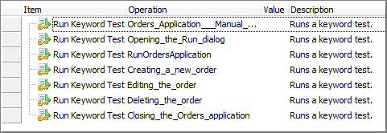{width="4.979998906386702in"
height="1.7118744531933507in"}

> **Figure 246 \--Manual Test Converted to Keyw ord Test**
>
> The **Convert Manual Step to Keyword Test** option launches the
> recorder and creates a Keyword Test with the same name as the manual
> test step. Once the recording is complete, you can change the Content
> Type to \"Keyword Test\" and the new Keyword Test will be
> automatically selected.

#### Manual Test Event Handling

> One of the unique features TestComplete brings to manual testing is
> the ability for a test developer to inject actions into the test while
> it\'s being performed. For example, if you wanted to initialize some
> test data, delete certain files or perform Checkpoint validation of
> test data, all of those actions can be performed using the built-in
> Manual Test Events.

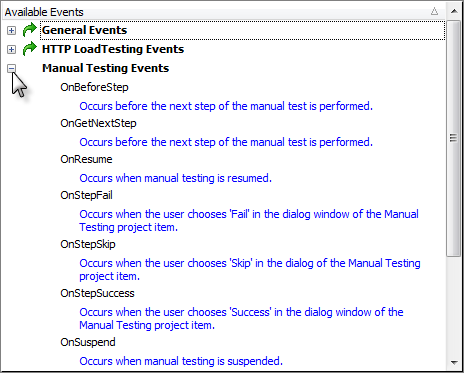{width="4.835881452318461in"
height="3.8854166666666665in"}

> **Figure 247 \--Manual Test Events provided by TestComplete**

Exporting a Manual Test
-----------------------

> Once you\'ve created a manual test you\'re given two options to export
> the test content using the context menu to either Microsoft Word or
> HTML:

{width="3.47748687664042in"
height="4.145833333333333in"}

> **Figure 248 \--Exporting Manual Tests**
>
> TestComplete provides an option to customize the Microsoft Word export
> template on the Properties tab at the bottom of the editor window. The
> export functionality works in a mail merge like fashion and allows you
> to create a Microsoft Word document containing the contents of the
> test.

{width="5.900073272090989in"
height="4.368124453193351in"}

> **Figure 249 \--Manual Test Editor Properties tab**
>
> You can optionally, define your own Microsoft Word template for use
> with the TestComplete export feature. TestComplete includes a default
> template that looks like this:

{width="5.943008530183727in"
height="4.045416666666667in"}

> **Figure 250 --TestComplete Default Microsoft Word Template**

Importing a Manual Test
-----------------------

> The ability to migrate existing legacy manual tests can be a huge time
> saver. TestComplete lets you import manual tests stored in text files,
> Microsoft Word or Microsoft Excel files. TestComplete can handle
> several format arrangements:
>
> One level or multilevel, bulleted or numbered lists. Numbered lists
> can use any number style and formatting for levels.
>
> Test steps using different indents for steps of different levels.
> Tables used to organize the step hierarchy.
>
> Keywords to separate the step caption, description, instructions and
> notes.
>
> TestComplete ships with a set of sample files that can be imported.
> Each file demonstrates a particular format, e.g. text, Excel, Word
> document with headers, etc. The closer your files are to the example
> formats, the less editing you will need to perform in the Manual Tests
> editor. See the online help for complete details on supported formats.
>
> You can find example files to import at:
>
> \\TestComplete Samples\\Manual Testing\\Recommended Formats for Manual
> Test Instructions

#### Simple Text File Import

> If you open the document titled \"Test Instructions in .txt file.txt\"
> you will see steps for testing the Orders application that use numbers
> to indicate each step.

{width="5.492455161854768in"
height="4.28125in"}

> **Figure 251 \--Sample Text File**
>
> If you open the document titled \"Test Instructions in .doc file
> (using headings).doc" you will see steps for testing the Orders
> application that uses the \"Heading1\" style to indicate a new step.

{width="5.929838145231846in" height="5.16in"}

> **Figure 252 \--Sam ple Im port Docum ent**
>
> Test steps can even be arranged in a hierarchy by using styles, i.e.
> \"Heading1\", \"Heading2\", where \"Heading2\" represents the set of
> steps indented from \"Heading1\".
>
> See the TestComplete online help topic \"Importing Manual Tests\" for
> detailed formatting information for each document type.

#### Lab

> Let\'s walk through importing one of the sample documents.

1.  From the TestComplete **File** menu choose **Import \| Test\...**

{width="4.528034776902887in"
height="2.6770833333333335in"}

> **Figure 253 \-- Selecting the Im port Test Option**

2.  In the **Import Test Options** page of the wizard, enter the **Test
    Name** as \"OrdersTest\". Click the ellipses of the **Source File
    Name** and locate the \"Test Instructions in .doc file (using
    headings).doc\" file in the path indicated at the top of this topic.
    Click the **Next** button to continue.

{width="6.199589895013124in"
height="3.0954166666666665in"}

> **Figure 254 \-- Import Test Options**

3.  The wizard will take a moment to process the file and then present a
    summary. Click the

> **Finish** button to close the wizard.

{width="6.191743219597551in"
height="3.037916666666667in"}

> **Figure 255 \--Import Summary**

4.  The imported manual test will show under the ManualTests node in the
    Project Explorer, and all steps described in the document will be
    included in the ManualTests editor.

{width="6.200479002624672in"
height="3.7989577865266844in"}

> **Figure 256 \--The Imported Manual Test**

Legacy Migration
----------------

> The ability to import legacy manual test steps stored in external
> files coupled with TestComplete tools for converting Manual Test to
> fully automated Keyword Tests comprises a complete migration path.
> This path takes you from the labor-intensive, error prone and
> inconsistent to a wholly automated system that can be run reliably on
> a schedule.

Summary
-------

> In this chapter, we explored TestComplete Manual Testing features and
> discussed the advantages of developing manual tests using
> TestComplete. We learned to:
>
> Create, edit and execute Manual Tests. Call Manual Tests.
>
> Use Events within a Manual Test. Import and Export Manual Tests.

### Low Level Procedures

Low Level Procedures
====================

Objectives
----------

> This chapter explains TestComplete Low Level Procedure functionality
> and how it can be leveraged to deal with situations where they may be
> no easy alternative. You'll learn how to record, edit and execute Low
> Level Procedures. Along the way you will learn how Low-Level
> Procedures differ from standard test recordings, when to use a
> Low-Level Procedure and the difference between Window and Screen Low
> Level Procedures.

About Low Level Procedures
--------------------------

> Low Level Procedures are an alternative recording type provided by
> TestComplete where actual mouse and keyboard events are recorded. Low
> Level Procedures differ dramatically from standard recordings where
> TestComplete records higher level actions against specific onscreen
> objects.

#### Low Level Procedure Types

> There are two kinds of Low Level Procedures:
>
> **Screen Coordinates** \-- Captures events relative to the entire
> screen where the top left-hand corner of the screen is 0,0.
>
> **Window Coordinates** \-- Captures events relative to a user selected
> Window where the top left-hand corner of the window is 0,0.
>
> Window Coordinate Low Level Procedures tend to be more reliable as
> they are unaffected by the location of the selected window and will
> playback relative to the Window\'s current screen location.

#### When To Use Low Level Procedures

> From the outset, tests that rely on screen coordinates generally are a
> bad idea and usually that holds true regardless of which tool you're
> using. However, in certain situations you may find yourself attempting
> to record a scenario that simply refuses to playback properly due to
> the complexity of capturing a user\'s intent via a recorder. In these
> cases, resorting to Low Level Procedures can, at the very least, serve
> as a stop-gap until alternative solutions can be developed.
>
> Additionally, you can work on applications using third party controls
> not directly supported by TestComplete and that provide no visibility
> into the client region of the control such as a custom grid.

Recording Low Level Procedures
------------------------------

> In the \"Web Testing\" chapter we looked at a Web application that
> used JavaScript to dynamically display menu items on screen. The
> application poses an interesting challenge for GUI recorders that tend
> to capture interactions with controls such as clicks and keystrokes.
> Let\'s take a look at recording a Low-Level Window Coordinates
> Procedure to handle the menu selection and understand this alternative
> approach to recording.

#### Low Level Window Coordinates Procedure

76. For starters we\'ll launch Internet Explorer and browse to the
    Orders application located here:

> [http:*//training.falafel.com/dynamiccontent*](http://training.falafel.com/dynamiccontent)

77. Select **File \| New \| Project\...** and on the **Create Project**
    dialog click the **OK** button.

78. Start recording a new test. From the Recorder toolbar, drop down the
    Low Level Procedure button and select the **Record Low-Level
    Procedure (window coordinates)** option.

{width="5.204438976377952in"
height="1.11375in"}

> **Figure 257 \--Recording a Low-Level Procedure**

79. A red selection rectangle will appear. Move the rectangle onto
    Internet Explorer and click the left mouse button to select it.

{width="2.1676990376202974in"
height="1.8046872265966754in"}

> **Figure 258 \--Selecting IE**

80. On the **Create Project Item** dialog click **OK** to add the
    **Low-Level Procedures Collection** item to the project.

{width="4.311887576552931in"
height="2.0315616797900264in"}

> **Figure 259 \--Adding the Low-Level Procedures Collection**

81. On the **Create Project Item** dialog click **OK** to add a
    Low-Level Procedure to the project.

{width="4.301522309711286in"
height="2.0315616797900264in"}

> **Figure 260 \--Adding a Low-Level Procedure**

82. Select the **Add \| New \| Customer \| Orders** menu item on the web
    page.

{width="3.5686811023622047in"
height="2.2395833333333335in"}

> **Figure 261 \--Selecting from a Dynamic Menu**

83. Click the **Stop** button on the recording toolbar.

#### Examining the Recording

> At the completion of the recording you can see that a \"LLCollection\"
> has been added in the Project Explorer. Inside the collection will be
> the Low-Level Procedure you recorded.

{width="1.9227165354330709in"
height="1.3303116797900263in"}

> **Figure 262 \--The Low-Level Procedure Collection**
>
> Next, look at the **Low-Level Procedure Editor** and the events
> captured by the Low-Level Procedure. Double click the **Advanced \|
> LLCollection1 \| LLP1** node from the **Project Explorer**.

{width="3.6925984251968504in"
height="2.4791666666666665in"}

> **Figure 263 \--Low Level Procedure Editor**
>
> The columns in the Low-level Procedure Editor are:

  **Column**   **Value**
  ------------ ------------------------------------------
  **Icon**     Indicator of the type of event performed
  **N**        Ordinal value of this event in the list
  **Event**    Type of action to be performed

  **Column**       **Value**
  ---------------- --------------------------------------
  **Parameters**   Data specific to the specified event
  **Delay, ms**    Delay in milliseconds between events

> From the Low-level Procedure Editor window you can add, edit and
> delete events from the list using the right click context menu.

{width="3.6925984251968504in"
height="2.4791666666666665in"}

> **Figure 264 \--The Editor Window Context Menu**
>
> The Edit Event dialog provides options to customize all facets of the
> captured event.

{width="2.61334864391951in"
height="1.8459372265966754in"}

> **Figure 265 \-- The Edit Event Dialog**

Calling Low Level Procedures from Keyword Tests
-----------------------------------------------

> To run a Low-Level Procedure from a Keyword Test, use the **Call
> Object Method** Operation. Specify the collection (code insight will
> drop down a list of available objects), followed by a period \".\",
> then the name of the low level procedure, another period \".\" and
> finally the **Execute()** method.

{width="2.039296806649169in"
height="1.1653116797900263in"}

> **Figure 266 \--Specifying an Object**
>
> To have the low-level procedure work in relation to a particular
> window, pass the window as a parameter to the Execute () method. It\'s
> also a good idea to make sure the window you're working with is
> activated and in front of the other windows. You can do this with the
> Run Code Snippet operation as shown in the screenshot below.

{width="2.195365266841645in"
height="1.1653116797900263in"}

> **Figure 267 \--Activating a Window**

Summary
-------

> In this chapter, we looked at TestComplete Low Level Procedure
> capabilities and: Explained how this recording type differs from a
> standard object-based recording Recorded a scenario which otherwise
> requires special handling
>
> Examined the Low-Level Procedure Editor

### User Forms

User Forms
==========

Objectives
----------

> This chapter demonstrates how User Forms are used to display dialogs
> and windows onscreen during test execution. You\'ll learn how to use
> the TestComplete User Form\'s designer to create your own forms.
> You\'ll also see how modal and non-modal display modes manage form
> display during test execution.

[]{#Materials .anchor}

Using the Designer
------------------

> User Forms are not part of the default project template so you\'ll
> first need to add the **User Forms** Project Item to your project.
> Once you\'ve added User Forms support to your project you can right
> click the User Forms node in the Project Explorer and add a form to
> your project. In this example, we\'ll construct a User Form that can
> be used to prompt for login credentials.

{width="2.613190069991251in"
height="1.8356244531933508in"}

> **Figure 268 \--User Forms Login Dialog**
>
> Once the form is created you will see the User Forms designer which is
> similar in style to those seen in Visual Basic, Visual Studio or other
> development tools supporting forms development. If you are familiar
> with any of these tools you\'ll immediately feel right at home in the
> designer. If not, don\'t fear. Learning the designer is quick and easy
> and you\'ll be able to construct dialogs in no time.

#### Layout of the User Forms Designer

> There are three panels of the User Forms editor including:

84. Component palette

85. Form Designer

86. Properties window

{width="5.950223097112861in"
height="3.9459372265966755in"}

> **Figure 269 \--User Form s Editor**

#### Building a User Form

> To illustrate the functionality of the User Forms designer we\'ll
> build a Login dialog that you can call from within your tests. If the
> UserForms node doesn\'t already exist in the project explorer,
> right-click the project and select **Add \| New Item**. Choose \"User
> Forms\" from the list and click **OK** to create the project item.

{width="4.3459667541557305in"
height="3.5833333333333335in"}

> **Figure 270 \--Adding User Form s**
>
> To create the form, right click the Project Explorer **UserForms**
> node and select **Add \| New Item\...** In the **Name** edit box enter
> \"PasswordDlg\".

{width="4.312343613298338in"
height="1.9903116797900262in"}

> **Figure 271 \--Adding a User Form**
>
> Using the Component palette, we\'ll add the components (TcxTextEdit,
> TcxLabel and TcxButton) from the **Editors**, **Helpers** and
> **Buttons** categories respectively to the form by simply double
> clicking the components. After adding a component to the design-time
> form you can use the mouse to move/size the control and the Properties
> window to change its appearance/behavior. We now have a form that
> looks like this:

{width="5.926007217847769in"
height="2.900624453193351in"}

> **Figure 272 \--Initial User Forms Layout**
>
> Next, we need to make the following property changes on the components
> placed on the form. The table below lists the components and the
> property/values for each. These changes improve the appearance of the
> dialog as well as set the expected behavior of a modal login dialog.

  **Component**   **Property**          **Value**
  --------------- --------------------- -------------
  cxTextEdit1     Name                  edUsername
                  Text                  (blank)
  cxTextEdit2     Name                  edPassword
                  Text                  (blank)
                  Properties.EchoMode   eemPassword
  cxLabel1        Caption               &Username:
                  FocusControl          edUsername

  **Component**   **Property**   **Value**
  --------------- -------------- ------------
  cxLabel2        Caption        &Password
                  FocusControl   edPassword
  cxButton1       Caption        OK
                  Default        True
                  ModalResult    mrOk
  cxButton2       Caption        Cancel
                  Cancel         True
                  ModalResult    True
  \[User Form\]   Caption        Login

> Once these properties have been assigned we\'ll have a completed User
> Form that we can use from within a Keyword Test.

{width="5.915184820647419in"
height="3.1755205599300087in"}

> **Figure 273 \--The Com pleted Form**
>
> []{#Calling_User_Forms_in_a_Keyword_Test .anchor}**Calling User Forms
> in a Keyword Test**
>
> User Forms can be displayed from within a Keyword test using several
> different operations such as **Call Object Method**, **Run Code
> Snippet**, or **Run Script Routine**. In this example we\'ll use the
> **Call Object Method** operation and illustrate how to invoke a modal
> dialog and respond to the user\'s action to the dialog.

#### Creating a Keyword Test to call a User Form

> The first step is to drag/drop a **Call Object Method** onto a Keyword
> test. This will invoke the wizard to select the object and choose the
> specific method. In the case of a User Form there are two methods for
> displaying the form, Show and ShowModal. The prior will display the
> form as a non-modal window and test execution will continue to the
> next operation. The latter will display the form as a modal window
> where a user has to respond to the dialog prior to test execution
> continuing. The ShowModal method returns a value called ModalResult
> representing the user\'s response to the dialog. The ModalResult will
> be one of the following values:

  **Constant**     **Description**
  ---------------- ----------------------------------
  **mrNone**       None.
  **mrOk**         The dialog result is OK.
  **mrCancel**     The dialog result is Cancel.
  **mrAbort**      The dialog result is Abort.
  **mrRetry**      The dialog result is Retry.
  **mrIgnore**     The dialog result is Ignore.
  **mrYes**        The dialog result is Yes.
  **mrNo**         The dialog result is No.
  **mrAll**        The dialog result is All.
  **mrNoToAll**    The dialog result is No To All.
  **mrYesToAll**   The dialog result is Yes To All.

> For this operation, we\'ll specify the **UserForms.PasswordDlg**
> object:

{width="4.550780839895013in"
height="2.4270833333333335in"}

> **Figure 274 \--Specifying a UserForm s Object**
>
> Clicking **Next** will display a list of the methods on the
> UserForms.PasswordDlg object including the **ShowModal** method. Type
> ShowModal to select the method then click the **Finish** button (the
> ShowModal method accepts no parameters).

{width="5.524841426071741in"
height="3.9895833333333335in"}

> **Figure 275 \--Calling Show Modal**

#### Responding to a User Form

> Once displayed onscreen using the ShowModal method, the user must
> respond to the dialog prior to the test proceeding. The Keyword Test
> will need to respond to the ModalResult returned by the form. We can
> use an **If\...Then** operation to provide the logic. For the login
> dialog we\'ll inspect the form\'s ModalResult, username and password,
> validate the data and perform additional actions based on the result.
> All of these values can be inspected within a single **If\...then**
> operation.
>
> To respond to the User Form:

1.  Drag and drop the **If\...Then** operation just after the call the
    User Form.

2.  Under **Value1** use the ellipsis, set the **Mode** to **Last
    Operation Result**.

3.  Under **Value2** use the ellipsis, set the **Mode** to **Code
    Expression** and enter **mrOk** as the

##### Value.

4.  Click the **And** button to add a new row.

5.  Under **Value1** use the ellipsis, set the **Mode** to **Code
    Expression** and enter

##### UserForms.PasswordDlg.edUsername.Text.

6.  Under **Value2** use the ellipsis, set the **Mode** to **Constant**
    and \"admin\" (without the quotes) as the **Value**.

7.  Under **Value1** use the ellipsis, set the **Mode** to **Code
    Expression** and enter

##### UserForms.PasswordDlg.edPassword.Text.

8.  Under **Value2** use the ellipsis, set the **Mode** to **Constant**
    and \"**password**\" (without the quotes) as the **Value**.

{width="5.6358497375328085in" height="2.75in"}

> **Figure 276 \--Specifying an If..Then Condition**
>
> Nested within the **If\...Then** operation we\'ll add a Log Message
> operation to indicate we\'ve logged in.

1.  Select the **Logging** category from the Operations palette and drag
    & drop the **Log Message** operation below the **If\...Then**
    operation.

{width="6.206896325459318in"
height="3.3333333333333335in"}

> **Figure 277 \--Adding a Log Message Operation to the If\...Then**

2.  On the **Log Message** dialog type **\"**Logged In\" on the
    **Message** tab and click the **Finish**

> button.

3.  Click the **Right** arrow button on the Keyword toolbar to indent
    the **Log Message** step.

{width="4.00501312335958in"
height="0.6329155730533683in"}

> **Figure 278 \--Indenting**
>
> We\'ve completed the logic for our User Form. The **Log Message**
> operation will be called if the correct user name and password are
> entered.
>
> []{#_bookmark303 .anchor}**Summary**
>
> In this chapter, we learned how to create user forms for input during
> test execution. We learned about the User Forms designer and how to
> incorporate user forms into a test.

### Best Practices

18. []{#Best_Practices .anchor}**Best Practices**

> **Objectives**
>
> This chapter includes real-world advice on how to plan, organize and
> version control your tests. Other handy tips tell you how to get the
> most out of \"smoke tests\" and how to communicate your test results
> with the team.
>
> []{#Communicating_Test_Results .anchor}**Communicating Test Results**
>
> Now you might be thinking \"huh? I haven\'t even started yet and I
> have to think about communicating my results?\" The answer is a
> resounding YES! Unfortunately, Quality Assurance and test automation
> specifically, at least in the software world, tends to get a bad rap.
> Creating solid test automation that can stand up over time and provide
> valuable ongoing feedback is a difficult task which leads a lot of
> people (read management) to think time and effort spent working on
> automation is wasted.
>
> To solve this problem, you'll want to focus on getting your test
> results published quickly and consistently to prove that your efforts
> are worth the investment. TestComplete provides some facilities for
> producing log output though you'll want to be sure and iron out your
> strategy from the start. For example, you may want to setup a web
> server where you can publish results. In fact, TestComplete supports
> exporting log results to HTML which could be a good starting place.
>
> []{#Plan_your_testing,_but_not_that_kind_of_ .anchor}**Plan your
> testing, but not that kind of planning\...**
>
> The preparation we\'re referring to has to do with your choice of
> testing tool, TestComplete. Although it\'s important to plan the
> application features to be tested, it\'s also important to be prepared
> with respect to the testing facilities available in TestComplete. You
> should gain a thorough understanding of TestComplete features before
> you embark on writing test automation to avoid a situation where your
> weeks into test development only to discover a feature that could have
> saved you numerous hours or days.
>
> TestComplete is rich with features that make test automation easier
> although like any development tool it provides many different ways to
> solve the same problem. For example, TestComplete has a powerful and
> indeed almost alluring recorder, making it easy to quickly create
> automated tests. While a test recorder is a great tool, recorded tests
> tend to be more brittle than hand written tests because they capture a
> single iteration at a given point in time and don\'t take into account
> unexpected events like an error dialog popping up. The alternative is
> handwritten tests where you can methodically plan how the test will
> react in unexpected circumstances. The down side of handwritten tests
> is they tend to take longer to develop though over the long run
> they\'ll likely require less maintenance because of the tendency to
> design the test more rigorously.
>
> []{#Organizing_your_TestComplete_Projects .anchor}**Organizing your
> TestComplete Projects**
>
> TestComplete provides the ability to customize the Project Items that
> are included by default on a new project using Project Templates. In
> order to maintain consistency across your testing organization you
> should work towards creating a project template(s) that\'s
> pre-configured for your test environment. For example, if you\'re
> testing a Window 32-bit GUI application, create a Project Template
> that has the Tested Applications node with your application already
> added to it. Also, look closely at how you can utilize Aliases to
> avoid using long dotted object names like:
>
> Sys.Process(\"iexplore\").IEFrame(0).Window(\"WorkerW\", \"\",
> 1).Window( \"ReBarWindow32\", \"\", 1).Window(\"ComboBoxEx32\", \"\",
> 1).Window(
>
> \"ComboBox\", \"\", 1).Window(\"Edit\", \"\", 1)
>
> TestComplete includes an automatic Name Mapping feature has been added
> to make this even easier.
>
> []{#Use_a_Source_Control_Repository .anchor}**Use a Source Control
> Repository**
>
> TestComplete is a development tool and as such the projects, scripts,
> data, etc. used in your tests should be kept under version control. If
> this is something you\'re already doing, skip ahead. If not, you
> should consider version control the next priority and work to get your
> test suites under version control. There are lots of options including
> some excellent Open Source projects which are freely available like
> Subversion, otherwise known as SVN. While it\'s beyond the scope of
> this document to discuss the specific merits of source control it\'s a
> subject that shouldn\'t be ignored.
>
> []{#Your_Most_Important_Test .anchor}**Your Most Important Test**
>
> Arguably, the first test you should focus on is a \"smoke test\". In
> this section we\'ll discuss what a smoke test is and provide guidance
> as to how to construct the test in such a way as to maximize its
> effectiveness.

#### Creating a Smoke Test

> Probably the most important test you\'ll write is your Smoke Test, at
> least it should be. Typically, the goal of a Smoke Test is to verify
> that the latest build delivered to QA is either worth further
> consideration or \"DOA\" (dead on arrival). The smoke test is crucial
> because of the time savings it can provide both R&D and QA. A good
> Smoke Test should:
>
> Run quickly \-- a smoke test should not last for hours but minutes and
> test the most crucial functionality.
>
> Fail quickly \-- as soon as a failure is detected in the smoke test
> should end and trigger a failure notification.
>
> Cover a broad range of functionality, focusing on breadth not depth.
> Require minimal setup/configuration of the application under test. Be
> setup to run against every build.
>
> Adapt over time as the application under test evolves. Serve as a
> model for new test automation.
>
> If you take the time to organize your Smoke Test to cover these goals
> you will undoubtedly save time and resources over the long run. Your
> Smoke Test should serve as a model that embodies your \"best
> practices\" from which your QA team can draw from for their own tests.
>
> If you\'ve never written a Smoke Test before, start small. In the
> beginning simply get the smoke test to verify even a single piece of
> functionality consistently. Over time, work to increase its coverage
> but remain focused on the quality of the test. It\'s unacceptable to
> have a Smoke Test that can\'t run consistently and without problems.

#### Executing your Tests Regularly

> Once your Smoke Test is written and under version control the next
> step is to automate its execution. SmartBear has a product called
> Automated Build Studio which can automate your TestComplete tests and
> trigger them to execute when a new build is delivered to QA, a process
> called **Continuous Integration** or **\"CI\"**. In addition to
> Automated Build Studio there are Open Source CI servers such as
> CruiseControl.NET.
>
> The main benefit of a CI server is to reduce the amount of time it
> takes to execute your test automation as well as ensure that it
> executes against every build. By setting up a CI server you can not
> only free your QA engineers from having to manually execute their
> tests. CI helps quickly identify tests that are unable to consistently
> run to completion and may require closer scrutiny. In addition, many
> CI servers include a means of publishing test results providing for
> greater visibility into the automation efforts.
>
> []{#General .anchor}**General**
>
> The following are general tips and best practices to help you get the
> most out of TestComplete:
>
> Record/Playback is a quick and easy way to get automated tests up and
> running but tend to be brittle leading to problems when the
> application changes, etc.
>
> Use the TestItems of the project as a framework for Test Cases (see
> the \"Project Organization\" chapter).
>
> Separate Data from the Test Framework (see \"Data Driven Testing\").
>
> Use the code metrics of the Code Explorer to improve the quality of
> the script code (see Overview of TestComplete).
>
> Use reusable routines whenever possible (see the \"Project
> Organization\" chapter). Keep routines short, i.e. less than a page of
> code.
>
> Use meaningful variable names. The default variable names of a
> recording are not acceptable for production use.
>
> []{#Web_Page .anchor}**Web Page**
>
> The following are tips for making effective use of TestComplete when
> testing web pages:
>
> Make sure that \"Make the Page object a child of the browser process\"
> is selected in the Project properties under **Open Applications \| Web
> Testing**.
>
> Use the \"Tree Model\" for best performance. You can set this under
> the Project properties in the General options.
>
> []{#Summary .anchor}**Summary**
>
> In this chapter you learned how to plan, organize and version control
> your tests. You also reviewed tips on how to get the most out of
> \"smoke tests\" and how to communicate your test results with the
> team.

### Appendix A - Cheat Sheet

19. []{#Appendix_A_-_Cheat_Sheet .anchor}**Appendix A - Cheat Sheet**

> **Keyboard Shortcuts**
>
> **Global Shortcuts** (keys that work when TestComplete is running even
> if TestComplete does not have focus)

  **Command**              **Default Key**
  ------------------------ -----------------
  Pause script execution   SHIFT-10
  Fix Information          SHIFT-CTRL-A
  Record                   SHIFT-F1
  Stop                     SHIFT-F2
  Run                      SHIFT-F3
  Pause recording          SHIFT-F11
  Low Level Record         SHIFT-F4

> **Key Mapping** (keys that work when TestComplete has focus, generally
> in the editors)

  **Command/Section**   **Default**   **Visual Studio**   **Borland Classic**
  --------------------- ------------- ------------------- ---------------------
  **Debugging**                                           
  Run                   F9            F5                  F9
  Reset                 CTRL-F2       SHIFT-F5            CTRL-F2
  Step Over             F8            F10                 F8
  Trace Into            F7            F11                 F7
  Run to Cursor         F4            F4                  F4
  Switch Breakpoint     F5            F9                  CTRL-F8

  **Command/Section**     **Default**      **Visual Studio**   **Borland Classic**
  ----------------------- ---------------- ------------------- ---------------------
  View Evaluate           CTRL-F7          CTRL-F2             CTRL-F4
  View Call Stack         CTRL-ALT-S       ALT-7               CTRL-ALT-S
  View Watches            CTRL-ALT-W       ALT-3               CTRL-ALT-W
  View Break Points       CTRL-ALT-B       CTRL-B              CTRL-ALT-B
  **Project/Units**                                            
  Close Page              CTRL-F4          CTRL-F4             ALT-F3
  Save Unit               CTRL-S           CTRL-S              CTRL-S
  Open Project            CTRL-F11         CTRL-SHIFT-0        CTRL-F11
  New Project                              CTRL-SHIFT-N        
  Save All                                 CTRL-SHIFT-S        CTRL-SHIFT-S
  Display previous page   CTRL-SHIFT-TAB   CTRL-SHIFT-TAB      CTRL-SHIFT-TAB
  Display next page       CTRL-TAB         CTRL-TAB            CTRL-TAB
  **Cursor movement**                                          
  Cursor Left             LEFT             LEFT                LEFT
  Cursor Right            RIGHT            RIGHT               RIGHT
  Beginning of Line       HOME             HOME                HOME
  End of Line             END              END                 END
  Up one line             UP               UP                  UP
  Down one line           DOWN             DOWN                DOWN

+-----------------+-----------------+-----------------+-----------------+
| **Command/Secti | **Default**     | **Visual        | **Borland       |
| on**            |                 | Studio**        | Classic**       |
+=================+=================+=================+=================+
| Up one page     | PGUP            | PGUP            | PGUP            |
+-----------------+-----------------+-----------------+-----------------+
| Down one page   | PGDN            | PGDN            | PGDN            |
+-----------------+-----------------+-----------------+-----------------+
| Beginning of    | CTRL-HOME       | CTRL-HOME       | CTRL-PGUP       |
| Document        |                 |                 |                 |
+-----------------+-----------------+-----------------+-----------------+
| End of Document | CTRL-END        | CTRL-END        | CTRL-PGDN       |
+-----------------+-----------------+-----------------+-----------------+
| Move to word    | CTRL-LEFT       | CTRL-LEFT       | CTRL-LEFT       |
| before          |                 |                 |                 |
+-----------------+-----------------+-----------------+-----------------+
| Move to word    | CTRL-RIGHT      | CTRL-RIGHT      | CTRL-RIGHT      |
| after           |                 |                 |                 |
+-----------------+-----------------+-----------------+-----------------+
| **Delete        |                 |                 |                 |
| operations**    |                 |                 |                 |
+-----------------+-----------------+-----------------+-----------------+
| Delete          | DEL             | DEL             | DEL             |
| character at    |                 |                 |                 |
| cursor          |                 |                 |                 |
+-----------------+-----------------+-----------------+-----------------+
| Delete          | BACKSPACE       | BACKSPACE       | BACKSPACE       |
| character       |                 |                 |                 |
| before cursor   |                 |                 |                 |
+-----------------+-----------------+-----------------+-----------------+
| Delete current  | CTRL-Y          | CTRL-SHIFT-L    | CTRL-Y          |
| line            |                 |                 |                 |
+-----------------+-----------------+-----------------+-----------------+
| Delete previous | CTRL-BACKSPACE  | CTRL-BACKSPACE  | CTRL-BACKSPACE  |
| word            |                 |                 |                 |
+-----------------+-----------------+-----------------+-----------------+
| Delete next     | CTRL-T          | CTRL-DEL        | CTRL-T          |
| word            |                 |                 |                 |
+-----------------+-----------------+-----------------+-----------------+
| **Miscellaneous |                 |                 |                 |
| **              |                 |                 |                 |
+-----------------+-----------------+-----------------+-----------------+
| Indent selected | CTRL-SHIFT-I    | CTRL-SHIFT-I    | CTRL-SHIFT-I    |
| block           | **or** TAB      |                 |                 |
+-----------------+-----------------+-----------------+-----------------+
| Unindent        | CTRL-SHIFT-U    | CTRL-SHIFT-U    | CTRL-SHIFT-U    |
| selected block  | **or**          |                 |                 |
|                 |                 |                 |                 |
|                 | SHIFT-TAB       |                 |                 |
+-----------------+-----------------+-----------------+-----------------+
| Toggle insert/  | INS             | INS             | INS             |
| overwrite mode  |                 |                 |                 |
+-----------------+-----------------+-----------------+-----------------+

+-----------------+-----------------+-----------------+-----------------+
| **Command/Secti | **Default**     | **Visual        | **Borland       |
| on**            |                 | Studio**        | Classic**       |
+=================+=================+=================+=================+
| Undo            | CTRL-Z **or**   | CTRL-Z **or**   | ALT-BACKSPACE   |
|                 | ALT- BACKSPACE  | ALT- BACKSPACE  |                 |
+-----------------+-----------------+-----------------+-----------------+
| Redo            | SHIFT-CTRL-Z    | SHIFT-CTRL-Z    | ALT-SHIFT-      |
|                 | **or**          | **or**          | BACKSPACE       |
|                 |                 |                 |                 |
|                 | ALT-SHIFT-      | ALT-SHIFT-      |                 |
|                 | BACKSPACE       | BACKSPACE       |                 |
+-----------------+-----------------+-----------------+-----------------+
| Print           | CTRL-P          | CTRL-P          | CTRL-P          |
+-----------------+-----------------+-----------------+-----------------+
| Scroll display  | CTRL-UP         | CTRL-UP         | CTRL-W          |
| up one line     |                 |                 |                 |
+-----------------+-----------------+-----------------+-----------------+
| Scroll display  | CTRL-DOWN       | CTRL-DOWN       | CTRL-Z          |
| down one line   |                 |                 |                 |
+-----------------+-----------------+-----------------+-----------------+
| Display context | ALT-F10 (Code   | ALT-F10 (Code   | ALT-F10 (Code   |
| menu            |                 |                 |                 |
|                 | Editor only)    | Editor only)    | Editor only)    |
+-----------------+-----------------+-----------------+-----------------+
| Find            | CTRL-F          | CTRL-F          | CTRL-F          |
+-----------------+-----------------+-----------------+-----------------+
| Replace         | CTRL-R          | CTRL-H          | CTRL-R          |
+-----------------+-----------------+-----------------+-----------------+
| Search Again    | F3              | F3              | CTRL-L          |
+-----------------+-----------------+-----------------+-----------------+
| Select All      | CTRL-A          | CTRL-A          |                 |
+-----------------+-----------------+-----------------+-----------------+
| Invoke Code     | CTRL-SPACE      | CTRL-SPACE      | CTRL-SPACE      |
| Completion      |                 |                 |                 |
+-----------------+-----------------+-----------------+-----------------+
| Code Templates  | CTRL-J          | CTRL-J          | CTRL-J          |
+-----------------+-----------------+-----------------+-----------------+
| **Bookmarks**   |                 |                 |                 |
+-----------------+-----------------+-----------------+-----------------+
| Set Numbered    | CTRL-SHIFT-\#   | CTRL-SHIFT-\#   | CTRL-SHIFT-\#   |
| Bookmark        |                 |                 |                 |
+-----------------+-----------------+-----------------+-----------------+
| Goto Numbered   | CTRL-\#         | CTRL-\#         | CTRL-\#         |
| Bookmark        |                 |                 |                 |
+-----------------+-----------------+-----------------+-----------------+

  **Command/Section**        **Default**            **Visual Studio**      **Borland Classic**
  -------------------------- ---------------------- ---------------------- ----------------------
  Set Unnumbered Bookmark    CTRL-SHIFT-\'          CTRL-SHIFT-\'          CTRL-SHIFT-\'
  Goto Unnumbered Bookmark   CTRL-\'                CTRL-\'                CTRL-\'
  **Clipboard**                                                            
  Cut to Clipboard           CTRL-X or SHIFT- DEL   CTRL-X or SHIFT- DEL   CTRL-X or SHIFT- DEL
  Copy to Clipboard          CTRL-C or CTRL-INS     CTRL-C or CTRL-INS     CTRL-C or CTRL-INS
  Paste from Clipboard       CTRL-V or SHIFT-INS    CTRL-V or SHIFT-INS    CTRL-V or SHIFT-INS

> []{#Keyboard_Handling_in_Recorder .anchor}**Keyboard Handling in
> Recorder**
>
> TestComplete will record all keys entered to the active control while
> recording except for any keys that are in the Global Shortcuts.
>
> **Global Shortcuts** (keys that work when TestComplete is running even
> if TestComplete does not have focus)

  **Command**              **Default Key**
  ------------------------ -----------------
  Pause script execution   SHIFT-10
  Fix Information          SHIFT-CTRL-A
  Record                   SHIFT-F1
  Stop                     SHIFT-F2
  Run                      SHIFT-F3
  Pause recording          SHIFT-F11
  Low Level Record         SHIFT-F4

> []{#Configuring_Global_Shortcuts .anchor}**Configuring Global
> Shortcuts**
>
> To access and change Global Shortcuts:

87. Select **Tools \| Options** from the main menu.

88. Select **General \| Global Shortcuts** from the Options dialog.

89. Select the **Action**.

90. Type in the new keyboard shortcut (note: if it is already in use,
    you will need to clear the one using it first).

{width="5.960137795275591in"
height="3.126457786526684in"}

> **Figure 279 \--Global Shortcuts**
>
> []{#Configuring_Keyboard_Emulation .anchor}**Configuring Keyboard
> Emulation**
>
> To access and change the keyboard emulation:

1.  Select **Tools \| Customize Keyboard\...** from the main menu.

2.  Choose the keyboard emulation that you want. (You can also set
    keyboard shortcuts for any command in this dialog).

{width="4.519971566054243in"
height="4.927083333333333in"}

> **Figure 280 \-- Customize Keyboard Dialog**

### Appendix B - Types of Testing

20. []{#Appendix_B_-_Types_of_Testing .anchor}**Appendix B - Types of
    Testing**

> []{#Types_of_Testing .anchor}**Types of Testing**

#### Manual Testing

> Manual Testing is where a tester methodically exercises the features
> of a product or product area without the aid of test automation. The
> single greatest strength of manual testing is that it is truly
> real-world testing, meaning that the tester can utilize the
> application under test the same way an end user would. Through manual
> testing the tester can provide a wide variety of feedback about the
> application under test not limited to simply reproducing bugs.
>
> Manual tests are difficult to perform on a regular basis. The major
> weakness of manual testing is that it is time consuming, tedious and
> requires extended periods of focused attention. Manual testing tends
> to be quite error prone, leading to situations where consistently
> reproducing a bug can be very difficult.

#### Functional Testing

> Functional Testing focuses on interactions with an application\'s user
> interface (UI) via the mouse, keyboard or other input device with
> particular attention to how the application visually responds to
> input. The goal of Functional Testing is to methodically cover all of
> the various UI features exposed by an application. Functional Testing
> should be highly organized and structured in a manner that allows for
> additional tests to easily be incorporated as new features are added.

#### Unit Testing

> Unit Testing focuses on smaller atomic portions of an application.
> Typically, Unit Testing requires internal knowledge of how an
> application performs and seeks to test portions (objects, methods and
> function) of an application in isolation. In many cases, applications
> have to be designed with Unit Testing in mind in order for this type
> of testing to be truly effective. The benefit of unit testing is that
> it tends to force application developers to write smaller, well
> defined routines with fewer dependencies allowing for highly specific
> tests to be developed.

#### Regression Testing

> Regression Testing is the process of executing tests in a repeatable
> manner and comparing the latest results with previous test executions
> to ensure that the same outcome is achieved. Regression Testing is
> extremely important and is the means of realizing the value of test
> automation. Repeatedly executing tests over time allows you to verify
> the application is still performing as intended.

#### Distributed Testing

> Distributed Testing is the act of farming different portions of a test
> out to separate machines for execution. Distributed Testing is useful
> for simulating real world interactions on a networked application such
> as a web site or web service and can exercise functionality designed
> to handle concurrent use of application resources including, but not
> restricted to data.

#### HTTP Performance Testing

> HTTP Performance Testing is the simulation of real-world interactions
> with a web application from multiple machines. TestComplete provides
> the ability to leverage networked computers and virtual users to
> simultaneously submit HTTP transactions to a web application.

#### Multi-Tier

> In software development there are typically three Tiers which are used
> to describe various aspects of an application they are Client Tier,
> Middle Tier and Data Tier. These are each defined as:
>
> **Client** \-- The user interface or presentation of an application
> and its data which is typically covered through Functional Testing.
>
> **Data Tier** \-- The storage of an application\'s data which can be
> exercised by Functional Testing as well as Unit Testing
>
> **Middle Tier** \-- Refers to the portion of the application
> responsible for moving data back and forth between the Client and the
> Data Tiers. The code that resides in this Tier can be tested from
> either the Client Tier via Functional testing or through Unit Testing
> on the code in the Middle Tier itself. Keep in mind that these are not
> strict rules as to which type of testing should be used but more
> illustrative how the different types of testing can be used.