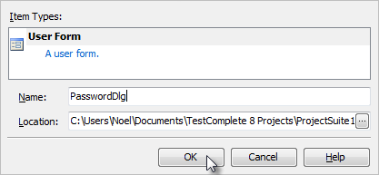
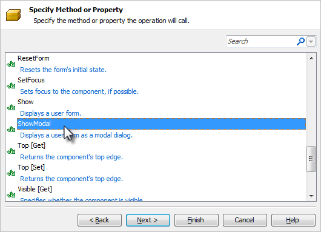

### User Forms

Objectives
----------

This chapter demonstrates how User Forms are used to display dialogs and windows onscreen during test execution. You\'ll learn how to use the TestComplete User Form\'s designer to create your own forms. You\'ll also see how modal and non-modal display modes manage form display during test execution.

Using the Designer
------------------

User Forms are not part of the default project template so you\'ll first need to add the **User Forms** Project Item to your project. Once you\'ve added User Forms support to your project you can right click the User Forms node in the Project Explorer and add a form to your project. In this example, we\'ll construct a User Form that can be used to prompt for login credentials.

Once the form is created you will see the User Forms designer which is similar in style to those seen in Visual Basic, Visual Studio or other development tools supporting forms development. If you are familiar with any of these tools you\'ll immediately feel right at home in the designer. If not, don\'t fear. Learning the designer is quick and easy and you\'ll be able to construct dialogs in no time.

#### Layout of the User Forms Designer

There are three panels of the User Forms editor including:

- Component palette

- Form Designer

- Properties window

#### Building a User Form

To illustrate the functionality of the User Forms designer we\'ll build a Login dialog that you can call from within your tests. If the UserForms node doesn\'t already exist in the project explorer, right-click the project and select **Add \| New Item**. Choose \"User Forms\" from the list and click **OK** to create the project item.

To create the form, right click the Project Explorer **UserForms** node and select **Add \| New Item\...** In the **Name** edit box enter \"PasswordDlg\".

Using the Component palette, we\'ll add the components (TcxTextEdit, TcxLabel and TcxButton) from the **Editors**, **Helpers** and **Buttons** categories respectively to the form by simply double clicking the components. After adding a component to the design-time form you can use the mouse to move/size the control and the Properties window to change its appearance/behavior. We now have a form that looks like this:

Next, we need to make the following property changes on the components placed on the form. The table below lists the components and the property/values for each. These changes improve the appearance of the dialog as well as set the expected behavior of a modal login dialog.

|**Component**|**Property**|**Value**|
  |---|---|---|
  |cxTextEdit1|Name|edUsername|
  |   |Text|(blank)|
  |cxTextEdit2|Name|edPassword|
  |  |Text|(blank)|
  |  |Properties.EchoMode|eemPassword|
  |cxLabel1|Caption|&Username:|
  |  |FocusControl|edUsername|
  |cxLabel2|Caption|&Password|
  |   |FocusControl|edPassword|
  |cxButton1|Caption|OK|
  |   |Default|True|
  |   |ModalResult|mrOk|
  |cxButton2|Caption|Cancel|
  |   |Cancel|True|
  |   |ModalResult|True|
  |\[User Form\]|Caption|Login|

Once these properties have been assigned we\'ll have a completed User Form that we can use from within a Keyword Test.

#### Calling User Forms in a Keyword Test

User Forms can be displayed from within a Keyword test using several different operations such as **Call Object Method**, **Run Code Snippet**, or **Run Script Routine**. In this example we\'ll use the **Call Object Method** operation and illustrate how to invoke a modal dialog and respond to the user\'s action to the dialog.

#### Creating a Keyword Test to call a User Form

The first step is to drag/drop a **Call Object Method** onto a Keyword test. This will invoke the wizard to select the object and choose the specific method. In the case of a User Form there are two methods for displaying the form, Show and ShowModal. The prior will display the form as a non-modal window and test execution will continue to the next operation. The latter will display the form as a modal window where a user has to respond to the dialog prior to test execution continuing. The ShowModal method returns a value called ModalResult representing the user\'s response to the dialog. The ModalResult will be one of the following values:

  |**Constant**|**Description**|
  |---|---|
  |**mrNone**|None|
  |**mrOk**|The dialog result is OK|
  |**mrCancel**|The dialog result is Cancel|
  |**mrAbort**|The dialog result is Abort|
  |**mrRetry**|The dialog result is Retry|
  |**mrIgnore**|The dialog result is Ignore|
  |**mrYes**|The dialog result is Yes|
  |**mrNo**|The dialog result is No|
  |**mrAll**|The dialog result is All|
  |**mrNoToAll**|The dialog result is No To All|
  |**mrYesToAll**|The dialog result is Yes To All|

For this operation, we\'ll specify the **UserForms.PasswordDlg** object:

Clicking **Next** will display a list of the methods on the UserForms.PasswordDlg object including the **ShowModal** method. Type ShowModal to select the method then click the **Finish** button (the ShowModal method accepts no parameters).

#### Responding to a User Form

Once displayed onscreen using the ShowModal method, the user must respond to the dialog prior to the test proceeding. The Keyword Test will need to respond to the ModalResult returned by the form. We can use an **If\...Then** operation to provide the logic. For the login dialog we\'ll inspect the form\'s ModalResult, username and password, validate the data and perform additional actions based on the result. 
All of these values can be inspected within a single **If\...then** operation.

To respond to the User Form:

1.  Drag and drop the **If\...Then** operation just after the call the User Form.

2.  Under **Value1** use the ellipsis, set the **Mode** to **Last Operation Result**.

3.  Under **Value2** use the ellipsis, set the **Mode** to **Code Expression** and enter **mrOk** as the Value.

4.  Click the **And** button to add a new row.

5.  Under **Value1** use the ellipsis, set the **Mode** to **Code Expression** and enter UserForms.PasswordDlg.edUsername.Text.

6.  Under **Value2** use the ellipsis, set the **Mode** to **Constant** and \"admin\" (without the quotes) as the **Value**.

7.  Under **Value1** use the ellipsis, set the **Mode** to **Code Expression** and enter UserForms.PasswordDlg.edPassword.Text.

8.  Under **Value2** use the ellipsis, set the **Mode** to **Constant** and \"**password**\" (without the quotes) as the **Value**.

Nested within the **If\...Then** operation we\'ll add a Log Message operation to indicate we\'ve logged in.

1.  Select the **Logging** category from the Operations palette and drag & drop the **Log Message** operation below the **If\...Then** operation.

2.  On the **Log Message** dialog type **\"**Logged In\" on the **Message** tab and click the **Finish** button.

3.  Click the **Right** arrow button on the Keyword toolbar to indent the **Log Message** step.

We\'ve completed the logic for our User Form. The **Log Message**
operation will be called if the correct user name and password are
entered.

#### Summary

In this chapter, we learned how to create user forms for input during test execution. We learned about the User Forms designer and how to incorporate user forms into a test.